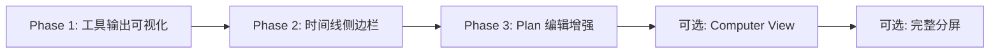

# Research Console UI 界面布局调研与设计方案

**文档版本**: v1.0
**创建日期**: 2025-10-07
**作者**: Claude Code
**项目**: ALEX - Agile Light Easy Xpert Code Agent

---

## 目录

1. [Research Console 核心设计理念](#一console-核心设计理念)
2. [ALEX 项目现有实现](#二alex-项目现有实现)
3. [推荐设计方案](#三推荐设计方案)
4. [立即实施计划](#四立即实施计划)
5. [设计系统规范](#五设计系统规范)
6. [总结与下一步](#六总结与下一步)

---

## 一、Research Console 核心设计理念

### 1.1 产品哲学

Research Console 作为新一代 AI Agent 产品,其界面设计围绕以下核心原则:

#### **透明化执行 (Transparency)**
- 通过 "Research Console's Computer" 侧面板实时展示 AI 执行步骤
- 用户可以看到每个工具调用、每个决策节点
- 避免 "黑盒" 体验,建立信任

#### **异步自主性 (Asynchronous Autonomy)**
- 云端虚拟环境持续工作,用户可离开设备
- 任务完成时发送通知
- 支持长时间运行任务 (数小时甚至数天)

#### **会话回放 (Session Replay)**
- 支持重放历史会话,观察每个步骤细节
- 用于调试、学习、审计

#### **极简主义 (Minimalism)**
- 低饱和度灰阶配色
- 最小视觉装饰
- 高信息密度 + 慷慨间距
- 专注内容而非装饰

### 1.2 主流布局模式

根据行业调研 (来源: [Emerge Haus Blog](https://www.emerge.haus/blog/the-new-dominant-ui-design-for-ai-agents)),AI Agent 界面正在收敛为以下标准布局:

```
┌─────────────────────────────────────────────────────────────┐
│                         Header                              │
├───────────────────────────┬─────────────────────────────────┤
│  Left Panel (40%)         │  Right Panel (60%)              │
│  ┌───────────────────────┐│  ┌─────────────────────────┐   │
│  │ 对话界面              ││  │ 实时工作区               │   │
│  │                       ││  │                         │   │
│  │ • 任务输入            ││  │ • 浏览器/终端视图        │   │
│  │ • 对话历史            ││  │ • 代码编辑器             │   │
│  │ • Plan 审批           ││  │ • 工具调用输出           │   │
│  │ • 思考过程            ││  │ • 文件差异对比           │   │
│  │                       ││  │                         │   │
│  └───────────────────────┘│  └─────────────────────────┘   │
│                           │                                 │
│  [Input Area - Fixed]     │  [Tab: Computer | Timeline]     │
└───────────────────────────┴─────────────────────────────────┘
```

#### **关键特性:**
- **Split-Screen Layout**: 会话在左,执行可视化在右
- **Real-Time Feedback**: 用户可监控、干预、重定向任务
- **Trust Building**: 通过可视化操作建立问责机制 (accountability)
- **Familiar Patterns**: 继承传统 IDE/终端的双栏布局习惯

### 1.3 视觉语言

#### **颜色系统**
```css
/* 低饱和度灰阶基础 */
--background: 0 0% 100%;     /* 纯白背景 */
--foreground: 0 0% 9%;       /* 深灰文字 */
--muted: 0 0% 96%;           /* 次要背景 */
--muted-foreground: 0 0% 40%; /* 次要文字 */

/* 功能色 - 去饱和处理 */
--primary: 215 14% 34%;      /* 低饱和度蓝 (Plan, 重要操作) */
--destructive: 0 50% 45%;    /* 柔和红 (错误) */
--success: 142 76% 36%;      /* 柔和绿 (成功) */
```

#### **排版规则**
- **字体**: System UI (macOS: SF Pro, Windows: Segoe UI)
- **等宽字体**: JetBrains Mono, Fira Code (支持连字)
- **字号**: 12px (代码) / 14px (正文) / 16-24px (标题)
- **行高**: 1.5 (正文) / 1.2 (标题)
- **字重**: 600 (标题) / 400 (正文)

#### **间距系统**
```css
/* Tailwind 间距倍数 */
space-y-1: 0.25rem  /* 密集列表 */
space-y-2: 0.5rem   /* 事件流 */
space-y-3: 0.75rem  /* 卡片间距 */
space-y-4: 1rem     /* Section 间距 */
space-y-6: 1.5rem   /* 大模块间距 */

/* 组件内边距 */
p-2: 0.5rem   /* 小按钮 */
p-3: 0.75rem  /* 输入框 */
p-4: 1rem     /* 卡片 */
p-6: 1.5rem   /* Section */
```

---

## 二、ALEX 项目现有实现

### 2.1 当前布局架构

#### **文件位置**: `web/app/page.tsx:78-148`

```typescript
<div className="flex flex-col h-[calc(100vh-8rem)]">
  {/* 1. Header - 固定高度 */}
  <div className="flex-shrink-0 pb-3 mb-3 border-b border-border/50">
    <div className="flex items-center justify-between">
      <div className="flex items-baseline gap-3">
        <h1 className="text-lg font-semibold tracking-tight">ALEX</h1>
        {sessionId && (
          <div className="flex items-center gap-2 text-xs font-mono">
            <div className={`w-1.5 h-1.5 rounded-full ${isConnected ? 'bg-green-500' : 'bg-gray-400'}`} />
            <span>{sessionId.slice(0, 8)}</span>
          </div>
        )}
      </div>
      {sessionId && <ClearButton />}
    </div>
  </div>

  {/* 2. Output Area - 弹性滚动 */}
  <div ref={outputRef} className="flex-1 overflow-y-auto mb-4 scroll-smooth">
    {events.length === 0 ? (
      <EmptyState />
    ) : (
      <TerminalOutput
        events={events}
        isConnected={isConnected}
        sessionId={sessionId}
        taskId={taskId}
      />
    )}
  </div>

  {/* 3. Input Area - 固定底部, 始终可见 */}
  <div className="flex-shrink-0 border-t border-border/50 pt-3">
    <TaskInput
      onSubmit={handleTaskSubmit}
      disabled={isPending}
      loading={isPending}
      placeholder={sessionId ? "Continue..." : "Describe your task..."}
    />
  </div>
</div>
```

#### **布局特点**:
- **Flexbox 三段式**: Header (固定) → Output (弹性) → Input (固定)
- **全高布局**: `h-[calc(100vh-8rem)]` (减去页面 padding)
- **自动滚动**: `useEffect` 监听 `events` 变化,滚动到底部
- **状态简化**: 只需 `sessionId` + `taskId` 两个状态

### 2.2 核心组件清单

| 组件文件 | 状态 | 用途 | 代码行数 |
|---------|------|------|---------|
| `TerminalOutput.tsx` | ✅ 生产中 | 事件流显示 + Plan 审批逻辑 | 114 行 |
| `EventList.tsx` | ✅ 生产中 | 虚拟化事件列表 (性能优化) | ~200 行 |
| `ResearchPlanCard.tsx` | ✅ 生产中 | Plan 审批/修改 UI | ~150 行 |
| `TaskInput.tsx` | ✅ 生产中 | 自动调整高度的输入框 | ~100 行 |
| `ConnectionBanner.tsx` | ✅ 生产中 | 连接状态提示 + 重连按钮 | ~50 行 |
| `Research ConsoleAgentOutput.tsx` | ⚠️ 存在但未使用 | 包含 Tab 切换逻辑 (Computer/Timeline) | ~200 行 |
| `WebViewport.tsx` | ⚠️ 存在但未使用 | 工具输出轮播查看器 | ~150 行 |
| `ResearchTimeline.tsx` | ❓ 待确认 | 步骤时间线组件 | 未知 |
| `DocumentCanvas.tsx` | ❓ 待确认 | 多模式文档查看 (Default/Reading/Compare) | 未知 |

### 2.3 已有优点

#### ✅ **输入框始终可见**
- 解决旧版 "提交后消失" 问题
- 无条件渲染 (`<TaskInput />` 不在条件判断内)
- 动态 placeholder (有/无 session 时不同)

#### ✅ **终端风格输出**
- 等宽字体 (`font-mono text-xs`)
- 彩色事件类型:
  - `task_started`: 绿色
  - `tool_call`: 青色 + `▸` 符号
  - `tool_result`: 青色 + `✓`/`✗`
  - `thinking`: 紫色 + `💭`
  - `task_failed`: 红色 + `✗`

#### ✅ **自动滚动**
```typescript
useEffect(() => {
  if (outputRef.current) {
    outputRef.current.scrollTop = outputRef.current.scrollHeight;
  }
}, [events]);
```

#### ✅ **Plan 审批集成**
- 从事件流解析 `research_plan` 事件
- 显示 `ResearchPlanCard` 组件
- 支持 Approve/Edit/Reject 操作
- API 调用: `POST /api/plans/approve`

### 2.4 存在不足

#### ❌ **缺少分屏布局**
- 无 "Computer View" 实时工作区
- 无法并排查看对话和执行结果
- 工具输出混在事件流中,难以定位

#### ❌ **工具输出不可视化**
- `bash` 输出: 纯文本,无语法高亮
- `file_read` 结果: 无代码高亮
- `web_fetch` 内容: 无 HTML 渲染
- 所有输出混排在事件流中

#### ❌ **无时间线视图**
- 缺少步骤导航 (Step 1, Step 2, ...)
- 无法快速跳转到特定步骤
- 无进度追踪 (估计耗时/实际耗时)

#### ❌ **单一视图模式**
- 无阅读模式 (Reading Mode)
- 无对比模式 (Compare Mode - 文件差异)
- 无全屏查看工具输出

---

## 三、推荐设计方案

### 方案对比

| 维度 | 方案 A: 渐进式增强 | 方案 B: 完整分屏重构 |
|------|------------------|---------------------|
| **工作量** | 5-7 天 (分 3 阶段) | 9-10 天 (一次性) |
| **风险** | 🟢 低 (保留现有架构) | 🔴 高 (破坏性变更) |
| **用户影响** | 🟢 无感知升级 | 🟡 需要重新学习 |
| **移动端适配** | 🟢 容易 (单栏布局) | 🔴 复杂 (需响应式断点) |
| **可回滚性** | 🟢 每阶段独立 | 🔴 需全部完成才能发布 |
| **最终效果** | 🟡 70% Research Console 体验 | 🟢 100% Research Console 体验 |

### 推荐: 方案 A - 渐进式增强 ⭐

#### **理由:**
1. **低风险**: 保留已验证的三段式布局
2. **快速迭代**: 每个 Phase 独立交付,快速获得用户反馈
3. **用户体验连续**: 无破坏性变更,学习成本低
4. **移动友好**: 响应式布局更容易维护
5. **团队效率**: 可并行开发 (前端 + 后端)

---

## 四、立即实施计划

### Phase 1: 工具输出可视化 (2-3 天)

#### **目标**: 让工具调用结果更易读、可交互

#### **新建组件**: `web/components/agent/ToolOutputCard.tsx`

```typescript
import { Card, CardHeader, CardContent } from '@/components/ui/card';
import { Badge } from '@/components/ui/badge';
import { Collapsible, CollapsibleTrigger, CollapsibleContent } from '@/components/ui/collapsible';
import { Prism as SyntaxHighlighter } from 'react-syntax-highlighter';
import { vscDarkPlus } from 'react-syntax-highlighter/dist/esm/styles/prism';

interface ToolOutputCardProps {
  tool: {
    name: string;
    parameters: Record<string, unknown>;
  };
  result: string;
  success: boolean;
  duration?: number;
  timestamp: string;
}

export function ToolOutputCard({
  tool,
  result,
  success,
  duration,
  timestamp,
}: ToolOutputCardProps) {
  const [isOpen, setIsOpen] = useState(false);

  // 自动检测语言 (bash -> bash, file_read -> 根据扩展名)
  const language = detectLanguage(tool.name, tool.parameters);

  return (
    <Card className="border-l-4 border-cyan-500 animate-fadeIn">
      <CardHeader className="py-3">
        <div className="flex justify-between items-center">
          {/* 工具名称 + 参数 */}
          <div className="font-mono text-sm flex items-center gap-2">
            <span className={success ? 'text-cyan-600' : 'text-red-500'}>
              {success ? '▸' : '✗'}
            </span>
            <span className="font-semibold">{tool.name}</span>
            <span className="text-muted-foreground">
              ({formatParams(tool.parameters)})
            </span>
          </div>

          {/* 耗时标签 */}
          {duration && (
            <Badge variant="outline" className="font-mono text-xs">
              {formatDuration(duration)}
            </Badge>
          )}
        </div>
      </CardHeader>

      {/* 可展开的结果区域 */}
      <Collapsible open={isOpen} onOpenChange={setIsOpen}>
        <CollapsibleTrigger asChild>
          <button className="w-full px-4 py-2 text-left text-xs text-muted-foreground hover:bg-accent transition-colors">
            {isOpen ? '▼ Hide output' : '▶ Show output'} ({result.length} chars)
          </button>
        </CollapsibleTrigger>

        <CollapsibleContent>
          <CardContent className="pt-0">
            <SyntaxHighlighter
              language={language}
              style={vscDarkPlus}
              customStyle={{
                margin: 0,
                borderRadius: '0.375rem',
                fontSize: '0.75rem',
                maxHeight: '400px',
              }}
              showLineNumbers
            >
              {result}
            </SyntaxHighlighter>
          </CardContent>
        </CollapsibleContent>
      </Collapsible>
    </Card>
  );
}

// 辅助函数
function detectLanguage(toolName: string, params: Record<string, unknown>): string {
  if (toolName === 'bash' || toolName === 'code_execute') return 'bash';
  if (toolName === 'file_read' && typeof params.path === 'string') {
    const ext = params.path.split('.').pop();
    return ext || 'text';
  }
  if (toolName === 'web_fetch') return 'html';
  return 'text';
}

function formatParams(params: Record<string, unknown>): string {
  return Object.entries(params)
    .map(([key, val]) => `${key}: ${String(val).slice(0, 30)}`)
    .join(', ');
}

function formatDuration(ms: number): string {
  if (ms < 1000) return `${ms}ms`;
  return `${(ms / 1000).toFixed(1)}s`;
}
```

#### **集成到 EventList**:

修改 `web/components/agent/EventList.tsx`:

```typescript
import { ToolOutputCard } from './ToolOutputCard';

function EventLine({ event, index }: { event: AnyAgentEvent; index: number }) {
  // 如果是 tool_result 事件, 使用卡片显示
  if (event.event_type === 'tool_result') {
    return (
      <ToolOutputCard
        tool={{
          name: event.tool_name,
          parameters: event.tool_parameters || {},
        }}
        result={event.result}
        success={event.success}
        duration={event.duration_ms}
        timestamp={event.timestamp}
      />
    );
  }

  // 其他事件保持原有显示方式
  return (
    <div className="flex gap-3 font-mono text-xs hover:bg-muted/30 transition-colors px-2 py-1 rounded">
      {/* ... 原有代码 ... */}
    </div>
  );
}
```

#### **依赖安装**:
```bash
npm install react-syntax-highlighter
npm install --save-dev @types/react-syntax-highlighter
```

#### **测试验证**:
- ✅ 工具输出卡片正确渲染
- ✅ 点击展开/折叠正常工作
- ✅ 语法高亮正确应用
- ✅ 长输出自动滚动条

---

### Phase 2: 研究时间线侧边栏 (2 天)

#### **目标**: 提供步骤导航和进度追踪

#### **布局调整**: `web/app/page.tsx`

```typescript
<div className="flex flex-col h-[calc(100vh-8rem)]">
  {/* Header - 不变 */}
  <div className="flex-shrink-0 pb-3 mb-3 border-b border-border/50">
    {/* ... */}
  </div>

  {/* Output Area - 添加横向分栏 */}
  <div ref={outputRef} className="flex-1 overflow-y-auto mb-4 flex gap-4">
    {/* 左侧: 时间线 (仅桌面端显示) */}
    {steps.length > 0 && (
      <aside className="hidden lg:block w-64 flex-shrink-0">
        <ResearchTimeline
          steps={steps}
          activeStep={currentStep}
          onStepClick={handleStepClick}
        />
      </aside>
    )}

    {/* 右侧: 事件流 */}
    <div className="flex-1 min-w-0">
      {events.length === 0 ? (
        <EmptyState />
      ) : (
        <TerminalOutput events={events} {...props} />
      )}
    </div>
  </div>

  {/* Input Area - 不变 */}
  <div className="flex-shrink-0 border-t border-border/50 pt-3">
    {/* ... */}
  </div>
</div>
```

#### **新建组件**: `web/components/agent/ResearchTimeline.tsx`

```typescript
interface Step {
  id: string;
  title: string;
  status: 'pending' | 'active' | 'completed' | 'error';
  duration?: number;
  toolsUsed?: string[];
}

interface ResearchTimelineProps {
  steps: Step[];
  activeStep: string | null;
  onStepClick: (stepId: string) => void;
}

export function ResearchTimeline({ steps, activeStep, onStepClick }: ResearchTimelineProps) {
  const activeRef = useRef<HTMLDivElement>(null);

  // 自动滚动到活跃步骤
  useEffect(() => {
    activeRef.current?.scrollIntoView({ behavior: 'smooth', block: 'center' });
  }, [activeStep]);

  return (
    <nav className="space-y-1" aria-label="Research progress">
      {steps.map((step, idx) => {
        const isActive = step.id === activeStep;
        const isCompleted = step.status === 'completed';
        const isError = step.status === 'error';

        return (
          <button
            key={step.id}
            ref={isActive ? activeRef : null}
            onClick={() => onStepClick(step.id)}
            className={cn(
              'w-full text-left px-3 py-2 rounded-md transition-colors',
              'flex items-start gap-2 group',
              isActive && 'bg-primary/10 border-l-2 border-primary',
              !isActive && 'hover:bg-accent'
            )}
          >
            {/* 步骤序号 */}
            <div className={cn(
              'w-6 h-6 rounded-full flex items-center justify-center text-xs font-semibold flex-shrink-0',
              isCompleted && 'bg-green-500 text-white',
              isError && 'bg-red-500 text-white',
              isActive && 'bg-primary text-primary-foreground',
              !isActive && !isCompleted && !isError && 'bg-muted text-muted-foreground'
            )}>
              {isCompleted ? '✓' : isError ? '✗' : idx + 1}
            </div>

            {/* 步骤信息 */}
            <div className="flex-1 min-w-0">
              <div className="font-medium text-sm truncate">{step.title}</div>
              {step.duration && (
                <div className="text-xs text-muted-foreground mt-0.5">
                  {formatDuration(step.duration)}
                </div>
              )}
              {step.toolsUsed && step.toolsUsed.length > 0 && (
                <div className="flex gap-1 mt-1 flex-wrap">
                  {step.toolsUsed.map(tool => (
                    <Badge key={tool} variant="outline" className="text-xs">
                      {tool}
                    </Badge>
                  ))}
                </div>
              )}
            </div>
          </button>
        );
      })}
    </nav>
  );
}
```

#### **步骤数据解析**: 新建 `web/hooks/useTimelineSteps.ts`

```typescript
export function useTimelineSteps(events: AnyAgentEvent[]): Step[] {
  return useMemo(() => {
    const steps: Step[] = [];
    let currentStep: Partial<Step> | null = null;

    events.forEach(event => {
      if (event.event_type === 'step_start') {
        // 结束上一步
        if (currentStep) {
          steps.push(currentStep as Step);
        }

        // 开始新步骤
        currentStep = {
          id: event.step_id,
          title: event.step_description,
          status: 'active',
          toolsUsed: [],
        };
      } else if (event.event_type === 'step_complete' && currentStep) {
        currentStep.status = 'completed';
        currentStep.duration = event.duration_ms;
        steps.push(currentStep as Step);
        currentStep = null;
      } else if (event.event_type === 'tool_call' && currentStep) {
        // 记录使用的工具
        if (!currentStep.toolsUsed?.includes(event.tool_name)) {
          currentStep.toolsUsed?.push(event.tool_name);
        }
      }
    });

    // 处理未完成的步骤
    if (currentStep) {
      steps.push(currentStep as Step);
    }

    return steps;
  }, [events]);
}
```

#### **测试验证**:
- ✅ 时间线正确显示所有步骤
- ✅ 活跃步骤高亮显示
- ✅ 点击步骤跳转到对应事件
- ✅ 移动端自动隐藏时间线

---

### Phase 3: Plan 编辑增强 (1 天)

#### **目标**: 优化 Plan 审批流程

#### **修改**: `web/components/agent/ResearchPlanCard.tsx`

新增功能:
1. **Reject 按钮**: 添加拒绝按钮和理由输入
2. **估计耗时显示**: 显示预计工具调用次数和时间
3. **步骤重排**: 拖拽调整步骤顺序

```typescript
// 新增 Reject 功能
const [rejectReason, setRejectReason] = useState('');
const [isRejecting, setIsRejecting] = useState(false);

<div className="flex gap-2">
  <button
    onClick={onApprove}
    className="flex-1 console-button-primary"
  >
    ✓ Approve Plan
  </button>

  <button
    onClick={() => setIsRejecting(true)}
    className="console-button-ghost text-destructive"
  >
    ✗ Reject
  </button>
</div>

{/* Reject 理由输入 */}
{isRejecting && (
  <div className="mt-3 space-y-2">
    <textarea
      value={rejectReason}
      onChange={(e) => setRejectReason(e.target.value)}
      placeholder="Why are you rejecting this plan? (optional)"
      className="console-input min-h-[60px]"
    />
    <div className="flex gap-2">
      <button
        onClick={() => onReject(rejectReason)}
        className="console-button-secondary"
      >
        Confirm Rejection
      </button>
      <button
        onClick={() => setIsRejecting(false)}
        className="console-button-ghost"
      >
        Cancel
      </button>
    </div>
  </div>
)}
```

---

## 五、设计系统规范

### 5.1 颜色语义

基于 `web/app/globals.css` 定义的变量:

```css
/* Light Mode */
--background: 0 0% 100%;           /* 纯白背景 */
--foreground: 0 0% 9%;             /* 深灰文字 (#171717) */
--primary: 215 14% 34%;            /* 低饱和度蓝 (#4A5B6D) - Plan, 重要操作 */
--muted-foreground: 0 0% 40%;      /* 次要文字 (#666666) */
--border: 0 0% 88%;                /* 边框 (#E0E0E0) */

/* Dark Mode */
--background: 0 0% 7%;             /* 深灰背景 (#121212) */
--foreground: 0 0% 96%;            /* 浅灰文字 (#F5F5F5) */
--primary: 215 20% 65%;            /* 提亮蓝 (#7D9BBF) */
--muted-foreground: 0 0% 60%;      /* 次要文字 (#999999) */
--border: 0 0% 20%;                /* 边框 (#333333) */
```

#### **事件类型配色**:
```typescript
const EVENT_STYLES = {
  task_started: 'text-green-600 dark:text-green-400',
  task_completed: 'text-green-600 dark:text-green-400 font-semibold',
  task_failed: 'text-red-500 dark:text-red-400',
  plan_created: 'text-blue-600 dark:text-blue-400',
  tool_call: 'text-cyan-600 dark:text-cyan-400',
  tool_result: 'text-cyan-600 dark:text-cyan-400',
  thinking: 'text-purple-600 dark:text-purple-400',
  step_start: 'text-yellow-600 dark:text-yellow-400',
  step_complete: 'text-yellow-600 dark:text-yellow-400',
};
```

### 5.2 间距系统

```css
/* 组件间距 */
space-y-1: 0.25rem   /* 4px  - 密集列表 */
space-y-2: 0.5rem    /* 8px  - 事件流 */
space-y-3: 0.75rem   /* 12px - 卡片间距 */
space-y-4: 1rem      /* 16px - Section 间距 */
space-y-6: 1.5rem    /* 24px - 大模块间距 */

/* 组件内边距 */
p-2: 0.5rem   /* 8px  - 小按钮 */
p-3: 0.75rem  /* 12px - 输入框 */
p-4: 1rem     /* 16px - 卡片 */
p-6: 1.5rem   /* 24px - Section */

/* 组件外边距 */
gap-2: 0.5rem   /* Flex 子元素间距 */
gap-3: 0.75rem
gap-4: 1rem
```

### 5.3 排版规则

```css
/* 标题层级 */
h1: text-4xl (36px) font-semibold tracking-tight
h2: text-3xl (30px) font-semibold tracking-tight
h3: text-2xl (24px) font-semibold tracking-tight
h4: text-xl  (20px) font-semibold tracking-tight
h5: text-lg  (18px) font-semibold tracking-tight
h6: text-base (16px) font-semibold tracking-tight

/* 正文 */
body: text-sm (14px) leading-relaxed (1.625)
small: text-xs (12px)

/* 等宽字体 (代码/终端) */
font-mono text-xs (12px)
font-mono text-sm (14px)
```

### 5.4 Research Console 工具类

#### **卡片样式**
```css
.console-card {
  @apply bg-card border border-border rounded-md;
}

.console-card-interactive {
  @apply console-card transition-colors duration-150;
}

.console-card-interactive:hover {
  @apply bg-accent;
}
```

#### **按钮样式**
```css
.console-button-primary {
  @apply px-4 py-2 rounded-md font-medium transition-colors duration-150;
  @apply bg-primary text-primary-foreground;
  @apply focus:ring-2 focus:ring-ring focus:ring-offset-2;
}

.console-button-primary:hover {
  @apply opacity-90;
}

.console-button-ghost {
  @apply px-4 py-2 rounded-md font-medium transition-colors duration-150;
  @apply bg-transparent;
}

.console-button-ghost:hover {
  @apply bg-accent;
}
```

#### **输入框样式**
```css
.console-input {
  @apply w-full px-3 py-2 bg-background border border-input rounded-md;
  @apply text-foreground placeholder:text-muted-foreground;
  @apply focus:outline-none focus:ring-2 focus:ring-ring;
  @apply transition-shadow duration-150;
}
```

### 5.5 动画时长

```css
/* 快速过渡 (颜色, 透明度) */
transition-colors duration-150  /* 150ms */
transition-opacity duration-150

/* 中速过渡 (位移, 缩放) */
transition-transform duration-300  /* 300ms */

/* 进入动画 */
.animate-fadeIn {
  animation: fadeIn 0.2s ease-out;
}

@keyframes fadeIn {
  from {
    opacity: 0;
    transform: translateY(4px);
  }
  to {
    opacity: 1;
    transform: translateY(0);
  }
}
```

---

## 六、总结与下一步

### 6.1 当前状态评估

#### **已有优势**:
- ✅ 稳定的三段式布局 (Header → Output → Input)
- ✅ 终端风格事件流 (等宽字体, 彩色事件)
- ✅ Plan 审批流程完整 (Approve/Edit)
- ✅ 自动滚动到底部
- ✅ 输入框始终可见
- ✅ 完善的设计系统 (Research Console 工具类)

#### **待改进项**:
- ❌ 工具输出不可视化 (纯文本)
- ❌ 无时间线导航
- ❌ 缺少分屏布局 (对话 vs 工作区)
- ❌ 无多视图模式 (Reading/Compare)

### 6.2 推荐实施路径



#### **时间线**:
- Week 1: Phase 1 (工具输出卡片化)
- Week 2: Phase 2 (时间线) + Phase 3 (Plan 增强)
- Week 3+: 根据用户反馈决定是否实施 Computer View

### 6.3 成功指标

#### **用户体验指标**:
- [ ] 工具输出可读性提升 (用户反馈 > 8/10)
- [ ] 步骤导航使用率 > 30%
- [ ] Plan 审批时间缩短 20%

#### **技术指标**:
- [ ] 事件流渲染性能 < 50ms (虚拟化)
- [ ] 首屏加载时间 < 2s
- [ ] 移动端 Lighthouse 评分 > 90

### 6.4 风险与缓解

| 风险 | 影响 | 缓解措施 |
|------|------|---------|
| 工具输出卡片增加渲染负担 | 中 | 使用虚拟滚动 (react-window) |
| 时间线数据解析复杂 | 低 | 编写完善单元测试 |
| 移动端时间线布局问题 | 中 | 使用 `lg:` 断点隐藏 |
| 用户不理解新 UI | 低 | 添加 Tooltip 和引导动画 |

### 6.5 下一步行动

#### **立即开始**:
```bash
# 1. 安装依赖
cd web
npm install react-syntax-highlighter @types/react-syntax-highlighter

# 2. 创建工具输出卡片组件
# (见上文 Phase 1 代码)

# 3. 运行开发服务器测试
npm run dev
```

#### **并行任务**:
- [ ] 前端: 实现 `ToolOutputCard` 组件
- [ ] 后端: 确保 `tool_result` 事件包含 `duration_ms` 字段
- [ ] 测试: 编写 E2E 测试用例 (`web/e2e/tool-output.spec.ts`)

---

## 附录

### A. 参考资料

- [Emerge Haus - The New Dominant UI Design for AI Agents](https://www.emerge.haus/blog/the-new-dominant-ui-design-for-ai-agents)
- [Cursor Agent Console Overview](https://cursor.sh/)
- [Perplexity Copilot Workspace](https://www.perplexity.ai/)
- [GitHub Copilot Workspace Announcement](https://github.blog/news-insights/product-news/github-copilot-workspace/)

### B. 相关文档

- `FRONTEND_REFACTOR.md` - 前端重构详细文档
- `web/docs/MANUS_INTERACTION_PATTERNS.md` - Research Console 交互模式
- `web/docs/COMPONENT_ARCHITECTURE.md` - 组件架构图
- `web/docs/EVENT_STREAM_ARCHITECTURE.md` - 事件流架构
- `CLAUDE.md` - 项目指南

### C. 联系方式

如有疑问或建议,请:
1. 创建 GitHub Issue
2. 查看 `docs/` 目录下的详细文档
3. 阅读 `CHANGELOG.md` 了解历史变更

---

**文档结束**
