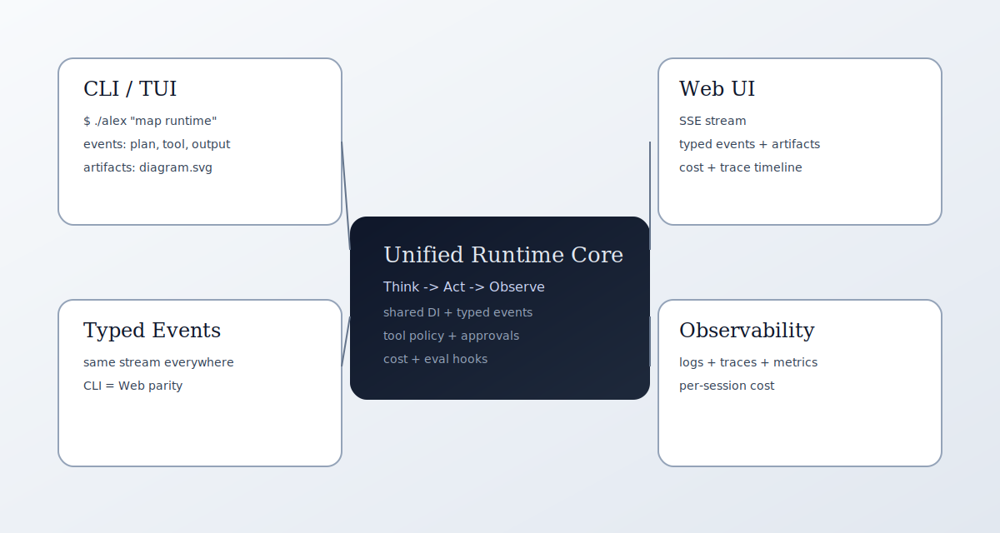

<p align="center">
  <span style="display:inline-flex; align-items:center; justify-content:center; padding:14px; border-radius:28px; background:radial-gradient(circle at 30% 30%, #34d39933, #3b82f633 55%, transparent 70%), linear-gradient(135deg, #0f172a, #111827); box-shadow:0 20px 60px -32px rgba(15, 23, 42, 0.6), 0 10px 30px -24px rgba(52, 211, 153, 0.45);">
    <span style="display:inline-flex; align-items:center; justify-content:center; width:92px; height:92px; border-radius:24px; background:linear-gradient(135deg, rgba(255,255,255,0.04), rgba(255,255,255,0)); border:1px solid rgba(255,255,255,0.08); box-shadow:inset 0 1px 0 rgba(255,255,255,0.06);">
      
    </span>
  </span>
</p>

# elephant.ai

elephant.ai is a unified runtime for production-grade AI agents: the `alex` CLI/TUI, `alex-server`, and web UI share one execution core, typed event stream, and observability pipeline. Build once, run everywhere, and render the same session in terminals and the browser.

**One-line pitch:** A single runtime that ships agentic workflows across CLI, server, and web with typed events, evals, and cost/trace accountability.

[](https://github.com/cklxx/Alex-Code/actions/workflows/ci.yml)
[](https://goreportcard.com/report/github.com/cklxx/Alex-Code)
[](https://opensource.org/licenses/MIT)

---

## Highlights

* One runtime, three entrypoints (CLI/TUI, server, dashboard) backed by the same DI container.
* OpenAI chat + Responses API, Anthropic Claude API, and OpenAI-compatible gateways (OpenRouter/DeepSeek/Antigravity).
* `llm_provider: auto` (or `cli`) picks the best available subscription from CLI auth + env keys (Codex/Antigravity/Claude/OpenAI).
* Typed, artifact-aware events that render identically in terminals and the web UI.
* Built-in observability: structured logs, OpenTelemetry traces, Prometheus metrics, and per-session cost accounting.
* Retrieval layers for memory, skills, docs, and external context plus approvals for risky actions.
* Evaluation harnesses (including SWE-Bench) live in-repo for parity between manual and automated runs.

---

## Demo (10 minutes)



```bash
# Configure runtime once
export OPENAI_API_KEY="sk-..."
cp examples/config/runtime-config.yaml ~/.alex/config.yaml

# Run backend + web
./dev.sh

# Run a demo task from the CLI
make build
./alex "Map the runtime layers, explain the event stream, and produce a short summary."
```

Expected:
- CLI shows a typed event stream (plan/tool/output).
- Web UI at `http://localhost:3000` renders the same events and artifacts.
- Cost + trace metadata update as the run progresses.

---

## Quickstart

Prerequisites: Go 1.24+, Node.js 20+ (web UI), Docker (optional).

```bash
# Configure your LLM provider (examples)
export OPENAI_API_KEY="sk-..."
# export ANTHROPIC_API_KEY="sk-ant-..."  # Claude
# export CLAUDE_CODE_OAUTH_TOKEN="..."   # Claude Code OAuth
# export CODEX_API_KEY="sk-..."          # OpenAI Responses / Codex
# export ANTIGRAVITY_API_KEY="..."       # Antigravity (OpenAI-compatible)
cp examples/config/runtime-config.yaml ~/.alex/config.yaml

# Run backend + web together
./dev.sh

# Check status/logs
./dev.sh status
./dev.sh logs server
./dev.sh logs web

# Stop services
./dev.sh down

# Optional: build and run the CLI/TUI
make build
./alex
./alex "print the repo layout"
```

Configuration is shared across every surface. Use `examples/config/runtime-config.yaml` and `docs/reference/CONFIG.md` for the canonical schema.

---

## Proof points

* Evaluation harnesses + reproducible results: `evaluation/` and `evaluation_results/`.
* Quality gates (Go + web): `./dev.sh lint`, `./dev.sh test`, and `npm --prefix web run e2e`.
* Typed events and cost tracking live in `internal/agent/` and `internal/observability/`.

---

## Roadmap + contribution entrypoints

`ROADMAP.md` is the guided map of the codebase and the public contribution queue. It calls out MVP-sized slices and recommended areas for external contributions.

---

## Architecture (short form)

```
Delivery (CLI, Server, Web) → Agent Application Layer → Domain Ports → Infrastructure Adapters
```

* Delivery: shared DI wiring for `cmd/alex`, `cmd/alex-server`, and `web/` keeps sessions consistent.
* Agent core: `internal/agent/{app,domain,ports}` implements the Think → Act → Observe loop, approvals, and typed events.
* Infrastructure: `internal/di`, `internal/tools`, `internal/toolregistry`, `internal/llm`, `internal/mcp`, `internal/session`, `internal/storage`, `internal/observability`, and `internal/context` provide adapters, context, telemetry, and persistence.
* Frontend: `web/` streams SSE events, artifacts, approvals, and cost details in real time.

---

## Key paths

* `internal/agent/`: ReAct loop, approvals, and event model.
* `internal/context/` + `internal/rag/`: layered retrieval and summarization.
* `internal/observability/`: logs, traces, metrics, and cost accounting.
* `internal/tools/` + `internal/toolregistry/`: typed tools and safety policies.
* `evaluation/`: SWE-Bench and regression harnesses.
* `deploy/`: Docker Compose entrypoints for local and production stacks.
* `web/`: Next.js dashboard that consumes the same event stream.

---

## Project governance

* [`LICENSE`](LICENSE): MIT license.
* [`CONTRIBUTING.md`](CONTRIBUTING.md): contribution workflow and code standards.
* [`CODE_OF_CONDUCT.md`](CODE_OF_CONDUCT.md): expected community behavior.
* [`SECURITY.md`](SECURITY.md): vulnerability reporting process.

---

## Docs

* [`docs/README.md`](docs/README.md): documentation landing page and navigation.
* [`docs/AGENT.md`](docs/AGENT.md): runtime overview covering the Think → Act → Observe loop and delivery surfaces.
* [`docs/reference/ALEX.md`](docs/reference/ALEX.md): architecture and development reference, including module boundaries and common commands.
* [`docs/reference/CONFIG.md`](docs/reference/CONFIG.md): canonical configuration schema and precedence.
* [`docs/guides/quickstart.md`](docs/guides/quickstart.md): from clone to running CLI/server/web.
* [`docs/operations/DEPLOYMENT.md`](docs/operations/DEPLOYMENT.md): deployment guide for local, Docker Compose, and custom clusters.
