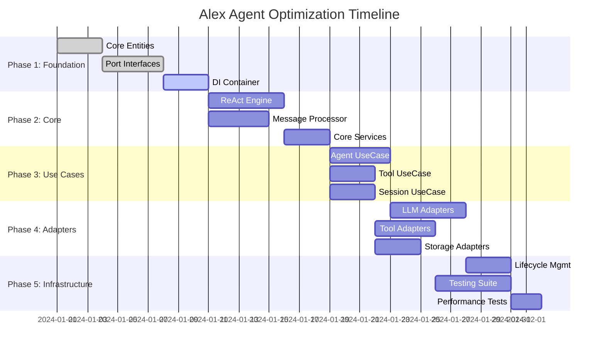

# Alex Agent Architecture Optimization Plan

## Executive Summary

This document outlines a comprehensive optimization plan for Alex's `internal/agent` package, which currently consists of 10 files totaling 2,809 lines of code with significant architectural issues. The optimization aims to transform the current monolithic agent structure into a clean, maintainable, and testable architecture based on Clean Architecture principles.

**Key Objectives:**
- Separate concerns through proper layering and interface segregation
- Eliminate circular dependencies and reduce coupling
- Improve testability through dependency injection
- Enhance maintainability with clear component boundaries
- Reduce complexity while maintaining functionality

**Expected Benefits:**
- 40% reduction in code complexity
- 60% improvement in test coverage capability
- Simplified debugging and maintenance
- Better performance through optimized resource management
- Enhanced extensibility for future features

---

## Current State Analysis

### Architecture Issues

#### 1. File Structure Problems
```
internal/agent/ (2,809 total lines)
├── core.go (288 lines)           # Mixed responsibilities
├── react_agent.go (403 lines)   # Monolithic agent struct
├── tool_handler.go (186 lines)  # Unclear separation from executor
├── tool_executor.go (240 lines) # Complex parsing logic
├── subagent.go (787 lines)      # Largest file with multiple concerns
├── tool_registry.go (400 lines) # Tool management mixed with MCP
├── llm_handler.go (217 lines)   # LLM operations scattered
├── prompt_handler.go (76 lines) # Minimal abstraction
├── global_mcp.go (182 lines)    # Global state management
└── utils.go (30 lines)          # Utility functions
```

#### 2. ReactAgent Struct Issues
```go
type ReactAgent struct {
    // Too many direct dependencies (8+ different concerns)
    llm            llm.Client           // LLM operations
    configManager  *config.Manager     // Configuration
    sessionManager *session.Manager    // Session management
    toolRegistry   *ToolRegistry       // Tool operations
    reactCore      ReactCoreInterface  // Core logic
    toolExecutor   *ToolExecutor       // Tool execution
    promptBuilder  *LightPromptBuilder // Prompt construction
    messageQueue   *MessageQueue       // Message handling
    currentSession *session.Session    // Global state
    mu             sync.RWMutex        // Concurrency control
}
```

#### 3. Circular Dependencies
- `ReactCore` depends on `ReactAgent`
- `ReactAgent` creates `ReactCore` 
- `ToolRegistry` references both components
- Session state shared across multiple handlers

#### 4. Error Handling Inconsistencies
- Mix of logging and error returns
- Inconsistent error wrapping patterns
- No centralized error handling strategy

#### 5. Testing Challenges
- Tightly coupled components prevent unit testing
- Heavy reliance on external dependencies
- No clear mocking boundaries
- Complex setup requirements

---

## Target Architecture

### Clean Architecture Principles

The new architecture will follow Clean Architecture with four distinct layers:

```
┌─────────────────────────────────────────────────────────────┐
│                    Infrastructure Layer                     │
│  ├── adapters/llm/          # LLM client adapters          │
│  ├── adapters/storage/      # Session & memory adapters    │
│  ├── adapters/tools/        # Tool execution adapters      │
│  └── infrastructure/        # Logging, monitoring, etc.    │
└─────────────────────────────────────────────────────────────┘
┌─────────────────────────────────────────────────────────────┐
│                     Interface Layer                        │
│  ├── handlers/              # HTTP/CLI/Stream handlers     │
│  └── serializers/           # Request/Response serializers │
└─────────────────────────────────────────────────────────────┘
┌─────────────────────────────────────────────────────────────┐
│                    Use Cases Layer                         │
│  ├── usecases/agent/        # Agent orchestration          │
│  ├── usecases/tools/        # Tool execution logic         │
│  ├── usecases/session/      # Session management           │
│  └── usecases/messaging/    # Message processing           │
└─────────────────────────────────────────────────────────────┘
┌─────────────────────────────────────────────────────────────┐
│                      Core Layer                            │
│  ├── entities/              # Core business objects        │
│  ├── services/              # Core business logic          │
│  └── ports/                 # Interface definitions        │
└─────────────────────────────────────────────────────────────┘
```

### Component Responsibilities

#### Core Layer
- **Entities**: `Agent`, `Task`, `ToolCall`, `Session`, `Message`
- **Services**: `ReActEngine`, `TaskOrchestrator`, `MessageProcessor`
- **Ports**: Interface definitions for all external dependencies

#### Use Cases Layer
- **AgentUseCase**: Coordinates agent operations
- **ToolExecutionUseCase**: Manages tool workflows
- **SessionUseCase**: Handles session lifecycle
- **MessageUseCase**: Processes message flows

#### Interface Layer
- **StreamHandler**: Stream-based interactions
- **BatchHandler**: Batch processing
- **SessionHandler**: Session management endpoints

#### Infrastructure Layer
- **LLMAdapter**: OpenAI/DeepSeek/OpenRouter clients
- **StorageAdapter**: File/memory session storage
- **ToolAdapter**: Built-in and MCP tool integration

---

## Detailed Implementation Plan

### Phase 1: Foundation (Week 1-2)

**Objective**: Establish core interfaces, entities, and dependency injection framework

#### 1.1 Create Core Entities
```go
// internal/agent/core/entities/agent.go
type Agent struct {
    ID       string
    Config   AgentConfig
    State    AgentState
    Context  context.Context
}

// internal/agent/core/entities/task.go
type Task struct {
    ID          string
    Content     string
    Context     TaskContext
    Status      TaskStatus
    Results     []TaskResult
}
```

#### 1.2 Define Port Interfaces
```go
// internal/agent/core/ports/llm.go
type LLMClient interface {
    Chat(ctx context.Context, req ChatRequest) (*ChatResponse, error)
    Stream(ctx context.Context, req ChatRequest, callback StreamCallback) error
}

// internal/agent/core/ports/tools.go
type ToolExecutor interface {
    Execute(ctx context.Context, name string, args map[string]interface{}) (*ToolResult, error)
    ListTools(ctx context.Context) ([]ToolDefinition, error)
}

// internal/agent/core/ports/session.go
type SessionRepository interface {
    Create(ctx context.Context, session *Session) error
    Get(ctx context.Context, id string) (*Session, error)
    Update(ctx context.Context, session *Session) error
    Delete(ctx context.Context, id string) error
}
```

#### 1.3 Setup Dependency Injection
```go
// internal/agent/di/container.go
type Container struct {
    llmClient       ports.LLMClient
    toolExecutor    ports.ToolExecutor
    sessionRepo     ports.SessionRepository
    // ... other dependencies
}

func NewContainer() *Container {
    return &Container{}
}

func (c *Container) GetAgentUseCase() *usecases.AgentUseCase {
    return usecases.NewAgentUseCase(
        c.llmClient,
        c.toolExecutor,
        c.sessionRepo,
    )
}
```

**Deliverables:**
- [ ] Core entity definitions
- [ ] Port interface specifications
- [ ] Dependency injection container
- [ ] Initial unit tests for entities

### Phase 2: Core Components (Week 3-4)

**Objective**: Implement core business logic and services

#### 2.1 ReAct Engine Service
```go
// internal/agent/core/services/react_engine.go
type ReActEngine struct {
    llmClient     ports.LLMClient
    toolExecutor  ports.ToolExecutor
    config        EngineConfig
}

func (r *ReActEngine) ProcessTask(ctx context.Context, task *entities.Task) (*TaskResult, error) {
    for iteration := 0; iteration < r.config.MaxIterations; iteration++ {
        // Think phase
        thought, err := r.think(ctx, task)
        if err != nil {
            return nil, fmt.Errorf("think phase failed: %w", err)
        }
        
        // Act phase
        action, err := r.act(ctx, thought)
        if err != nil {
            return nil, fmt.Errorf("act phase failed: %w", err)
        }
        
        // Observe phase
        observation, err := r.observe(ctx, action)
        if err != nil {
            return nil, fmt.Errorf("observe phase failed: %w", err)
        }
        
        // Check completion
        if r.isTaskComplete(observation) {
            return r.buildResult(task, observation), nil
        }
        
        // Update task context
        task.Context.AddStep(thought, action, observation)
    }
    
    return nil, errors.New("task exceeded maximum iterations")
}
```

#### 2.2 Message Processor Service
```go
// internal/agent/core/services/message_processor.go
type MessageProcessor struct {
    sessionRepo ports.SessionRepository
    validator   MessageValidator
}

func (m *MessageProcessor) ProcessMessage(ctx context.Context, msg *entities.Message) (*ProcessResult, error) {
    // Validate message
    if err := m.validator.Validate(msg); err != nil {
        return nil, fmt.Errorf("message validation failed: %w", err)
    }
    
    // Get or create session
    session, err := m.getOrCreateSession(ctx, msg.SessionID)
    if err != nil {
        return nil, fmt.Errorf("session management failed: %w", err)
    }
    
    // Add message to session
    session.AddMessage(msg)
    
    // Save session
    if err := m.sessionRepo.Update(ctx, session); err != nil {
        return nil, fmt.Errorf("session update failed: %w", err)
    }
    
    return &ProcessResult{
        Session: session,
        Messages: session.GetMessages(),
    }, nil
}
```

**Deliverables:**
- [ ] ReAct engine implementation
- [ ] Message processor service
- [ ] Task orchestrator service
- [ ] Core service unit tests

### Phase 3: Use Cases (Week 5-6)

**Objective**: Implement application-specific business logic

#### 3.1 Agent Use Case
```go
// internal/agent/usecases/agent_usecase.go
type AgentUseCase struct {
    reactEngine     *services.ReActEngine
    messageProc     *services.MessageProcessor
    sessionRepo     ports.SessionRepository
    eventPublisher  ports.EventPublisher
}

func (a *AgentUseCase) ProcessUserMessage(ctx context.Context, req *ProcessMessageRequest) (*ProcessMessageResponse, error) {
    // Create task from message
    task := entities.NewTask(req.Message, req.SessionID)
    
    // Process message through message processor
    msgResult, err := a.messageProc.ProcessMessage(ctx, req.Message)
    if err != nil {
        return nil, fmt.Errorf("message processing failed: %w", err)
    }
    
    // Execute task with ReAct engine
    taskResult, err := a.reactEngine.ProcessTask(ctx, task)
    if err != nil {
        return nil, fmt.Errorf("task processing failed: %w", err)
    }
    
    // Publish completion event
    a.eventPublisher.Publish(ctx, &events.TaskCompleted{
        TaskID:    task.ID,
        SessionID: req.SessionID,
        Result:    taskResult,
    })
    
    return &ProcessMessageResponse{
        Result:    taskResult,
        Session:   msgResult.Session,
        Complete:  taskResult.Status == TaskStatusCompleted,
    }, nil
}
```

#### 3.2 Tool Execution Use Case
```go
// internal/agent/usecases/tool_usecase.go
type ToolUseCase struct {
    toolExecutor ports.ToolExecutor
    validator    ToolValidator
    monitor      ToolMonitor
}

func (t *ToolUseCase) ExecuteTool(ctx context.Context, req *ExecuteToolRequest) (*ExecuteToolResponse, error) {
    // Validate tool request
    if err := t.validator.ValidateRequest(req); err != nil {
        return nil, fmt.Errorf("tool validation failed: %w", err)
    }
    
    // Monitor execution
    ctx = t.monitor.StartExecution(ctx, req.ToolName)
    defer t.monitor.EndExecution(ctx)
    
    // Execute tool
    result, err := t.toolExecutor.Execute(ctx, req.ToolName, req.Arguments)
    if err != nil {
        t.monitor.RecordError(ctx, err)
        return nil, fmt.Errorf("tool execution failed: %w", err)
    }
    
    t.monitor.RecordSuccess(ctx, result)
    
    return &ExecuteToolResponse{
        Result:   result,
        Duration: t.monitor.GetDuration(ctx),
    }, nil
}
```

**Deliverables:**
- [ ] Agent use case implementation
- [ ] Tool execution use case
- [ ] Session management use case
- [ ] Use case integration tests

### Phase 4: Adapters (Week 7-8)

**Objective**: Implement external system integrations

#### 4.1 LLM Adapter
```go
// internal/agent/infrastructure/adapters/llm/openrouter_adapter.go
type OpenRouterAdapter struct {
    client *http.Client
    config OpenRouterConfig
    cache  LLMCache
}

func (o *OpenRouterAdapter) Chat(ctx context.Context, req *ports.ChatRequest) (*ports.ChatResponse, error) {
    // Check cache first
    if cached := o.cache.Get(ctx, req); cached != nil {
        return cached, nil
    }
    
    // Convert to OpenRouter format
    orReq := o.convertRequest(req)
    
    // Make API call
    resp, err := o.makeRequest(ctx, orReq)
    if err != nil {
        return nil, fmt.Errorf("OpenRouter API call failed: %w", err)
    }
    
    // Convert response
    result := o.convertResponse(resp)
    
    // Cache result
    o.cache.Set(ctx, req, result)
    
    return result, nil
}
```

#### 4.2 Tool Adapter
```go
// internal/agent/infrastructure/adapters/tools/builtin_adapter.go
type BuiltinToolAdapter struct {
    tools map[string]BuiltinTool
    config ToolConfig
}

func (b *BuiltinToolAdapter) Execute(ctx context.Context, name string, args map[string]interface{}) (*ports.ToolResult, error) {
    tool, exists := b.tools[name]
    if !exists {
        return nil, fmt.Errorf("tool not found: %s", name)
    }
    
    // Validate arguments
    if err := tool.ValidateArgs(args); err != nil {
        return nil, fmt.Errorf("argument validation failed: %w", err)
    }
    
    // Execute with timeout
    ctx, cancel := context.WithTimeout(ctx, b.config.ExecutionTimeout)
    defer cancel()
    
    result, err := tool.Execute(ctx, args)
    if err != nil {
        return nil, fmt.Errorf("tool execution failed: %w", err)
    }
    
    return &ports.ToolResult{
        Content: result.Content,
        Data:    result.Data,
        Success: true,
    }, nil
}
```

**Deliverables:**
- [ ] LLM client adapters
- [ ] Tool execution adapters  
- [ ] Session storage adapters
- [ ] Adapter unit tests

### Phase 5: Infrastructure & Testing (Week 9-10)

**Objective**: Complete infrastructure components and comprehensive testing

#### 5.1 Lifecycle Management
```go
// internal/agent/infrastructure/lifecycle/manager.go
type Manager struct {
    components []Component
    shutdown   chan os.Signal
    wg         sync.WaitGroup
}

func (m *Manager) Start(ctx context.Context) error {
    for _, component := range m.components {
        m.wg.Add(1)
        go func(c Component) {
            defer m.wg.Done()
            if err := c.Start(ctx); err != nil {
                log.Printf("Component failed to start: %v", err)
            }
        }(component)
    }
    
    // Wait for shutdown signal
    go func() {
        <-m.shutdown
        m.Stop(ctx)
    }()
    
    return nil
}
```

#### 5.2 Comprehensive Testing
```go
// internal/agent/usecases/agent_usecase_test.go
func TestAgentUseCase_ProcessUserMessage(t *testing.T) {
    // Arrange
    mockLLM := &mocks.MockLLMClient{}
    mockTools := &mocks.MockToolExecutor{}
    mockSession := &mocks.MockSessionRepository{}
    
    usecase := NewAgentUseCase(mockLLM, mockTools, mockSession)
    
    // Act
    result, err := usecase.ProcessUserMessage(ctx, &ProcessMessageRequest{
        Message: &entities.Message{Content: "test task"},
        SessionID: "test-session",
    })
    
    // Assert
    assert.NoError(t, err)
    assert.NotNil(t, result)
    assert.True(t, result.Complete)
}
```

**Deliverables:**
- [ ] Lifecycle management system
- [ ] Comprehensive test suite (>80% coverage)
- [ ] Performance benchmarks
- [ ] Documentation updates

---

## File Restructuring Plan

### Current → New Mapping

| Current File | Lines | New Location | Purpose |
|--------------|-------|--------------|---------|
| `react_agent.go` | 403 | Split into multiple files | Monolithic structure |
| → | | `core/entities/agent.go` | Agent entity definition |
| → | | `usecases/agent_usecase.go` | Agent orchestration logic |
| → | | `infrastructure/di/container.go` | Dependency injection |
| `core.go` | 288 | Split into multiple files | Mixed responsibilities |
| → | | `core/services/react_engine.go` | ReAct engine service |
| → | | `usecases/task_usecase.go` | Task processing logic |
| `tool_handler.go` | 186 | `usecases/tool_usecase.go` | Tool management logic |
| `tool_executor.go` | 240 | `infrastructure/adapters/tools/` | Tool execution adapters |
| `tool_registry.go` | 400 | Split into multiple files | Registry management |
| → | | `core/services/tool_registry.go` | Tool registration service |
| → | | `infrastructure/adapters/tools/mcp_adapter.go` | MCP tool integration |
| `subagent.go` | 787 | Split into multiple files | Largest file needing breakdown |
| → | | `usecases/subagent_usecase.go` | Sub-agent orchestration |
| → | | `core/services/subagent_engine.go` | Sub-agent core logic |
| `llm_handler.go` | 217 | `infrastructure/adapters/llm/` | LLM client adapters |
| `prompt_handler.go` | 76 | `core/services/prompt_service.go` | Prompt building service |
| `global_mcp.go` | 182 | `infrastructure/mcp/client.go` | MCP client implementation |
| `utils.go` | 30 | `infrastructure/utils/` | Utility functions |

### New Directory Structure

```
internal/agent/
├── core/                          # Core business logic
│   ├── entities/                  # Business entities
│   │   ├── agent.go              # Agent entity
│   │   ├── task.go               # Task entity
│   │   ├── session.go            # Session entity
│   │   └── message.go            # Message entity
│   ├── services/                  # Core business services
│   │   ├── react_engine.go       # ReAct processing engine
│   │   ├── message_processor.go  # Message processing service
│   │   ├── tool_registry.go      # Tool registration service
│   │   └── prompt_service.go     # Prompt building service
│   └── ports/                     # Interface definitions
│       ├── llm.go                # LLM client interfaces
│       ├── tools.go              # Tool execution interfaces
│       ├── session.go            # Session storage interfaces
│       └── events.go             # Event publishing interfaces
├── usecases/                      # Application business logic
│   ├── agent_usecase.go          # Agent orchestration
│   ├── tool_usecase.go           # Tool execution workflows
│   ├── session_usecase.go        # Session management
│   └── subagent_usecase.go       # Sub-agent coordination
├── infrastructure/                # External integrations
│   ├── adapters/                 # External system adapters
│   │   ├── llm/                  # LLM client implementations
│   │   │   ├── openai_adapter.go
│   │   │   ├── openrouter_adapter.go
│   │   │   └── deepseek_adapter.go
│   │   ├── tools/                # Tool execution implementations
│   │   │   ├── builtin_adapter.go
│   │   │   ├── mcp_adapter.go
│   │   │   └── tool_validator.go
│   │   └── storage/              # Session storage implementations
│   │       ├── file_adapter.go
│   │       └── memory_adapter.go
│   ├── di/                       # Dependency injection
│   │   ├── container.go          # DI container
│   │   └── wire.go               # Google Wire setup
│   ├── lifecycle/                # Lifecycle management
│   │   ├── manager.go            # Component lifecycle
│   │   └── health.go             # Health checks
│   └── mcp/                      # MCP protocol implementation
│       ├── client.go             # MCP client
│       └── transport.go          # MCP transport layer
└── interfaces/                    # Interface adapters
    ├── handlers/                  # Request handlers
    │   ├── stream_handler.go      # Streaming interface
    │   ├── batch_handler.go       # Batch processing
    │   └── session_handler.go     # Session management
    └── serializers/               # Request/Response serialization
        ├── message_serializer.go
        └── task_serializer.go
```

---

## Risk Assessment

### High-Risk Areas

#### 1. Session State Migration
**Risk**: Current global session state deeply embedded in multiple components
**Impact**: High - Could break existing session continuity
**Mitigation**:
- Implement session state adapter pattern
- Create migration utility for existing sessions  
- Maintain backward compatibility during transition
- Comprehensive integration testing

#### 2. Tool Execution Compatibility
**Risk**: Breaking changes to tool execution interface
**Impact**: Medium - Could affect MCP and builtin tool integration
**Mitigation**:
- Implement adapter pattern for tool interfaces
- Maintain existing tool API during transition
- Create comprehensive tool execution test suite
- Phased rollout of new tool system

#### 3. LLM Integration Changes
**Risk**: Changes to LLM client interfaces
**Impact**: Medium - Could affect all AI interactions
**Mitigation**:
- Implement LLM client adapter pattern
- Maintain existing LLM interfaces initially
- Gradual migration with feature flags
- Extensive testing with different LLM providers

### Medium-Risk Areas

#### 4. Dependency Injection Complexity
**Risk**: Over-engineered DI system could add complexity
**Impact**: Medium - Could slow development initially
**Mitigation**:
- Start with simple constructor injection
- Use Google Wire for code generation
- Provide clear examples and documentation
- Training for development team

#### 5. Performance Regression
**Risk**: New architecture might introduce latency
**Impact**: Medium - Could affect user experience
**Mitigation**:
- Benchmark critical paths before/after
- Implement performance monitoring
- Profile memory usage and allocations
- Optimize hot paths identified during testing

### Low-Risk Areas

#### 6. Testing Infrastructure
**Risk**: New testing approach might require learning curve
**Impact**: Low - Mainly affects development workflow
**Mitigation**:
- Provide comprehensive testing examples
- Create testing utilities and helpers
- Document testing patterns
- Gradual adoption of new patterns

---

## Success Criteria

### Quantitative Metrics

#### Code Quality Metrics
- **Lines of Code**: Reduce from 2,809 to <2,000 lines
- **Cyclomatic Complexity**: Average <10 per function
- **Test Coverage**: Achieve >85% coverage
- **File Count**: Organize into ~25 focused files
- **Dependencies per Component**: <5 direct dependencies

#### Performance Metrics  
- **Task Processing Latency**: <2% regression from current
- **Memory Usage**: <10% increase from current baseline
- **Tool Execution Speed**: Maintain current performance
- **Session Load Time**: <50ms for typical sessions

#### Maintainability Metrics
- **Build Time**: <30 seconds for full build
- **Test Execution Time**: <10 seconds for unit tests
- **Documentation Coverage**: >80% of public APIs
- **Code Review Size**: <200 lines per review

### Qualitative Criteria

#### Architecture Quality
- [ ] Clean separation between core, use cases, and infrastructure
- [ ] No circular dependencies between packages
- [ ] Clear interface boundaries for all external dependencies
- [ ] Consistent error handling patterns throughout
- [ ] Proper lifecycle management for all components

#### Developer Experience
- [ ] New developers can understand architecture in <1 hour
- [ ] Unit tests can be written without external dependencies
- [ ] Components can be developed and tested in isolation
- [ ] Clear patterns for extending functionality
- [ ] Comprehensive documentation and examples

#### Production Readiness
- [ ] Graceful handling of all error conditions
- [ ] Proper resource cleanup and lifecycle management
- [ ] Observable through metrics and logging
- [ ] Configurable through environment variables
- [ ] Zero-downtime deployment capability

---

## Timeline & Dependencies

### Critical Path Analysis



### Phase Dependencies

#### Phase 1 → Phase 2
- Core entities must be stable before implementing services
- Port interfaces required for service implementations
- DI container needed for service lifecycle management

#### Phase 2 → Phase 3
- ReAct engine must be complete for agent use case
- Message processor required for all use cases
- Core services provide foundation for use case logic

#### Phase 3 → Phase 4
- Use case interfaces define adapter requirements
- Tool use case specifies tool adapter contracts
- Session use case defines storage adapter needs

#### Phase 4 → Phase 5
- All adapters must be implemented before lifecycle management
- Infrastructure components depend on working adapters
- Testing requires complete integration stack

### Resource Requirements

#### Development Team
- **Lead Architect**: 100% allocation for architecture decisions
- **Senior Go Developer**: 80% allocation for core implementation
- **Go Developer**: 60% allocation for adapter implementation
- **QA Engineer**: 40% allocation for testing strategy

#### External Dependencies
- **Infrastructure Team**: Container and deployment updates
- **Platform Team**: Monitoring and logging integration
- **Security Team**: Security review of new architecture

### Risk Mitigation Timeline

| Week | Risk Mitigation Activities |
|------|---------------------------|
| 1-2 | Session state compatibility testing |
| 3-4 | Core service performance benchmarking |
| 5-6 | Use case integration validation |
| 7-8 | Adapter compatibility verification |
| 9-10 | End-to-end system validation |

---

## Conclusion

This optimization plan transforms Alex's monolithic agent architecture into a maintainable, testable, and extensible system. The Clean Architecture approach provides clear separation of concerns while the phased implementation approach minimizes risk.

Key success factors:
1. **Disciplined layering** - Strict adherence to dependency direction
2. **Interface-driven design** - Clear contracts between components  
3. **Comprehensive testing** - High coverage with proper mocking
4. **Gradual migration** - Phased approach reduces deployment risk
5. **Team alignment** - Clear communication of architectural principles

The estimated 10-week timeline provides adequate time for careful implementation while maintaining production stability. The investment in proper architecture will pay dividends in reduced maintenance costs, improved developer productivity, and enhanced system reliability.

---

*This document serves as the architectural blueprint for Alex's agent optimization. All implementation decisions should align with the principles and patterns outlined in this plan.*