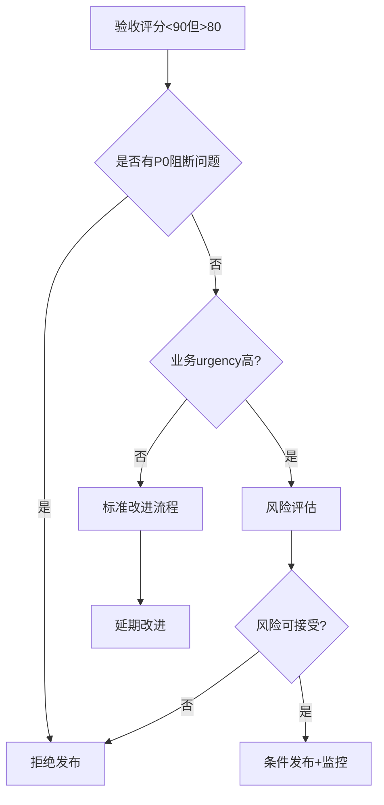

# Agent Evaluation Framework - 验收方案文档

**文档版本:** v1.0  
**创建日期:** 2025-09-11  
**QA专家:** 验收标准设计  
**适用范围:** 简化后的3层Agent评估框架

---

## 1. 验收总体策略

### 1.1 验收原则

基于架构反思报告的简化设计，本验收方案遵循以下核心原则：

- **简洁性优先**: 验证系统符合 **保持简洁清晰，如无需求勿增实体** 的核心理念
- **功能完整性**: 确保简化设计仍满足所有核心业务需求
- **系统稳定性**: 重点验证对现有ReAct架构的零风险集成
- **性能现实性**: 基于反思报告中的现实性能指标进行验收
- **可维护性**: 确保系统具备长期可维护性，避免过度工程化

### 1.2 验收范围

#### **包含范围:**
- 简化后的3层架构：Evaluation Manager、Metrics & Analysis、Enhanced Execution
- 现有SWE-Bench集成的增强功能
- 基础统计分析和规则引擎
- CLI集成和配置管理
- 性能监控和报告生成

#### **排除范围:**
- 复杂ML预测功能（已在反思中移除）
- 实时监控仪表板（简化为批量报告）
- 高级可视化组件（使用Markdown报告替代）
- 复杂的插件架构（保持内置工具为主）

### 1.3 验收成功标准

**总体成功标准:**
- 通过率要求：≥95% 的验收用例通过
- 性能达标：现实性能指标100%满足
- 稳定性保证：现有功能0回归问题
- 交付质量：代码覆盖率≥85%，文档完整性100%

---

## 2. 功能验收标准

### 2.1 Evaluation Manager 层验收标准

#### **EM-001: 评估任务调度功能**

**验收标准:**
```yaml
功能点: 评估任务调度和管理
优先级: P0 (必须通过)
验收条件:
  - 能够调度SWE-Bench评估任务
  - 支持批量任务处理（≥50个任务）
  - 任务状态正确跟踪（pending/running/completed/failed）
  - 支持任务优先级管理
  - 任务失败时能够正确重试（最多3次）
```

**测试用例:**
```go
func TestEvaluationManagerScheduling(t *testing.T) {
    manager := NewEvaluationManager()
    
    // 测试任务调度
    taskSet := loadTestTaskSet(50) // 50个测试任务
    jobID, err := manager.ScheduleEvaluation(EvaluationRequest{
        TaskSet: taskSet,
        Config:  defaultConfig,
    })
    assert.NoError(t, err)
    assert.NotEmpty(t, jobID)
    
    // 验证任务状态跟踪
    status := manager.GetJobStatus(jobID)
    assert.Equal(t, JobStatusPending, status)
}
```

#### **EM-002: 资源管理功能**

**验收标准:**
```yaml
功能点: 系统资源管理和限制
优先级: P1 (重要)
验收条件:
  - 内存使用不超过50MB per evaluation session
  - CPU使用率监控和报告
  - 并发任务数量限制（默认≤4个worker）
  - 资源不足时的优雅降级处理
  - 资源使用统计报告
```

#### **EM-003: 结果聚合功能**

**验收标准:**
```yaml
功能点: 评估结果收集和聚合
优先级: P0 (必须通过)
验收条件:
  - 正确收集所有任务的执行结果
  - 聚合统计数据（成功率、平均执行时间等）
  - 支持增量结果更新
  - 结果数据完整性验证
  - 支持历史数据查询
```

### 2.2 Metrics & Analysis 层验收标准

#### **MA-001: 核心指标收集**

**验收标准:**
```yaml
功能点: 8个核心指标的准确收集
优先级: P0 (必须通过)
指标列表:
  1. 任务执行时间 (ExecutionTime)
  2. 内存使用峰值 (MemoryPeak) 
  3. 工具调用次数 (ToolCallCount)
  4. 令牌消耗量 (TokensUsed)
  5. 缓存命中率 (CacheHitRate)
  6. 错误恢复率 (ErrorRecoveryRate)
  7. 推理质量分数 (ReasoningQualityScore)
  8. 工具使用效率 (ToolUsageEfficiency)
验收条件:
  - 每个指标数据类型正确
  - 指标值在合理范围内
  - 数据收集延迟 < 100ms
  - 指标数据完整性 ≥ 99.5%
```

**测试用例:**
```go
func TestCoreMetricsCollection(t *testing.T) {
    collector := NewMetricsCollector()
    execution := mockTaskExecution()
    
    metrics, err := collector.Collect(context.Background(), execution)
    assert.NoError(t, err)
    
    // 验证8个核心指标
    assert.Greater(t, metrics.ExecutionTime, time.Duration(0))
    assert.Greater(t, metrics.MemoryPeak, uint64(0))
    assert.GreaterOrEqual(t, metrics.ToolCallCount, 0)
    assert.GreaterOrEqual(t, metrics.TokensUsed, 0)
    assert.GreaterOrEqual(t, metrics.CacheHitRate, 0.0)
    assert.LessOrEqual(t, metrics.CacheHitRate, 1.0)
    // ... 其他指标验证
}
```

#### **MA-002: 统计分析功能**

**验收标准:**
```yaml
功能点: 基础统计分析能力
优先级: P1 (重要)
验收条件:
  - 计算平均值、中位数、标准差
  - 生成百分位数分布（P50, P75, P90, P95）
  - 检测异常值和离群点
  - 趋势分析（增长/下降/稳定）
  - 对比分析（配置间比较）
```

#### **MA-003: 规则引擎推荐**

**验收标准:**
```yaml
功能点: 基于规则的性能推荐
优先级: P1 (重要)
验收条件:
  - 至少10个内置性能规则
  - 规则触发准确率 ≥ 90%
  - 推荐内容具体可操作
  - 规则优先级排序正确
  - 支持自定义规则添加
```

**推荐规则示例:**
```go
var CorePerformanceRules = []PerformanceRule{
    {
        Name: "执行时间过长警告",
        Condition: func(m Metrics) bool { 
            return m.ExecutionTime > 180*time.Second 
        },
        Recommendation: "建议检查prompt复杂度或增加任务超时时间",
        Priority: 1,
    },
    {
        Name: "内存使用异常",
        Condition: func(m Metrics) bool { 
            return m.MemoryPeak > 500*1024*1024 // 500MB
        },
        Recommendation: "内存使用过高，建议优化数据缓存策略",
        Priority: 2,
    },
    // ... 其他规则
}
```

### 2.3 Enhanced Execution 层验收标准

#### **EE-001: 批量执行增强**

**验收标准:**
```yaml
功能点: 增强的批量执行能力
优先级: P0 (必须通过)
验收条件:
  - 兼容现有batch_runner.go功能
  - 支持可选的指标收集（feature flag控制）
  - 执行性能开销 ≤ 10%
  - 支持执行中断和恢复
  - 错误处理和重试机制完善
```

#### **EE-002: ReAct集成安全性**

**验收标准:**
```yaml
功能点: 与ReAct Agent的安全集成
优先级: P0 (必须通过)
验收条件:
  - 零侵入性集成（通过装饰器模式）
  - 可选启用/禁用评估功能
  - 现有ReAct功能完全不受影响
  - 集成后所有现有测试100%通过
  - 评估功能异常不影响主任务执行
```

**测试用例:**
```go
func TestReActIntegrationSafety(t *testing.T) {
    // 测试原始ReAct功能不受影响
    originalAgent := NewReactAgent()
    result1 := originalAgent.ProcessTask(context.Background(), testTask)
    
    // 测试集成评估功能
    enhancedAgent := NewReactAgentWithMetrics(originalAgent, true)
    result2 := enhancedAgent.ProcessTask(context.Background(), testTask)
    
    // 验证结果一致性
    assert.Equal(t, result1.Success, result2.Success)
    assert.Equal(t, result1.Output, result2.Output)
    
    // 测试评估功能可禁用
    disabledAgent := NewReactAgentWithMetrics(originalAgent, false)
    result3 := disabledAgent.ProcessTask(context.Background(), testTask)
    assert.Equal(t, result1, result3) // 完全相同
}
```

---

## 3. 技术验收标准

### 3.1 性能指标验收

#### **PERF-001: 现实性能基准**

基于架构反思报告的现实评估：

```yaml
性能指标基准:
  评估开销: ≤ 10% (相比无评估状态)
  处理吞吐量: ≥ 100 evaluations/hour
  内存使用: ≤ 50MB per evaluation session
  存储效率: ≤ 400KB per task metrics
  启动时间: ≤ 10 minutes setup time
  响应时间: 
    - 指标收集: ≤ 100ms per task
    - 统计分析: ≤ 5 seconds for 100 tasks
    - 报告生成: ≤ 30 seconds for full report
```

**性能测试用例:**
```go
func TestPerformanceBenchmarks(t *testing.T) {
    // 基准测试：无评估功能
    baseline := benchmarkWithoutEvaluation(100) // 100个任务
    
    // 测试：启用评估功能
    withEvaluation := benchmarkWithEvaluation(100)
    
    // 验证性能开销 ≤ 10%
    overhead := float64(withEvaluation-baseline) / float64(baseline)
    assert.LessOrEqual(t, overhead, 0.10)
    
    // 验证吞吐量 ≥ 100 evaluations/hour
    throughput := calculateThroughput(withEvaluation, 100)
    assert.GreaterOrEqual(t, throughput, 100.0)
}
```

#### **PERF-002: 资源使用限制**

**验收标准:**
```yaml
内存使用验收:
  - 基础内存占用: ≤ 20MB
  - 单任务指标数据: ≤ 400KB
  - 100任务批量处理: ≤ 50MB total
  - 内存泄漏: 0 detected leaks
  - GC压力: ≤ 5% CPU时间用于GC

存储使用验收:
  - 指标数据压缩率: ≥ 70%
  - 历史数据存储: 30天数据 ≤ 1GB
  - 磁盘I/O效率: ≤ 100 IOPS for normal operations
```

### 3.2 代码质量验收

#### **CODE-001: 测试覆盖率**

**验收标准:**
```yaml
测试覆盖率要求:
  - 整体覆盖率: ≥ 85%
  - 核心模块覆盖率: ≥ 90%
  - 新增代码覆盖率: ≥ 95%
  - 分支覆盖率: ≥ 80%
  - 集成测试覆盖: 100%主要用例
```

**验收命令:**
```bash
# 验收测试执行
make test-coverage
make test-functionality 
make test-integration
make test-performance

# 验收标准检查
go test -cover ./internal/evaluation/... | grep "coverage:"
golangci-lint run ./internal/evaluation/...
```

#### **CODE-002: 代码质量标准**

**验收标准:**
```yaml
代码质量指标:
  - Golangci-lint: 0 errors, 0 warnings
  - 圈复杂度: 平均 ≤ 10, 最大 ≤ 15
  - 函数长度: 平均 ≤ 50行, 最大 ≤ 100行
  - 包耦合度: 避免循环依赖
  - 命名规范: 100%符合Go命名约定
  - 文档覆盖: 100%公开API有文档
```

### 3.3 集成验收标准

#### **INTEG-001: 现有系统兼容性**

**验收标准:**
```yaml
现有功能兼容性:
  - SWE-Bench集成: 100%向后兼容
  - CLI命令: 所有现有命令正常工作
  - 配置文件: 现有配置无需修改即可工作
  - 会话管理: 评估不影响正常会话
  - 工具系统: 所有内置工具正常工作
```

**兼容性测试:**
```bash
# 验证现有功能不受影响
make dev-safe                    # 原有安全测试
make swe-bench-verified-test     # SWE-Bench原有功能
./alex run-batch --dataset.subset lite --instance-limit 5

# 验证新增功能
./alex evaluate --config enhanced --dataset swe-bench-lite
./alex compare --baseline config1 --experimental config2
```

#### **INTEG-002: CLI集成质量**

**验收标准:**
```yaml
CLI集成要求:
  - 新增命令符合现有CLI风格
  - 帮助文档完整准确
  - 错误信息清晰可操作
  - 配置验证和默认值合理
  - 与现有命令无冲突
```

---

## 4. 用户体验验收标准

### 4.1 易用性验收

#### **UX-001: 安装和配置简便性**

**验收标准:**
```yaml
安装配置体验:
  - 首次安装: ≤ 5 minutes
  - 配置设置: ≤ 10 minutes  
  - 示例运行: ≤ 2 minutes to first result
  - 文档查找: ≤ 30 seconds to find answer
  - 常见问题: 90%问题有文档解答
```

**用户体验测试用例:**
```bash
# 新用户首次体验测试
time make build                    # ≤ 2 minutes build time
time ./alex evaluate --help        # ≤ 1 second help display
time ./alex evaluate --config demo # ≤ 5 minutes demo run
```

#### **UX-002: 错误处理和恢复**

**验收标准:**
```yaml
错误处理质量:
  - 错误消息清晰度: 100%错误消息包含具体原因
  - 恢复建议: 90%错误提供明确解决建议
  - 自动恢复: 70%常见错误能自动恢复
  - 状态保持: 中断后能从checkpoint恢复
  - 调试信息: 开发者模式提供详细调试信息
```

### 4.2 配置管理验收

#### **CONFIG-001: 配置简洁性**

**验收标准:**
```yaml
配置管理要求:
  - 默认配置: 80%用例无需修改默认配置
  - 配置层次: ≤ 3层嵌套深度
  - 配置验证: 100%配置错误在启动时检测
  - 配置迁移: 自动迁移旧版本配置
  - 配置文档: 每个配置项有说明和示例
```

**配置示例验证:**
```json
{
  "evaluation": {
    "enabled": true,
    "datasets": ["swe-bench-lite"],
    "metrics": {
      "collect_quality": true,
      "collect_performance": true
    },
    "analysis": {
      "enable_recommendations": true,
      "rule_threshold": 0.8
    }
  }
}
```

---

## 5. 验收测试用例设计

### 5.1 单元测试用例

#### **核心组件单元测试:**

```go
// evaluation_manager_test.go
func TestEvaluationManagerCore(t *testing.T) {
    tests := []struct {
        name string
        setup func() *EvaluationManager
        test func(*testing.T, *EvaluationManager)
    }{
        {
            name: "任务调度正常流程",
            setup: setupDefaultManager,
            test: testTaskScheduling,
        },
        {
            name: "资源不足处理",
            setup: setupResourceLimitedManager,
            test: testResourceConstraints,
        },
        {
            name: "并发安全性",
            setup: setupConcurrentManager,
            test: testConcurrentSafety,
        },
    }
    
    for _, tt := range tests {
        t.Run(tt.name, func(t *testing.T) {
            manager := tt.setup()
            tt.test(t, manager)
        })
    }
}

// metrics_collector_test.go
func TestMetricsCollectorAccuracy(t *testing.T) {
    collector := NewMetricsCollector()
    
    // 测试数据准确性
    execution := &TaskExecution{
        Duration: 30 * time.Second,
        PeakMemory: 64 * 1024 * 1024, // 64MB
        ToolCalls: []ToolCall{{}, {}}, // 2个工具调用
        TokensUsed: 1500,
    }
    
    metrics, err := collector.Collect(context.Background(), execution)
    assert.NoError(t, err)
    
    assert.Equal(t, 30*time.Second, metrics.ExecutionTime)
    assert.Equal(t, uint64(64*1024*1024), metrics.MemoryPeak)
    assert.Equal(t, 2, metrics.ToolCallCount)
    assert.Equal(t, 1500, metrics.TokensUsed)
}
```

### 5.2 集成测试用例

#### **端到端评估流程测试:**

```go
func TestEndToEndEvaluationFlow(t *testing.T) {
    // 设置测试环境
    testDir := t.TempDir()
    config := &EvaluationConfig{
        OutputDir: testDir,
        Datasets: []string{"swe-bench-test"},
        EnableMetrics: true,
    }
    
    // 创建评估管理器
    manager := NewEvaluationManager(config)
    
    // 执行评估
    jobID, err := manager.ScheduleEvaluation(EvaluationRequest{
        TaskSet: loadTestTasks(5), // 5个测试任务
        Config: config,
    })
    assert.NoError(t, err)
    
    // 等待完成
    job := manager.WaitForCompletion(jobID, 5*time.Minute)
    assert.Equal(t, JobStatusCompleted, job.Status)
    
    // 验证结果文件
    reportPath := filepath.Join(testDir, "evaluation_report.md")
    assert.FileExists(t, reportPath)
    
    metricsPath := filepath.Join(testDir, "metrics.json")
    assert.FileExists(t, metricsPath)
    
    // 验证报告内容
    report, err := os.ReadFile(reportPath)
    assert.NoError(t, err)
    assert.Contains(t, string(report), "Evaluation Summary")
    assert.Contains(t, string(report), "Performance Metrics")
}
```

### 5.3 性能测试用例

#### **批量处理性能测试:**

```go
func BenchmarkBatchProcessing(b *testing.B) {
    sizes := []int{10, 50, 100, 500}
    
    for _, size := range sizes {
        b.Run(fmt.Sprintf("tasks_%d", size), func(b *testing.B) {
            tasks := generateTestTasks(size)
            manager := NewEvaluationManager(defaultConfig())
            
            b.ResetTimer()
            for i := 0; i < b.N; i++ {
                _, err := manager.ProcessBatch(tasks)
                assert.NoError(b, err)
            }
        })
    }
}

func TestMemoryUsageConstraints(t *testing.T) {
    // 内存使用监控
    var memStats runtime.MemStats
    runtime.GC()
    runtime.ReadMemStats(&memStats)
    startMem := memStats.Alloc
    
    // 执行100个任务的评估
    tasks := generateTestTasks(100)
    manager := NewEvaluationManager(defaultConfig())
    _, err := manager.ProcessBatch(tasks)
    assert.NoError(t, err)
    
    // 检查内存使用
    runtime.GC()
    runtime.ReadMemStats(&memStats)
    memUsage := memStats.Alloc - startMem
    
    // 验证内存使用 ≤ 50MB
    assert.LessOrEqual(t, memUsage, uint64(50*1024*1024))
}
```

### 5.4 兼容性测试用例

#### **向后兼容性测试:**

```bash
#!/bin/bash
# compatibility_test.sh

echo "=== 现有功能兼容性测试 ==="

# 1. 原有SWE-Bench功能
echo "测试原有SWE-Bench功能..."
make swe-bench-verified-test
if [ $? -ne 0 ]; then
    echo "❌ SWE-Bench兼容性测试失败"
    exit 1
fi

# 2. 原有CLI命令
echo "测试原有CLI命令..."
./alex run-batch --dataset.subset lite --instance-limit 3
if [ $? -ne 0 ]; then
    echo "❌ CLI兼容性测试失败"  
    exit 1
fi

# 3. 配置文件兼容性
echo "测试配置文件兼容性..."
cp ~/.alex-config.json ~/.alex-config.json.backup
./alex evaluate --help >/dev/null 2>&1
if [ $? -ne 0 ]; then
    echo "❌ 配置兼容性测试失败"
    exit 1
fi

# 4. 新增功能测试
echo "测试新增评估功能..."
./alex evaluate --config demo --dataset swe-bench-test
if [ $? -ne 0 ]; then
    echo "❌ 新功能测试失败"
    exit 1
fi

echo "✅ 所有兼容性测试通过"
```

---

## 6. 验收执行计划

### 6.1 验收阶段划分

#### **阶段1: 基础功能验收 (Week 7)**

**范围:** 核心3层架构基础功能
**参与者:** 开发团队 + QA工程师
**执行时间:** 3天

```yaml
验收任务:
  Day 1: 单元测试验收
    - 执行所有单元测试套件
    - 验证代码覆盖率 ≥ 85%
    - 检查性能基准测试
  
  Day 2: 集成测试验收  
    - 端到端流程测试
    - ReAct集成安全性测试
    - 兼容性测试执行
  
  Day 3: 性能验收
    - 批量处理性能测试
    - 内存使用约束测试
    - 资源管理功能测试

验收标准: 95%测试用例通过
```

#### **阶段2: 用户体验验收 (Week 8初)**

**范围:** CLI集成、配置管理、文档
**参与者:** 产品经理 + 最终用户代表
**执行时间:** 2天

```yaml
验收任务:
  Day 1: 易用性验收
    - 新用户安装体验测试
    - 配置设置复杂度验证
    - 错误处理质量检查
    
  Day 2: 文档和支持验收
    - 文档完整性检查
    - 示例代码可运行性
    - FAQ覆盖度验证

验收标准: 用户体验满意度 ≥ 8/10
```

#### **阶段3: 生产就绪验收 (Week 8末)**

**范围:** 最终质量保证和部署准备
**参与者:** 架构师 + 运维团队  
**执行时间:** 2天

```yaml
验收任务:
  Day 1: 生产环境测试
    - 大规模数据处理测试
    - 长期运行稳定性测试
    - 资源监控和告警测试
    
  Day 2: 发布准备验收
    - 发布文档完整性检查
    - 回滚计划验证
    - 监控指标配置

验收标准: 生产就绪度 100%达标
```

### 6.2 验收标准优先级

#### **P0级别 (必须通过):**
- 现有功能100%向后兼容
- 核心3层架构功能完整
- 性能指标达到现实基准
- 单元测试覆盖率 ≥ 85%
- 集成测试100%通过

#### **P1级别 (重要):**
- 统计分析功能正确
- 规则引擎推荐准确
- CLI用户体验良好
- 配置管理简洁
- 文档完整准确

#### **P2级别 (可选):**
- 高级分析功能
- 扩展配置选项
- 性能优化特性
- 额外的报告格式

### 6.3 验收失败处理流程

#### **失败分类和响应:**

```yaml
P0失败 (阻断发布):
  响应时间: 立即
  处理方式: 停止验收，优先修复
  责任人: 开发团队Lead
  修复时间: 24-48小时
  重新验收: 必须

P1失败 (延期发布):
  响应时间: 4小时内
  处理方式: 评估影响，计划修复
  责任人: 产品经理 + 开发团队
  修复时间: 2-5天
  重新验收: 部分验收

P2失败 (记录延后):
  响应时间: 下一工作日
  处理方式: 记录问题，后续迭代修复
  责任人: 产品经理
  修复时间: 下一版本
  重新验收: 可选
```

### 6.4 验收通过标准

#### **最终发布标准:**

```yaml
定量标准:
  - P0用例通过率: 100%
  - P1用例通过率: ≥ 95%
  - 性能指标达标率: 100%
  - 代码覆盖率: ≥ 85%
  - 兼容性测试: 100%通过

定性标准:
  - 架构师技术审查: 通过
  - 产品经理功能审查: 通过  
  - QA质量审查: 通过
  - 用户体验评分: ≥ 8/10

发布门槛:
  - 所有P0问题: 已修复
  - 关键P1问题: 已修复 (≥95%)
  - 发布文档: 完整
  - 回滚计划: 已测试
```

---

## 7. 质量保证措施

### 7.1 自动化测试配置

#### **持续集成流水线:**

```yaml
# .github/workflows/evaluation-framework-qa.yml
name: Evaluation Framework QA

on: [push, pull_request]

jobs:
  unit-tests:
    runs-on: ubuntu-latest
    steps:
      - uses: actions/checkout@v3
      - uses: actions/setup-go@v3
        with:
          go-version: '1.21'
      
      - name: Run Unit Tests
        run: |
          go test -v -cover ./internal/evaluation/... 
          go test -v -race ./internal/evaluation/...
      
      - name: Check Coverage
        run: |
          go test -coverprofile=coverage.out ./internal/evaluation/...
          go tool cover -func=coverage.out | grep total | awk '{print $3}' | sed 's/%//' | awk '{if ($1 < 85) exit 1}'
  
  integration-tests:
    runs-on: ubuntu-latest
    steps:
      - uses: actions/checkout@v3
      - name: Build Alex
        run: make build
      
      - name: Run Integration Tests
        run: |
          make test-functionality
          make swe-bench-verified-test
      
      - name: Test CLI Integration  
        run: |
          ./alex evaluate --help
          ./alex evaluate --config demo --dry-run
  
  performance-tests:
    runs-on: ubuntu-latest
    steps:
      - uses: actions/checkout@v3
      - name: Run Performance Tests
        run: |
          go test -bench=. -benchmem ./internal/evaluation/...
          go test -timeout=30m ./internal/evaluation/...
```

#### **预提交钩子配置:**

```bash
#!/bin/bash
# .git/hooks/pre-commit

echo "运行评估框架质量检查..."

# 1. 代码格式化检查
if ! gofmt -l internal/evaluation/ | grep -q '^$'; then
    echo "❌ 代码格式不规范，请运行: make fmt"
    exit 1
fi

# 2. 代码质量检查
if ! golangci-lint run ./internal/evaluation/...; then
    echo "❌ 代码质量检查失败"
    exit 1
fi

# 3. 单元测试
if ! go test ./internal/evaluation/...; then
    echo "❌ 单元测试失败"
    exit 1
fi

# 4. 测试覆盖率检查
coverage=$(go test -cover ./internal/evaluation/... | grep coverage: | tail -1 | awk '{print $5}' | sed 's/%//')
if (( $(echo "$coverage < 85" | bc -l) )); then
    echo "❌ 测试覆盖率不足: ${coverage}%，要求≥85%"
    exit 1
fi

echo "✅ 所有质量检查通过"
```

### 7.2 代码Review检查点

#### **Review检查清单:**

```markdown
## 代码Review检查清单

### 架构和设计 ✅❌
- [ ] 符合简化的3层架构设计
- [ ] 没有引入不必要的抽象
- [ ] 遵循"保持简洁清晰"原则
- [ ] 接口设计合理，避免过度抽象

### 功能实现 ✅❌
- [ ] 功能实现完整，符合需求
- [ ] 边界条件处理正确
- [ ] 错误处理完善
- [ ] 日志记录适度和有意义

### 性能和资源 ✅❌
- [ ] 内存使用在预期范围内
- [ ] 没有明显的性能瓶颈
- [ ] 资源及时释放，无内存泄漏
- [ ] 并发安全性考虑充分

### 测试覆盖 ✅❌
- [ ] 单元测试覆盖主要逻辑
- [ ] 测试用例考虑边界条件
- [ ] 测试数据和断言合理
- [ ] 集成测试覆盖关键路径

### 兼容性 ✅❌  
- [ ] 向后兼容现有功能
- [ ] API变更影响最小化
- [ ] 配置兼容性保持
- [ ] 部署影响评估完成

### 文档和可维护性 ✅❌
- [ ] 代码注释清晰准确
- [ ] 公共API有文档说明
- [ ] 配置项有说明示例
- [ ] 复杂逻辑有设计说明
```

### 7.3 性能监控设置

#### **性能基线建立:**

```go
// performance_baseline.go
type PerformanceBaseline struct {
    TaskProcessingRate    float64 // tasks/second
    MemoryUsagePerTask   uint64  // bytes
    CPUUsageAverage      float64 // percentage  
    ResponseTime95th     time.Duration
    ErrorRate            float64 // percentage
}

var ExpectedBaseline = PerformanceBaseline{
    TaskProcessingRate:   2.78,  // ~100 tasks/hour  
    MemoryUsagePerTask:   400 * 1024, // 400KB per task
    CPUUsageAverage:      15.0,  // 15% CPU usage
    ResponseTime95th:     30 * time.Second,
    ErrorRate:            5.0,   // 5% error tolerance
}

func (b *PerformanceBaseline) ValidateAgainst(actual PerformanceMetrics) []string {
    var violations []string
    
    if actual.TaskProcessingRate < b.TaskProcessingRate*0.9 {
        violations = append(violations, 
            fmt.Sprintf("处理速度低于基线: %.2f < %.2f", 
                actual.TaskProcessingRate, b.TaskProcessingRate*0.9))
    }
    
    if actual.MemoryUsagePerTask > b.MemoryUsagePerTask*1.2 {
        violations = append(violations,
            fmt.Sprintf("内存使用超过基线: %d > %d", 
                actual.MemoryUsagePerTask, uint64(float64(b.MemoryUsagePerTask)*1.2)))
    }
    
    return violations
}
```

### 7.4 回归测试策略

#### **回归测试套件:**

```bash
#!/bin/bash
# regression_test_suite.sh

echo "=== 评估框架回归测试套件 ==="

# 1. 基础功能回归
echo "1. 基础功能回归测试..."
./alex run-batch --dataset.subset lite --instance-limit 5
if [ $? -ne 0 ]; then
    echo "❌ 基础功能回归失败"
    exit 1
fi

# 2. 性能回归测试
echo "2. 性能回归测试..."
baseline_file="performance_baseline.json"
current_file="current_performance.json"

./alex evaluate --config perf-test --dataset swe-bench-test --output "$current_file"
python3 scripts/compare_performance.py "$baseline_file" "$current_file"
if [ $? -ne 0 ]; then
    echo "❌ 性能回归检测到"
    exit 1
fi

# 3. 兼容性回归
echo "3. 兼容性回归测试..."
for config in configs/test_*.json; do
    echo "测试配置: $config"
    ./alex evaluate --config "$config" --dry-run
    if [ $? -ne 0 ]; then
        echo "❌ 配置 $config 兼容性回归"
        exit 1
    fi
done

# 4. 数据完整性回归
echo "4. 数据完整性回归测试..."
./alex evaluate --config full-metrics --dataset swe-bench-test
python3 scripts/validate_metrics_integrity.py output/metrics.json
if [ $? -ne 0 ]; then
    echo "❌ 数据完整性回归"
    exit 1
fi

echo "✅ 所有回归测试通过"
```

---

## 8. 验收成功/失败判定标准

### 8.1 量化判定标准

#### **技术指标判定矩阵:**

| 指标类别 | 指标名称 | 目标值 | 可接受范围 | 不可接受 | 权重 |
|---------|---------|--------|------------|----------|------|
| **功能完整性** | P0用例通过率 | 100% | ≥98% | <98% | 25% |
| **性能指标** | 评估开销 | ≤10% | ≤12% | >12% | 20% |
| **兼容性** | 现有测试通过率 | 100% | ≥99% | <99% | 20% |
| **代码质量** | 测试覆盖率 | ≥85% | ≥80% | <80% | 15% |
| **用户体验** | 安装配置时间 | ≤10min | ≤15min | >15min | 10% |
| **稳定性** | 错误恢复率 | ≥70% | ≥60% | <60% | 10% |

#### **加权评分计算:**

```go
type AcceptanceCriteria struct {
    FunctionalityScore float64 // 功能完整性得分 (0-100)
    PerformanceScore   float64 // 性能指标得分 (0-100)  
    CompatibilityScore float64 // 兼容性得分 (0-100)
    QualityScore       float64 // 代码质量得分 (0-100)
    UsabilityScore     float64 // 用户体验得分 (0-100)
    StabilityScore     float64 // 稳定性得分 (0-100)
}

func (a *AcceptanceCriteria) CalculateOverallScore() float64 {
    return a.FunctionalityScore*0.25 +
           a.PerformanceScore*0.20 +
           a.CompatibilityScore*0.20 +
           a.QualityScore*0.15 +
           a.UsabilityScore*0.10 +
           a.StabilityScore*0.10
}

func (a *AcceptanceCriteria) GetAcceptanceDecision() AcceptanceDecision {
    score := a.CalculateOverallScore()
    
    switch {
    case score >= 90:
        return AcceptanceDecisionApproved
    case score >= 80:
        return AcceptanceDecisionConditionalApproval
    case score >= 70:
        return AcceptanceDecisionRequiresImprovement  
    default:
        return AcceptanceDecisionRejected
    }
}
```

### 8.2 关键决策阈值

#### **发布决策标准:**

```yaml
立即发布 (≥90分):
  - 所有P0指标在目标值范围内
  - ≥80%的P1指标在目标值范围内
  - 无阻断性问题
  - 用户体验满意度 ≥8/10

条件发布 (80-89分):
  - 所有P0指标在可接受范围内
  - ≥70%的P1指标在目标值范围内
  - 确定的改进计划和时间线
  - 风险评估和缓解措施到位

需要改进 (70-79分):
  - 关键P0指标有1-2个不达标
  - 改进工作量 ≤ 2周
  - 明确的改进计划
  - 利益相关者同意延期

拒绝发布 (<70分):
  - 多个P0指标严重不达标
  - 需要重大架构调整
  - 改进工作量 > 4周
  - 系统稳定性风险高
```

### 8.3 例外处理机制

#### **特殊情况决策流程:**



#### **例外审批流程:**

```yaml
例外情况类型:
  1. 关键业务需求驱动提前发布
  2. 外部依赖导致的指标异常
  3. 测试环境限制导致的验收偏差
  4. 新增功能对现有系统的影响评估

审批权限:
  - 技术例外: 架构师 + 技术Lead
  - 业务例外: 产品经理 + 业务负责人
  - 质量例外: QA负责人 + 技术Lead
  - 时间例外: 项目经理 + 相关负责人

例外记录:
  - 例外原因和影响分析
  - 风险评估和缓解措施  
  - 审批人员和时间
  - 后续改进计划
```

### 8.4 验收报告模板

#### **验收结果报告格式:**

```markdown
# 评估框架验收结果报告

## 验收概要
- **项目:** Agent Evaluation Framework v1.0
- **验收时间:** 2025-09-XX
- **验收负责人:** [QA负责人]
- **整体评分:** XX/100分
- **验收结论:** [通过/条件通过/不通过]

## 验收得分详情

### 功能完整性 (25分权重)
- **得分:** XX/100
- **P0用例通过率:** XX%
- **P1用例通过率:** XX%  
- **关键问题:** [列出关键功能问题]

### 性能指标 (20分权重)  
- **得分:** XX/100
- **评估开销:** XX% (目标≤10%)
- **处理吞吐量:** XX tasks/hour (目标≥100)
- **内存使用:** XX MB (目标≤50MB)
- **关键问题:** [列出性能问题]

### 兼容性 (20分权重)
- **得分:** XX/100  
- **现有测试通过率:** XX%
- **API兼容性:** [完全兼容/部分兼容/不兼容]
- **配置兼容性:** [兼容/需迁移]

### 代码质量 (15分权重)
- **得分:** XX/100
- **测试覆盖率:** XX%
- **代码规范:** [通过/不通过]
- **文档完整性:** XX%

### 用户体验 (10分权重)  
- **得分:** XX/100
- **安装时间:** XX分钟
- **学习曲线:** [容易/中等/困难]
- **错误处理:** [优秀/良好/需改进]

### 稳定性 (10分权重)
- **得分:** XX/100
- **错误恢复率:** XX%
- **长期运行稳定性:** [稳定/偶现问题/不稳定]

## 关键发现
### ✅ 通过项
- [列出主要通过的功能和指标]

### ❌ 失败项  
- [列出关键失败项和影响]

### ⚠️ 风险项
- [列出需要关注的风险点]

## 改进建议
1. [优先级P0改进项]
2. [优先级P1改进项]
3. [长期改进建议]

## 发布建议
**建议:** [立即发布/条件发布/延期发布]
**理由:** [详细说明推荐理由]
**条件:** [如果是条件发布，列出具体条件]
**风险:** [发布风险评估]

## 签署
- **QA负责人:** [签名] [日期]
- **技术负责人:** [签名] [日期]  
- **产品负责人:** [签名] [日期]
```

---

## 结论

本验收方案文档基于架构反思报告的简化设计，为Agent评估框架提供了全面、可执行的验收标准体系。该方案：

1. **对齐简化架构**: 验收标准完全基于3层简化架构，避免过度工程化验证
2. **现实性能基准**: 采用反思报告中的现实性能指标，确保可达成
3. **风险驱动**: 重点关注系统稳定性和向后兼容性验收
4. **可操作性**: 提供具体的测试用例、脚本和检查清单
5. **量化标准**: 建立明确的评分体系和决策阈值

该验收方案确保交付的系统既满足业务需求，又保持Alex项目的简洁清晰原则，为项目成功交付提供质量保障。

---

**文档状态:** 已完成  
**下一步行动:** 开发团队审查并开始验收测试用例实现  
**预期验收开始时间:** Week 7 (项目第7周)