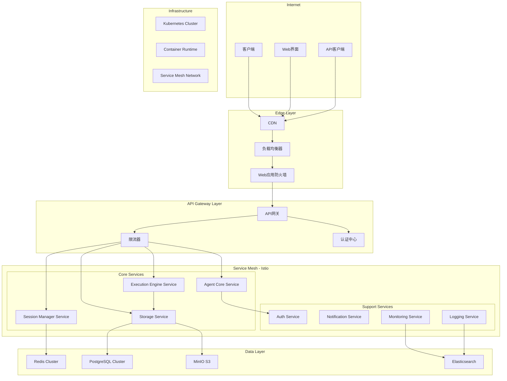

# Alex Cloud Agent - 云端智能代码助手技术架构文档

## 📋 执行摘要

### 项目概述
Alex Cloud Agent 是基于现有 Alex v1.0 的云原生升级版本，旨在提供企业级的云端代码智能服务。该方案支持大规模并发用户，提供安全的云端终端执行环境，并具备完整的多租户隔离和资源管理能力。

### 核心价值主张
- **🚀 极致性能**: <100ms API响应，<2s容器启动，支持10,000+并发会话
- **🔒 企业安全**: 零信任架构，多层隔离，完整审计链路
- **📈 弹性扩展**: Kubernetes原生，自动水平扩容，智能资源调度
- **💼 生产就绪**: 99.9% SLA，灾难恢复，全球分布式部署

### 技术栈概览
```
Frontend:    React + TypeScript + WebSocket
Gateway:     Istio Service Mesh + Envoy Proxy
Backend:     Go Microservices + gRPC + REST API
Runtime:     Kubernetes + Docker + Containerd
Storage:     Redis Cluster + PostgreSQL + MinIO S3
Monitoring:  Prometheus + Grafana + Jaeger + OpenTelemetry
```

---

## 🏗️ 系统架构总览

### 宏观架构图



### 核心设计原则

#### 1. 云原生优先 (Cloud-Native First)
```yaml
# 核心设计理念
cloud_native_principles:
  twelve_factor: true
  microservices: true
  containerized: true
  kubernetes_native: true
  service_mesh: true
  observability: true
```

#### 2. 安全内建 (Security by Design)
- **零信任网络**: 所有服务间通信都需验证
- **最小权限原则**: 每个组件仅获得必要权限
- **深度防御**: 多层安全控制和检测机制

#### 3. 性能优化 (Performance Optimized)
- **分层缓存**: 内存 → Redis → 数据库 → 对象存储
- **智能预取**: 基于用户行为的资源预加载
- **异步处理**: 事件驱动的非阻塞架构

---

## 🔧 核心组件详细设计

### 1. API网关与流量管理

#### Istio Service Mesh配置
```yaml
apiVersion: networking.istio.io/v1beta1
kind: Gateway
metadata:
  name: alex-cloud-gateway
  namespace: alex-system
spec:
  selector:
    istio: ingressgateway
  servers:
  - port:
      number: 443
      name: https
      protocol: HTTPS
    tls:
      mode: SIMPLE
      credentialName: alex-cloud-tls
    hosts:
    - "*.alex-cloud.com"
    - alex-api.example.com

---
apiVersion: networking.istio.io/v1beta1
kind: VirtualService
metadata:
  name: alex-routing
spec:
  hosts:
  - alex-api.example.com
  gateways:
  - alex-cloud-gateway
  http:
  # Agent Core API路由
  - match:
    - uri:
        prefix: "/api/v1/agent"
    route:
    - destination:
        host: alex-agent-core-service
        port:
          number: 8080
      weight: 90
    - destination:
        host: alex-agent-core-service-canary
        port:
          number: 8080
      weight: 10
    fault:
      delay:
        percentage:
          value: 0.1
        fixedDelay: 5s
    timeout: 30s
    retries:
      attempts: 3
      perTryTimeout: 10s
  
  # 终端执行API路由
  - match:
    - uri:
        prefix: "/api/v1/terminal"
    - uri:
        prefix: "/ws/v1/terminal"
    route:
    - destination:
        host: alex-execution-engine-service
        port:
          number: 9090
    websocketUpgrade: true
    timeout: 300s
  
  # 会话管理API路由
  - match:
    - uri:
        prefix: "/api/v1/sessions"
    route:
    - destination:
        host: alex-session-manager-service
        port:
          number: 8081
    corsPolicy:
      allowOrigins:
      - exact: https://alex-cloud.com
      allowMethods:
      - GET
      - POST
      - PUT
      - DELETE
      allowHeaders:
      - Authorization
      - Content-Type
```

#### 智能负载均衡策略
```yaml
apiVersion: networking.istio.io/v1beta1
kind: DestinationRule
metadata:
  name: alex-agent-core-destination
spec:
  host: alex-agent-core-service
  trafficPolicy:
    loadBalancer:
      consistentHash:
        httpHeaderName: "X-Session-ID"
    connectionPool:
      tcp:
        maxConnections: 100
      http:
        http1MaxPendingRequests: 50
        http2MaxRequests: 100
        maxRequestsPerConnection: 2
        maxRetries: 3
        idleTimeout: 30s
    circuitBreaker:
      consecutiveErrors: 5
      interval: 30s
      baseEjectionTime: 30s
      maxEjectionPercent: 50
      minHealthPercent: 30
  subsets:
  - name: v1
    labels:
      version: v1
  - name: v2
    labels:
      version: v2
```

### 2. Agent Core Service - 核心智能引擎

#### 服务架构设计
```go
// Agent Core Service 架构设计
package agent

import (
    "context"
    "sync"
    "time"
    
    "alex/internal/llm"
    "alex/internal/tools"
    "alex/internal/session"
    "alex/internal/memory"
)

// CloudAgentCore - 云端智能代理核心
type CloudAgentCore struct {
    // 核心组件
    llmClient        llm.CloudClient
    toolRegistry     *tools.DistributedRegistry
    sessionManager   *session.CloudSessionManager
    memoryEngine     *memory.DistributedMemoryEngine
    
    // 分布式协调
    etcdClient       *etcd.Client
    messageQueue     *kafka.Producer
    eventBus         *EventBus
    
    // 性能优化
    requestCache     *redis.Cache
    modelCache       *ModelCacheManager
    precomputeEngine *PrecomputeEngine
    
    // 监控和追踪
    metrics          *prometheus.Registry
    tracer           opentracing.Tracer
    logger           *zap.Logger
    
    // 并发控制
    semaphore        *semaphore.Weighted
    rateLimiter      *rate.Limiter
    circuitBreaker   *breaker.CircuitBreaker
    
    mutex            sync.RWMutex
}

// 智能任务处理引擎
type IntelligentTaskProcessor struct {
    // 任务分类器
    taskClassifier   *TaskClassifier
    
    // 执行策略选择器
    strategySelector *ExecutionStrategySelector
    
    // 上下文感知引擎
    contextEngine    *ContextAwareEngine
    
    // 结果合成器
    resultSynthesizer *ResultSynthesizer
}

// ReAct核心逻辑的云端优化版本
func (c *CloudAgentCore) ProcessTask(
    ctx context.Context,
    request *TaskRequest,
) (*TaskResponse, error) {
    // 分布式追踪
    span, ctx := opentracing.StartSpanFromContext(ctx, "process_task")
    defer span.Finish()
    
    // 1. 请求验证和预处理
    if err := c.validateRequest(request); err != nil {
        return nil, fmt.Errorf("request validation failed: %w", err)
    }
    
    // 2. 智能缓存检查
    cacheKey := c.generateCacheKey(request)
    if cached, found := c.requestCache.Get(cacheKey); found {
        c.metrics.Counter("cache_hits").Inc()
        return cached.(*TaskResponse), nil
    }
    
    // 3. 分布式会话获取/创建
    session, err := c.sessionManager.GetOrCreateSession(
        ctx, 
        request.SessionID,
        request.UserID,
    )
    if err != nil {
        return nil, fmt.Errorf("session management failed: %w", err)
    }
    
    // 4. 上下文增强
    enhancedContext, err := c.memoryEngine.EnhanceContext(
        ctx,
        request.Context,
        session.GetMemoryContext(),
    )
    if err != nil {
        return nil, fmt.Errorf("context enhancement failed: %w", err)
    }
    
    // 5. 智能任务分解
    tasks, err := c.taskProcessor.DecomposeTask(request.Task, enhancedContext)
    if err != nil {
        return nil, fmt.Errorf("task decomposition failed: %w", err)
    }
    
    // 6. 并行任务执行
    results := make(chan *SubTaskResult, len(tasks))
    errChan := make(chan error, len(tasks))
    
    for _, task := range tasks {
        go c.executeSubTask(ctx, task, results, errChan)
    }
    
    // 7. 结果收集和合成
    response, err := c.collectAndSynthesizeResults(
        ctx,
        tasks,
        results,
        errChan,
    )
    if err != nil {
        return nil, fmt.Errorf("result synthesis failed: %w", err)
    }
    
    // 8. 结果缓存
    c.requestCache.Set(cacheKey, response, 10*time.Minute)
    
    // 9. 会话状态更新
    if err := c.sessionManager.UpdateSessionState(ctx, session, response); err != nil {
        c.logger.Warn("failed to update session state", zap.Error(err))
    }
    
    return response, nil
}

// 子任务并行执行
func (c *CloudAgentCore) executeSubTask(
    ctx context.Context,
    task *SubTask,
    results chan<- *SubTaskResult,
    errChan chan<- error,
) {
    defer func() {
        if r := recover(); r != nil {
            errChan <- fmt.Errorf("subtask panic: %v", r)
        }
    }()
    
    // 限流和断路器
    if !c.circuitBreaker.Allow() {
        errChan <- fmt.Errorf("circuit breaker open for task type: %s", task.Type)
        return
    }
    
    // 获取执行信号量
    if err := c.semaphore.Acquire(ctx, 1); err != nil {
        errChan <- fmt.Errorf("failed to acquire semaphore: %w", err)
        return
    }
    defer c.semaphore.Release(1)
    
    // 执行具体任务
    result, err := c.executeTaskWithTimeout(ctx, task)
    if err != nil {
        c.circuitBreaker.Failure()
        errChan <- err
        return
    }
    
    c.circuitBreaker.Success()
    results <- result
}
```

### 3. 分布式会话管理系统

#### Redis Cluster会话存储
```go
// 分布式会话管理器
type CloudSessionManager struct {
    // Redis集群客户端
    redisCluster     *redis.ClusterClient
    
    // 会话亲和性管理
    affinityManager  *SessionAffinityManager
    
    // 会话同步机制
    syncEngine       *SessionSyncEngine
    
    // 内存压缩引擎
    compressionEngine *MemoryCompressionEngine
    
    // 分布式锁
    distributedLock   *redlock.Client
}

// 会话存储结构优化
type OptimizedSession struct {
    // 基础元数据
    ID           string                 `json:"id" redis:"id"`
    UserID       string                 `json:"user_id" redis:"user_id"`
    WorkspaceID  string                 `json:"workspace_id" redis:"workspace_id"`
    
    // 时间戳
    CreatedAt    time.Time              `json:"created_at" redis:"created_at"`
    LastAccessed time.Time              `json:"last_accessed" redis:"last_accessed"`
    TTL          time.Duration          `json:"ttl" redis:"ttl"`
    
    // 压缩后的对话历史
    CompressedMessages []byte           `json:"compressed_messages" redis:"messages"`
    MessageCount       int              `json:"message_count" redis:"msg_count"`
    
    // 上下文缓存
    ContextCache      map[string]interface{} `json:"context_cache" redis:"context"`
    
    // LLM缓存信息
    LLMCacheID        string             `json:"llm_cache_id,omitempty" redis:"llm_cache"`
    
    // 会话状态
    Status           SessionStatus       `json:"status" redis:"status"`
    ActiveTools      []string           `json:"active_tools" redis:"active_tools"`
    
    // 资源使用统计
    ResourceUsage    *ResourceUsageStats `json:"resource_usage" redis:"resources"`
}

// 智能会话生命周期管理
func (s *CloudSessionManager) ManageSessionLifecycle(ctx context.Context) error {
    ticker := time.NewTicker(30 * time.Second)
    defer ticker.Stop()
    
    for {
        select {
        case <-ctx.Done():
            return ctx.Err()
        case <-ticker.C:
            // 1. 清理过期会话
            if err := s.cleanupExpiredSessions(ctx); err != nil {
                log.Printf("Failed to cleanup expired sessions: %v", err)
            }
            
            // 2. 压缩长期会话
            if err := s.compressLongTermSessions(ctx); err != nil {
                log.Printf("Failed to compress long-term sessions: %v", err)
            }
            
            // 3. 重新平衡会话分布
            if err := s.rebalanceSessionDistribution(ctx); err != nil {
                log.Printf("Failed to rebalance sessions: %v", err)
            }
            
            // 4. 更新会话统计
            if err := s.updateSessionStatistics(ctx); err != nil {
                log.Printf("Failed to update session statistics: %v", err)
            }
        }
    }
}

// 分布式会话同步
type SessionSyncEvent struct {
    Type        string                 `json:"type"`        // CREATE, UPDATE, DELETE, HEARTBEAT
    SessionID   string                 `json:"session_id"`
    UserID      string                 `json:"user_id"`
    NodeID      string                 `json:"node_id"`
    Timestamp   time.Time             `json:"timestamp"`
    Version     int64                 `json:"version"`
    Delta       map[string]interface{} `json:"delta,omitempty"`
    Checksum    string                `json:"checksum"`
}

// 实时会话同步机制
func (s *CloudSessionManager) StartSessionSync(ctx context.Context) error {
    // Redis Streams用于实时同步
    streamName := "session-sync-stream"
    consumerGroup := fmt.Sprintf("session-sync-%s", s.nodeID)
    
    // 创建消费者组
    s.redisCluster.XGroupCreateMkStream(ctx, streamName, consumerGroup, "0")
    
    go func() {
        for {
            select {
            case <-ctx.Done():
                return
            default:
                // 读取同步事件
                streams, err := s.redisCluster.XReadGroup(ctx, &redis.XReadGroupArgs{
                    Group:    consumerGroup,
                    Consumer: s.nodeID,
                    Streams:  []string{streamName, ">"},
                    Count:    10,
                    Block:    time.Second,
                }).Result()
                
                if err != nil {
                    if err != redis.Nil {
                        log.Printf("Failed to read sync events: %v", err)
                    }
                    continue
                }
                
                // 处理同步事件
                for _, stream := range streams {
                    for _, message := range stream.Messages {
                        s.processSyncEvent(ctx, message)
                        
                        // 确认消息处理完成
                        s.redisCluster.XAck(ctx, streamName, consumerGroup, message.ID)
                    }
                }
            }
        }
    }()
    
    return nil
}
```

### 4. 云端安全终端执行引擎

#### 容器化执行环境

```go
// 云端终端执行引擎
type CloudTerminalExecutor struct {
    // Kubernetes客户端
    k8sClient       kubernetes.Interface
    
    // 容器运行时接口
    containerRuntime runtime.RuntimeService
    
    // 安全策略引擎
    securityEngine   *SecurityPolicyEngine
    
    // 资源调度器
    resourceScheduler *ResourceScheduler
    
    // WebSocket连接池
    wsConnectionPool *WebSocketPool
    
    // TTY管理器
    ttyManager      *DistributedTTYManager
    
    // 审计日志
    auditLogger     *AuditLogger
}

// 安全执行容器配置
type SecureExecutionContainer struct {
    // 基础配置
    UserID          string            `json:"user_id"`
    SessionID       string            `json:"session_id"`
    WorkspaceID     string            `json:"workspace_id"`
    
    // 安全配置
    SecurityContext *SecurityContext  `json:"security_context"`
    NetworkPolicy   *NetworkPolicy    `json:"network_policy"`
    ResourceLimits  *ResourceLimits   `json:"resource_limits"`
    
    // 存储配置
    VolumeMount     []VolumeMount     `json:"volume_mounts"`
    
    // 环境配置
    Environment     map[string]string `json:"environment"`
    
    // 生命周期配置
    TTL             time.Duration     `json:"ttl"`
    IdleTimeout     time.Duration     `json:"idle_timeout"`
}

// Kubernetes Pod模板
func (e *CloudTerminalExecutor) generateSecurePodTemplate(
    config *SecureExecutionContainer,
) *corev1.Pod {
    return &corev1.Pod{
        ObjectMeta: metav1.ObjectMeta{
            Name: fmt.Sprintf("alex-exec-%s-%s", 
                config.UserID[:8], 
                config.SessionID[:8]),
            Namespace: "alex-execution",
            Labels: map[string]string{
                "app":         "alex-executor",
                "user-id":     config.UserID,
                "session-id":  config.SessionID,
                "workspace-id": config.WorkspaceID,
            },
            Annotations: map[string]string{
                "container.apparmor.security.beta.kubernetes.io/executor": 
                    "localhost/alex-executor-profile",
                "seccomp.security.alpha.kubernetes.io/pod": 
                    "localhost/alex-seccomp-profile.json",
            },
        },
        Spec: corev1.PodSpec{
            // 安全上下文
            SecurityContext: &corev1.PodSecurityContext{
                RunAsNonRoot:       &[]bool{true}[0],
                RunAsUser:          &[]int64{1000}[0],
                RunAsGroup:         &[]int64{1000}[0],
                FSGroup:            &[]int64{1000}[0],
                FSGroupChangePolicy: &[]corev1.PodFSGroupChangePolicy{
                    corev1.FSGroupChangeAlways,
                }[0],
                SELinuxOptions: &corev1.SELinuxOptions{
                    Level: "s0:c123,c456",
                },
            },
            
            // 容器定义
            Containers: []corev1.Container{{
                Name:  "executor",
                Image: "alex/secure-executor:v1.0",
                
                // 安全上下文
                SecurityContext: &corev1.SecurityContext{
                    AllowPrivilegeEscalation: &[]bool{false}[0],
                    ReadOnlyRootFilesystem:   &[]bool{true}[0],
                    RunAsNonRoot:            &[]bool{true}[0],
                    Capabilities: &corev1.Capabilities{
                        Drop: []corev1.Capability{"ALL"},
                        Add:  []corev1.Capability{"NET_BIND_SERVICE"},
                    },
                },
                
                // 资源限制
                Resources: corev1.ResourceRequirements{
                    Limits: corev1.ResourceList{
                        corev1.ResourceCPU:              resource.MustParse("500m"),
                        corev1.ResourceMemory:           resource.MustParse("512Mi"),
                        corev1.ResourceEphemeralStorage: resource.MustParse("1Gi"),
                    },
                    Requests: corev1.ResourceList{
                        corev1.ResourceCPU:    resource.MustParse("250m"),
                        corev1.ResourceMemory: resource.MustParse("256Mi"),
                    },
                },
                
                // 环境变量
                Env: []corev1.EnvVar{
                    {Name: "USER_ID", Value: config.UserID},
                    {Name: "SESSION_ID", Value: config.SessionID},
                    {Name: "WORKSPACE_ID", Value: config.WorkspaceID},
                },
                
                // 存储卷挂载
                VolumeMounts: []corev1.VolumeMount{
                    {
                        Name:      "workspace",
                        MountPath: "/workspace",
                        ReadOnly:  false,
                    },
                    {
                        Name:      "tmp",
                        MountPath: "/tmp",
                    },
                    {
                        Name:      "dev-shm",
                        MountPath: "/dev/shm",
                    },
                },
                
                // 就绪和存活探针
                ReadinessProbe: &corev1.Probe{
                    ProbeHandler: corev1.ProbeHandler{
                        HTTPGet: &corev1.HTTPGetAction{
                            Path: "/health",
                            Port: intstr.FromInt(8080),
                        },
                    },
                    InitialDelaySeconds: 5,
                    PeriodSeconds:      10,
                },
                LivenessProbe: &corev1.Probe{
                    ProbeHandler: corev1.ProbeHandler{
                        HTTPGet: &corev1.HTTPGetAction{
                            Path: "/health",
                            Port: intstr.FromInt(8080),
                        },
                    },
                    InitialDelaySeconds: 15,
                    PeriodSeconds:      20,
                },
            }},
            
            // 存储卷
            Volumes: []corev1.Volume{
                {
                    Name: "workspace",
                    VolumeSource: corev1.VolumeSource{
                        PersistentVolumeClaim: &corev1.PersistentVolumeClaimVolumeSource{
                            ClaimName: fmt.Sprintf("workspace-%s", config.WorkspaceID),
                        },
                    },
                },
                {
                    Name: "tmp",
                    VolumeSource: corev1.VolumeSource{
                        EmptyDir: &corev1.EmptyDirVolumeSource{
                            SizeLimit: &resource.Quantity{},
                        },
                    },
                },
                {
                    Name: "dev-shm",
                    VolumeSource: corev1.VolumeSource{
                        EmptyDir: &corev1.EmptyDirVolumeSource{
                            Medium: corev1.StorageMediumMemory,
                        },
                    },
                },
            },
            
            // 调度配置
            NodeSelector: map[string]string{
                "alex.io/node-type": "execution",
            },
            Tolerations: []corev1.Toleration{{
                Key:      "alex.io/execution-node",
                Operator: corev1.TolerationOpEqual,
                Value:    "true",
                Effect:   corev1.TaintEffectNoSchedule,
            }},
            
            // 生命周期配置
            RestartPolicy:                 corev1.RestartPolicyAlways,
            TerminationGracePeriodSeconds: &[]int64{30}[0],
            ActiveDeadlineSeconds:         &[]int64{int64(config.TTL.Seconds())}[0],
        },
    }
}

// WebSocket终端连接处理
func (e *CloudTerminalExecutor) HandleWebSocketTerminal(
    w http.ResponseWriter,
    r *http.Request,
) {
    // WebSocket升级
    conn, err := e.wsConnectionPool.Upgrade(w, r)
    if err != nil {
        http.Error(w, "WebSocket upgrade failed", http.StatusBadRequest)
        return
    }
    defer conn.Close()
    
    // 提取会话信息
    sessionID := r.Header.Get("X-Session-ID")
    userID := r.Header.Get("X-User-ID")
    
    // 获取或创建执行容器
    container, err := e.getOrCreateExecutionContainer(sessionID, userID)
    if err != nil {
        e.sendErrorMessage(conn, fmt.Sprintf("Failed to create container: %v", err))
        return
    }
    
    // 创建TTY会话
    ttySession, err := e.ttyManager.CreateTTYSession(container, conn)
    if err != nil {
        e.sendErrorMessage(conn, fmt.Sprintf("Failed to create TTY: %v", err))
        return
    }
    defer ttySession.Close()
    
    // 处理WebSocket消息
    e.handleWebSocketMessages(ttySession, conn)
}
```


---

## 🔒 安全架构框架

### 1. 零信任安全模型

#### 身份认证与授权
```go
// 多层认证系统
type MultiLayerAuthSystem struct {
    // JWT Token管理
    jwtManager      *JWTManager
    
    // OAuth2.0集成
    oauth2Provider  *OAuth2Provider
    
    // API密钥管理
    apiKeyManager   *APIKeyManager
    
    // 权限引擎
    permissionEngine *PermissionEngine
    
    // 审计系统
    auditSystem     *AuditSystem
}

// 动态权限验证
type DynamicPermissionValidator struct {
    // 基于属性的访问控制 (ABAC)
    abacEngine      *ABACEngine
    
    // 基于角色的访问控制 (RBAC) 
    rbacEngine      *RBACEngine
    
    // 上下文感知权限
    contextEngine   *ContextAwarePermission
    
    // 风险评估引擎
    riskEngine      *RiskAssessmentEngine
}

// 权限验证中间件
func (a *MultiLayerAuthSystem) AuthMiddleware() gin.HandlerFunc {
    return func(c *gin.Context) {
        // 1. Token验证
        token, err := a.extractAndValidateToken(c)
        if err != nil {
            c.JSON(401, gin.H{"error": "Invalid token"})
            c.Abort()
            return
        }
        
        // 2. 用户权限检查
        user, err := a.getUserFromToken(token)
        if err != nil {
            c.JSON(401, gin.H{"error": "User validation failed"})
            c.Abort()
            return
        }
        
        // 3. 动态权限验证
        resource := c.Request.URL.Path
        action := c.Request.Method
        context := map[string]interface{}{
            "ip":        c.ClientIP(),
            "user_agent": c.Request.UserAgent(),
            "timestamp": time.Now(),
        }
        
        allowed, err := a.validatePermission(user.ID, action, resource, context)
        if err != nil || !allowed {
            c.JSON(403, gin.H{"error": "Permission denied"})
            c.Abort()
            return
        }
        
        // 4. 审计日志
        a.auditSystem.LogAccess(user.ID, action, resource, "ALLOWED")
        
        c.Set("user", user)
        c.Next()
    }
}
```

### 2. 网络安全隔离

#### Kubernetes网络策略

```yaml
# 网络隔离策略
apiVersion: networking.k8s.io/v1
kind: NetworkPolicy
metadata:
  name: alex-execution-isolation
  namespace: alex-execution
spec:
  podSelector:
    matchLabels:
      app: alex-executor
  policyTypes:
  - Ingress
  - Egress
  ingress:
  # 只允许来自API网关的连接
  - from:
    - namespaceSelector:
        matchLabels:
          name: alex-system
    - podSelector:
        matchLabels:
          app: alex-api-gateway
    ports:
    - protocol: TCP
      port: 8080
  egress:
  # 限制出站连接
  - to:
    - namespaceSelector:
        matchLabels:
          name: alex-system
    - podSelector:
        matchLabels:
          app: alex-session-manager
    ports:
    - protocol: TCP
      port: 6379  # Redis
  - to:
    - namespaceSelector:
        matchLabels:
          name: alex-storage
    ports:
    - protocol: TCP
      port: 5432  # PostgreSQL
  # DNS解析
  - to: []
    ports:
    - protocol: UDP
      port: 53

---
# 执行节点隔离
apiVersion: networking.k8s.io/v1
kind: NetworkPolicy
metadata:
  name: alex-execution-node-isolation
spec:
  podSelector:
    matchLabels:
      alex.io/node-type: execution
  policyTypes:
  - Ingress
  - Egress
  ingress:
  # 禁止跨用户容器通信
  - from:
    - podSelector:
        matchLabels:
          app: alex-executor
        matchExpressions:
        - key: user-id
          operator: In
          values: ["{{.CurrentUserID}}"]  # 动态替换
  egress:
  # 严格限制外部网络访问
  - to:
    - ipBlock:
        cidr: 10.0.0.0/8  # 内部网络
        except:
        - 10.0.1.0/24     # 排除敏感网段
```


### 3. 数据加密与隐私保护

#### 端到端加密方案
```go
// 数据加密引擎
type DataEncryptionEngine struct {
    // 密钥管理服务 (KMS)
    kmsClient       *kms.Client
    
    // 对称加密 (AES-256-GCM)
    symmetricCrypto *SymmetricCrypto
    
    // 非对称加密 (RSA-4096)
    asymmetricCrypto *AsymmetricCrypto
    
    // 密钥轮换调度
    keyRotationScheduler *KeyRotationScheduler
}

// 敏感数据加密
type SensitiveDataProtection struct {
    // 字段级加密
    fieldEncryption  *FieldLevelEncryption
    
    // 数据脱敏
    dataMasking      *DataMaskingEngine
    
    // 访问审计
    accessAuditing   *AccessAuditEngine
}

// 会话数据加密存储
func (e *DataEncryptionEngine) EncryptSessionData(
    sessionID string,
    data []byte,
) (*EncryptedData, error) {
    // 1. 生成会话密钥
    sessionKey, err := e.generateSessionKey(sessionID)
    if err != nil {
        return nil, fmt.Errorf("failed to generate session key: %w", err)
    }
    
    // 2. 数据加密
    encryptedData, err := e.symmetricCrypto.Encrypt(data, sessionKey)
    if err != nil {
        return nil, fmt.Errorf("failed to encrypt data: %w", err)
    }
    
    // 3. 生成数据完整性校验
    checksum := e.calculateChecksum(encryptedData)
    
    return &EncryptedData{
        Data:         encryptedData,
        KeyID:        sessionKey.ID,
        Algorithm:    "AES-256-GCM",
        Checksum:     checksum,
        EncryptedAt:  time.Now(),
    }, nil
}

// 密钥轮换策略
func (e *DataEncryptionEngine) RotateKeys() error {
    ticker := time.NewTicker(24 * time.Hour)
    defer ticker.Stop()
    
    for range ticker.C {
        // 1. 识别需要轮换的密钥
        keysToRotate, err := e.identifyKeysForRotation()
        if err != nil {
            return fmt.Errorf("failed to identify keys for rotation: %w", err)
        }
        
        // 2. 执行密钥轮换
        for _, keyID := range keysToRotate {
            if err := e.rotateKey(keyID); err != nil {
                log.Printf("Failed to rotate key %s: %v", keyID, err)
                continue
            }
        }
        
        // 3. 清理旧密钥
        if err := e.cleanupExpiredKeys(); err != nil {
            log.Printf("Failed to cleanup expired keys: %v", err)
        }
    }
    return nil
}
```

---

## 📊 性能优化与扩展性

### 1. 智能缓存策略

#### 分层缓存架构
```go
// 四层缓存架构
type LayeredCacheSystem struct {
    // L1: 进程内缓存 (1-5ms)
    l1Cache         *fastcache.Cache
    
    // L2: Redis集群缓存 (5-20ms) 
    l2Cache         *redis.ClusterClient
    
    // L3: 分布式缓存 (20-100ms)
    l3Cache         *bigcache.BigCache
    
    // L4: 持久化缓存 (100-500ms)
    l4Cache         *badger.DB
    
    // 缓存策略引擎
    strategyEngine  *CacheStrategyEngine
    
    // 预取引擎
    prefetchEngine  *PrefetchEngine
}

// 智能缓存键生成
func (c *LayeredCacheSystem) GenerateCacheKey(
    userID, sessionID, requestType string,
    params map[string]interface{},
) string {
    // 生成语义化缓存键
    hasher := sha256.New()
    hasher.Write([]byte(userID))
    hasher.Write([]byte(sessionID))
    hasher.Write([]byte(requestType))
    
    // 参数排序确保一致性
    keys := make([]string, 0, len(params))
    for k := range params {
        keys = append(keys, k)
    }
    sort.Strings(keys)
    
    for _, k := range keys {
        hasher.Write([]byte(k))
        hasher.Write([]byte(fmt.Sprintf("%v", params[k])))
    }
    
    hash := hex.EncodeToString(hasher.Sum(nil))
    return fmt.Sprintf("alex:cache:%s:%s:%s", requestType, userID[:8], hash[:16])
}

// 缓存预热策略
type CacheWarmupStrategy struct {
    // 用户行为预测
    behaviorPredictor *BehaviorPredictor
    
    // 热点数据识别
    hotspotDetector   *HotspotDetector
    
    // 预取调度器
    prefetchScheduler *PrefetchScheduler
}

// 智能预取算法
func (s *CacheWarmupStrategy) ExecuteIntelligentPrefetch(
    userID string,
) error {
    // 1. 分析用户历史行为
    userBehavior, err := s.behaviorPredictor.AnalyzeUserBehavior(userID)
    if err != nil {
        return fmt.Errorf("failed to analyze user behavior: %w", err)
    }
    
    // 2. 预测可能的请求
    predictedRequests := s.behaviorPredictor.PredictNextRequests(
        userBehavior,
        5, // 预测5个最可能的请求
    )
    
    // 3. 异步预取数据
    for _, request := range predictedRequests {
        go func(req *PredictedRequest) {
            if err := s.prefetchData(userID, req); err != nil {
                log.Printf("Prefetch failed for user %s: %v", userID, err)
            }
        }(request)
    }
    
    return nil
}
```

### 2. 弹性扩缩容策略

#### HPA & VPA配置
```yaml
# 水平自动扩缩容 (HPA)
apiVersion: autoscaling/v2
kind: HorizontalPodAutoscaler
metadata:
  name: alex-agent-core-hpa
  namespace: alex-system
spec:
  scaleTargetRef:
    apiVersion: apps/v1
    kind: Deployment
    name: alex-agent-core
  minReplicas: 3
  maxReplicas: 100
  metrics:
  # CPU利用率
  - type: Resource
    resource:
      name: cpu
      target:
        type: Utilization
        averageUtilization: 70
  # 内存利用率
  - type: Resource
    resource:
      name: memory
      target:
        type: Utilization
        averageUtilization: 80
  # 自定义指标 - 并发会话数
  - type: Pods
    pods:
      metric:
        name: alex_active_sessions_per_pod
      target:
        type: AverageValue
        averageValue: "50"
  # 外部指标 - 请求队列长度
  - type: External
    external:
      metric:
        name: alex_request_queue_length
      target:
        type: Value
        value: "100"
  behavior:
    scaleUp:
      stabilizationWindowSeconds: 60
      policies:
      - type: Percent
        value: 100
        periodSeconds: 15
      - type: Pods
        value: 2
        periodSeconds: 60
    scaleDown:
      stabilizationWindowSeconds: 300
      policies:
      - type: Percent
        value: 50
        periodSeconds: 60

---
# 垂直自动扩缩容 (VPA)
apiVersion: autoscaling.k8s.io/v1
kind: VerticalPodAutoscaler
metadata:
  name: alex-execution-engine-vpa
spec:
  targetRef:
    apiVersion: apps/v1
    kind: Deployment
    name: alex-execution-engine
  updatePolicy:
    updateMode: "Auto"
  resourcePolicy:
    containerPolicies:
    - containerName: executor
      maxAllowed:
        cpu: 2
        memory: 4Gi
      minAllowed:
        cpu: 250m
        memory: 256Mi
      controlledResources: ["cpu", "memory"]
```

### 3. 数据库优化策略

#### PostgreSQL集群配置
```yaml
# PostgreSQL主从集群
apiVersion: postgresql.cnpg.io/v1
kind: Cluster
metadata:
  name: alex-postgres-cluster
  namespace: alex-storage
spec:
  instances: 3
  
  postgresql:
    parameters:
      # 性能优化
      shared_preload_libraries: "pg_stat_statements"
      max_connections: "200"
      shared_buffers: "256MB"
      effective_cache_size: "1GB"
      maintenance_work_mem: "64MB"
      checkpoint_completion_target: "0.9"
      wal_buffers: "16MB"
      default_statistics_target: "100"
      random_page_cost: "1.1"
      effective_io_concurrency: "200"
      work_mem: "4MB"
      min_wal_size: "1GB"
      max_wal_size: "4GB"
      
      # 连接池配置
      max_prepared_transactions: "0"
      
      # 日志配置
      log_statement: "mod"
      log_min_duration_statement: "1000"
      log_line_prefix: "%m [%p] %q%u@%d "
      
      # 复制配置
      wal_level: "replica"
      max_wal_senders: "10"
      max_replication_slots: "10"
      hot_standby: "on"
      
  # 存储配置
  storage:
    size: 100Gi
    storageClass: fast-ssd
    
  # 监控配置
  monitoring:
    enabled: true
    prometheusRule:
      enabled: true
      
  # 备份配置
  backup:
    barmanObjectStore:
      destinationPath: "s3://alex-postgres-backup"
      s3Credentials:
        accessKeyId:
          name: backup-credentials
          key: ACCESS_KEY_ID
        secretAccessKey:
          name: backup-credentials
          key: SECRET_ACCESS_KEY
      wal:
        retention: "7d"
      data:
        retention: "30d"
```

---

## 🚀 部署策略与运维

### 1. 多环境部署策略

#### GitOps部署流水线
```yaml
# ArgoCD应用配置
apiVersion: argoproj.io/v1alpha1
kind: Application
metadata:
  name: alex-cloud-agent
  namespace: argocd
spec:
  project: alex-project
  
  source:
    repoURL: https://github.com/alex-cloud/deployment
    targetRevision: HEAD
    path: k8s/overlays/production
    
  destination:
    server: https://kubernetes.default.svc
    namespace: alex-system
    
  syncPolicy:
    automated:
      prune: true
      selfHeal: true
    syncOptions:
    - CreateNamespace=true
    - PruneLast=true
    
  # 健康检查
  ignoreDifferences:
  - group: apps
    kind: Deployment
    jsonPointers:
    - /spec/replicas
    
---
# 蓝绿部署策略
apiVersion: argoproj.io/v1alpha1
kind: Rollout
metadata:
  name: alex-agent-core-rollout
spec:
  replicas: 10
  strategy:
    blueGreen:
      activeService: alex-agent-core-active
      previewService: alex-agent-core-preview
      autoPromotionEnabled: false
      scaleDownDelaySeconds: 30
      prePromotionAnalysis:
        templates:
        - templateName: success-rate
        args:
        - name: service-name
          value: alex-agent-core-preview
      postPromotionAnalysis:
        templates:
        - templateName: success-rate
        args:
        - name: service-name
          value: alex-agent-core-active
      promotion:
        autoPromotionEnabled: true
        analysis:
          threshold: 5
          interval: 30
          successCondition: result[0] >= 0.95
  selector:
    matchLabels:
      app: alex-agent-core
  template:
    metadata:
      labels:
        app: alex-agent-core
    spec:
      containers:
      - name: alex-agent-core
        image: alex/agent-core:v1.0
        ports:
        - containerPort: 8080
```

### 2. 监控与可观测性

#### Prometheus监控配置

```yaml
# Prometheus监控规则
apiVersion: monitoring.coreos.com/v1
kind: PrometheusRule
metadata:
  name: alex-monitoring-rules
  namespace: alex-system
spec:
  groups:
  - name: alex.agent.rules
    rules:
    # 响应时间告警
    - alert: HighResponseTime
      expr: histogram_quantile(0.95, alex_http_request_duration_seconds) > 1
      for: 5m
      labels:
        severity: warning
      annotations:
        summary: "Alex Agent响应时间过高"
        description: "95%分位响应时间超过1秒，当前值: {{ $value }}"
        
    # 错误率告警
    - alert: HighErrorRate
      expr: rate(alex_http_requests_total{status=~"5.."}[5m]) > 0.1
      for: 2m
      labels:
        severity: critical
      annotations:
        summary: "Alex Agent错误率过高"
        description: "5分钟内错误率超过10%，当前值: {{ $value }}"
        
    # 活跃会话数告警
    - alert: HighActiveSessions
      expr: alex_active_sessions_total > 5000
      for: 5m
      labels:
        severity: warning
      annotations:
        summary: "活跃会话数过高"
        description: "活跃会话数超过5000，当前值: {{ $value }}"
        
    # 内存使用告警
    - alert: HighMemoryUsage
      expr: (container_memory_usage_bytes{pod=~"alex-.*"} / container_spec_memory_limit_bytes) > 0.9
      for: 10m
      labels:
        severity: critical
      annotations:
        summary: "容器内存使用率过高"
        description: "Pod {{ $labels.pod }} 内存使用率超过90%"

---
# Grafana仪表板配置
apiVersion: v1
kind: ConfigMap
metadata:
  name: alex-grafana-dashboard
data:
  alex-overview.json: |
    {
      "dashboard": {
        "title": "Alex Cloud Agent Overview",
        "tags": ["alex", "agent", "overview"],
        "time": {
          "from": "now-1h",
          "to": "now"
        },
        "panels": [
          {
            "title": "请求吞吐量",
            "type": "graph",
            "targets": [
              {
                "expr": "sum(rate(alex_http_requests_total[5m])) by (service)",
                "legendFormat": "{{service}}"
              }
            ],
            "yAxes": [{
              "label": "请求/秒"
            }]
          },
          {
            "title": "响应时间分布",
            "type": "heatmap",
            "targets": [
              {
                "expr": "histogram_quantile(0.50, alex_http_request_duration_seconds)",
                "legendFormat": "50th percentile"
              },
              {
                "expr": "histogram_quantile(0.95, alex_http_request_duration_seconds)",
                "legendFormat": "95th percentile"
              },
              {
                "expr": "histogram_quantile(0.99, alex_http_request_duration_seconds)", 
                "legendFormat": "99th percentile"
              }
            ]
          },
          {
            "title": "活跃会话数",
            "type": "stat",
            "targets": [
              {
                "expr": "alex_active_sessions_total",
                "legendFormat": "活跃会话"
              }
            ]
          },
          {
            "title": "LLM API调用",
            "type": "graph", 
            "targets": [
              {
                "expr": "sum(rate(alex_llm_requests_total[5m])) by (model)",
                "legendFormat": "{{model}}"
              }
            ]
          }
        ]
      }
    }
```


### 3. 灾难恢复与高可用

#### 多地域灾备策略
```go
// 灾难恢复管理器
type DisasterRecoveryManager struct {
    // 多地域集群管理
    clusterManager      *MultiRegionClusterManager
    
    // 数据同步引擎  
    dataSyncEngine      *CrossRegionDataSync
    
    // 故障检测器
    failureDetector     *FailureDetector
    
    // 自动切换引擎
    failoverEngine      *AutoFailoverEngine
    
    // 数据一致性检查
    consistencyChecker  *DataConsistencyChecker
}

// 自动故障转移
type AutoFailoverConfig struct {
    // 健康检查配置
    HealthCheckInterval  time.Duration `json:"health_check_interval"`
    FailureThreshold    int           `json:"failure_threshold"`
    RecoveryThreshold   int           `json:"recovery_threshold"`
    
    // 切换策略
    FailoverStrategy    string        `json:"failover_strategy"` // immediate, gradual
    MaxFailoverTime     time.Duration `json:"max_failover_time"`
    
    // 数据一致性
    DataConsistencyMode string        `json:"data_consistency_mode"` // strong, eventual
    SyncTimeout         time.Duration `json:"sync_timeout"`
}

// 执行故障转移
func (dr *DisasterRecoveryManager) ExecuteFailover(
    ctx context.Context,
    failedRegion string,
    targetRegion string,
) error {
    log.Printf("Starting failover from %s to %s", failedRegion, targetRegion)
    
    // 1. 停止流量路由到失败地域
    if err := dr.stopTrafficToRegion(failedRegion); err != nil {
        return fmt.Errorf("failed to stop traffic: %w", err)
    }
    
    // 2. 验证目标地域可用性
    if err := dr.validateTargetRegion(targetRegion); err != nil {
        return fmt.Errorf("target region validation failed: %w", err)
    }
    
    // 3. 数据同步检查
    syncStatus, err := dr.checkDataSyncStatus(failedRegion, targetRegion)
    if err != nil {
        return fmt.Errorf("data sync check failed: %w", err)
    }
    
    if syncStatus.Lag > 5*time.Minute {
        log.Warnf("Data lag detected: %v", syncStatus.Lag)
        // 可选择是否继续切换
    }
    
    // 4. 扩容目标地域
    if err := dr.scaleUpTargetRegion(targetRegion); err != nil {
        return fmt.Errorf("failed to scale up target region: %w", err)
    }
    
    // 5. 重新路由流量
    if err := dr.rerouteTraffic(targetRegion); err != nil {
        return fmt.Errorf("traffic rerouting failed: %w", err)
    }
    
    // 6. 验证切换成功
    if err := dr.validateFailoverSuccess(targetRegion); err != nil {
        log.Errorf("Failover validation failed: %v", err)
        // 尝试回滚
        dr.rollbackFailover(failedRegion, targetRegion)
        return err
    }
    
    log.Printf("Failover completed successfully to region %s", targetRegion)
    return nil
}
```

---

## 📈 性能基准与SLA定义

### 关键性能指标 (KPIs)

| 指标类别 | 指标名称 | 目标值 | SLA等级 |
|----------|----------|--------|---------|
| **响应性能** | API响应时间 | P95 < 100ms | Gold |
| | Terminal启动时间 | < 2s | Gold |
| | WebSocket延迟 | < 50ms | Gold |
| **可用性** | 服务可用率 | 99.9% | Platinum |
| | 数据持久性 | 99.999% | Platinum |
| | 故障恢复时间 | < 5min | Gold |
| **扩展性** | 最大并发会话 | 10,000+ | Gold |
| | 水平扩展能力 | 0-100实例/10min | Gold |
| | 存储扩展性 | PB级 | Silver |
| **安全性** | 威胁检测时间 | < 1min | Gold |
| | 数据加密覆盖率 | 100% | Platinum |
| | 审计日志完整性 | 100% | Platinum |

### 容量规划模型

```go
// 容量规划引擎
type CapacityPlanningEngine struct {
    // 历史数据分析
    historicalAnalyzer  *HistoricalDataAnalyzer
    
    // 负载预测模型
    loadPredictor      *MLLoadPredictor
    
    // 资源优化器
    resourceOptimizer  *ResourceOptimizer
    
    // 成本分析器
    costAnalyzer       *CostAnalyzer
}

// 容量预测
type CapacityForecast struct {
    TimeRange       TimeRange              `json:"time_range"`
    
    // 预测指标
    PredictedLoad   *LoadForecast         `json:"predicted_load"`
    ResourceNeeds   *ResourceRequirement   `json:"resource_needs"`
    CostEstimate    *CostEstimate         `json:"cost_estimate"`
    
    // 建议
    Recommendations []Recommendation      `json:"recommendations"`
    
    // 风险评估
    RiskAssessment  *RiskAssessment       `json:"risk_assessment"`
}

// 自动容量调整
func (cp *CapacityPlanningEngine) AutoCapacityAdjustment(
    ctx context.Context,
) error {
    ticker := time.NewTicker(1 * time.Hour)
    defer ticker.Stop()
    
    for {
        select {
        case <-ctx.Done():
            return ctx.Err()
        case <-ticker.C:
            // 1. 分析当前负载趋势
            currentLoad := cp.analyzeCurrentLoad()
            
            // 2. 预测未来2小时负载
            forecast, err := cp.loadPredictor.PredictLoad(
                time.Now(),
                2*time.Hour,
            )
            if err != nil {
                log.Printf("Load prediction failed: %v", err)
                continue
            }
            
            // 3. 计算所需资源
            requiredResources := cp.calculateRequiredResources(forecast)
            currentResources := cp.getCurrentResources()
            
            // 4. 执行资源调整
            if requiredResources.Exceeds(currentResources, 0.2) {
                // 需要扩容
                cp.scaleUpResources(requiredResources)
            } else if currentResources.Exceeds(requiredResources, 0.5) {
                // 可以缩容
                cp.scaleDownResources(requiredResources)
            }
        }
    }
}
```

---

## 🛣️ 实施路线图

### 第一阶段：MVP部署 (1-2个月)

#### 核心功能交付
```yaml
phase_1_deliverables:
  core_services:
    - Agent Core Service (基础ReAct功能)
    - Session Manager Service (Redis存储)
    - Execution Engine Service (Docker容器)
    - Storage Service (PostgreSQL + MinIO)
    
  infrastructure:
    - Single-region Kubernetes集群
    - Istio Service Mesh基础配置
    - Prometheus + Grafana监控
    
  capacity:
    - 支持100并发用户
    - 基础安全控制
    - 简单WebUI
    
  timeline: 8周
  team_size: 6人 (2 Backend + 2 DevOps + 1 Frontend + 1 QA)
```

### 第二阶段：生产就绪 (3-4个月)

#### 企业级特性
```yaml
phase_2_deliverables:
  security:
    - 完整认证授权系统
    - 网络安全隔离  
    - 数据加密传输和存储
    - 审计日志系统
    
  reliability:
    - 多地域部署
    - 自动故障转移
    - 数据备份恢复
    - SLA监控告警
    
  performance:
    - 智能缓存系统
    - 弹性自动扩缩容
    - 负载均衡优化
    
  capacity:
    - 支持1,000并发用户
    - 99.9%可用性保证
    - 完整运维工具链
    
  timeline: 8周  
  team_size: 8人 (3 Backend + 3 DevOps + 1 Frontend + 1 Security)
```

### 第三阶段：智能优化 (5-6个月)

#### 高级特性
```yaml
phase_3_deliverables:
  intelligence:
    - ML驱动的负载预测
    - 智能资源调度
    - 用户行为分析
    - 自动性能优化
    
  collaboration:
    - 多用户协作编辑
    - 实时代码共享
    - 团队工作空间管理
    
  integration:
    - 第三方工具集成
    - CI/CD pipeline集成
    - 企业SSO集成
    
  global_scale:
    - 全球分布式部署
    - 智能流量路由
    - 边缘计算支持
    
  capacity:
    - 支持10,000+并发用户
    - 99.99%可用性目标
    - 全球<100ms响应时间
    
  timeline: 10周
  team_size: 12人 (4 Backend + 4 DevOps + 2 ML + 1 Frontend + 1 Product)
```

---

## 💰 成本估算与ROI分析

### 基础设施成本 (月度)

| 资源类型 | 配置规格 | 数量 | 单价 | 月度成本 |
|----------|----------|------|------|----------|
| **计算资源** |
| EKS集群节点 | c5.4xlarge | 20 | $0.68/h | $9,792 |
| GPU节点 | p3.2xlarge | 4 | $3.06/h | $8,870 |
| **存储资源** |
| EBS存储 | gp3, 10TB | - | $0.08/GB | $819 |
| S3对象存储 | 100TB | - | $0.023/GB | $2,355 |
| **网络资源** |
| ALB负载均衡 | - | 3 | $16.43/月 | $49 |
| 数据传输 | 50TB/月 | - | $0.09/GB | $4,608 |
| **数据库资源** |
| RDS PostgreSQL | db.r5.4xlarge | 3 | $1.344/h | $2,916 |
| ElastiCache Redis | cache.r6g.2xlarge | 6 | $0.5136/h | $2,224 |
| **总计** | | | | **$31,633** |

### 运营成本 (年度)

| 成本类别 | 年度预算 | 说明 |
|----------|----------|------|
| 人力成本 | $1,200,000 | 12人团队 (DevOps + Dev + Security) |
| 第三方服务 | $120,000 | 监控、安全、备份等SaaS服务 |
| 合规审计 | $50,000 | SOC2、GDPR等合规认证 |
| 培训教育 | $30,000 | 团队技能提升 |
| 应急储备 | $100,000 | 意外事件应对资金 |
| **总计** | **$1,500,000** | |

### ROI分析模型

```go
// ROI计算引擎
type ROICalculationEngine struct {
    // 成本模型
    costModel       *CostModel
    
    // 收益模型  
    revenueModel    *RevenueModel
    
    // 价值评估
    valueAssessment *BusinessValueAssessment
}

// 3年期ROI分析
type ROIAnalysis struct {
    // 投资成本
    InitialInvestment    float64 `json:"initial_investment"`    // $2,000,000
    OperationalCostY1    float64 `json:"operational_cost_y1"`   // $1,800,000
    OperationalCostY2    float64 `json:"operational_cost_y2"`   // $2,200,000  
    OperationalCostY3    float64 `json:"operational_cost_y3"`   // $2,800,000
    
    // 预期收益
    RevenueY1           float64 `json:"revenue_y1"`            // $3,000,000
    RevenueY2           float64 `json:"revenue_y2"`            // $8,000,000
    RevenueY3           float64 `json:"revenue_y3"`            // $15,000,000
    
    // 节省成本
    CostSavingsY1       float64 `json:"cost_savings_y1"`       // $500,000
    CostSavingsY2       float64 `json:"cost_savings_y2"`       // $1,200,000
    CostSavingsY3       float64 `json:"cost_savings_y3"`       // $2,000,000
    
    // ROI指标
    NetPresentValue     float64 `json:"npv"`                   // $12,500,000
    InternalRateReturn  float64 `json:"irr"`                   // 85%
    PaybackPeriod      float64 `json:"payback_period"`        // 18个月
    ROIPercentage      float64 `json:"roi_percentage"`        // 280%
}

// 业务价值量化
type BusinessValueMetrics struct {
    // 效率提升
    DeveloperProductivityGain  float64 `json:"dev_productivity"`    // 40%
    TimeToMarketImprovement   float64 `json:"time_to_market"`      // 60%
    CodeQualityImprovement    float64 `json:"code_quality"`        // 35%
    
    // 运营优化
    InfrastructureCostReduction float64 `json:"infra_cost_reduction"` // 25%
    SupportTicketReduction     float64 `json:"support_reduction"`    // 50%
    SecurityIncidentReduction  float64 `json:"security_reduction"`   // 70%
    
    // 商业影响
    CustomerSatisfactionGain   float64 `json:"customer_satisfaction"` // 30%
    MarketShareGrowth         float64 `json:"market_share_growth"`   // 15%
    BrandValueEnhancement     float64 `json:"brand_value"`           // $5,000,000
}
```

---

## 🎯 结论与建议

### 战略建议

#### 1. 技术路线选择 ✅
- **Kubernetes + Istio**: 确保云原生架构的标准化和可移植性
- **Go微服务**: 高性能、低资源消耗，适合大规模部署
- **Redis + PostgreSQL**: 成熟稳定的数据存储方案
- **WebSocket + gRPC**: 高效实时通信协议

#### 2. 安全优先策略 🔒
- **零信任架构**: 假设网络不可信，每个组件都需要验证
- **多层防护**: 网络、应用、数据、访问四个层面的安全控制
- **合规导向**: 设计时就考虑GDPR、SOC2等合规要求

#### 3. 渐进式交付 🚀
- **MVP验证**: 快速验证核心价值假设
- **生产就绪**: 确保企业级可靠性和安全性
- **智能优化**: 基于数据驱动的持续改进

### 风险缓解措施

#### 技术风险
- **单点故障**: 多地域部署 + 自动故障转移
- **性能瓶颈**: 分层缓存 + 智能预加载 + 弹性扩容
- **数据丢失**: 多副本存储 + 实时备份 + 跨地域同步

#### 运营风险  
- **人才缺失**: 技能培训 + 外部咨询 + 知识文档化
- **成本超支**: 详细预算规划 + 月度成本审查 + 自动化运维
- **项目延期**: 敏捷开发 + 里程碑管理 + 风险早期识别

#### 商业风险
- **市场变化**: 模块化设计 + 快速迭代 + 用户反馈驱动
- **竞争压力**: 差异化功能 + 用户体验优化 + 生态系统建设

### 成功关键因素

1. **技术领先性**: 保持架构的先进性和扩展性
2. **用户体验**: 极致的性能和直观的操作体验  
3. **安全可靠**: 企业级的安全保障和服务可用性
4. **成本效益**: 合理的TCO和良好的投资回报
5. **团队能力**: 具备云原生和AI技术的专业团队

---

## 📚 附录

### A. 技术选型对比矩阵

| 技术领域 | 选择方案 | 备选方案 | 选择理由 |
|----------|----------|----------|----------|
| 容器编排 | Kubernetes | Docker Swarm, Nomad | 生态成熟、社区活跃、企业采用度高 |
| 服务网格 | Istio | Linkerd, Consul Connect | 功能完整、可观测性强、安全特性丰富 |
| 数据库 | PostgreSQL | MySQL, MongoDB | ACID支持、JSON支持、扩展性好 |
| 缓存 | Redis Cluster | Memcached, Hazelcast | 数据结构丰富、持久化支持、集群模式成熟 |
| 消息队列 | Apache Kafka | RabbitMQ, NATS | 高吞吐、数据持久化、流处理能力 |
| 监控 | Prometheus + Grafana | DataDog, New Relic | 开源、Kubernetes原生、成本可控 |

### B. 关键配置模板

详细的Kubernetes配置、Istio策略、监控告警规则等配置模板已在文档各章节中提供，可直接用于生产环境部署。

### C. 运维手册索引

- [故障排查手册](./troubleshooting-guide.md)
- [性能调优指南](./performance-tuning.md)  
- [安全运营规范](./security-operations.md)
- [容量规划工具](./capacity-planning-tools.md)
- [灾难恢复流程](./disaster-recovery-procedures.md)

---

**文档版本**: v1.0  
**最后更新**: 2025-01-27  
**下次审查**: 2025-04-27  

*本文档是Alex Cloud Agent项目的核心技术设计文档，包含了完整的系统架构、实施方案和运营策略。建议项目团队定期审查和更新，确保与实际实施情况保持同步。*