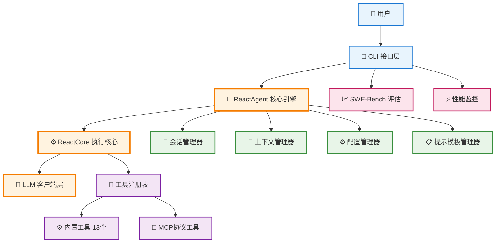
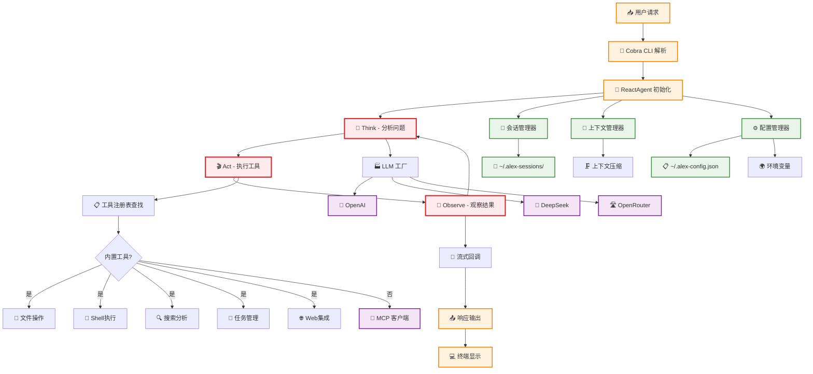

# ALEX - 架构全面分析报告

## 🏗️ 概述 
ALEX (Agile Light Easy Xpert Code Agent) 是一个基于 Go 语言构建的生产级终端原生 AI 编程代理，采用 ReAct 架构、MCP 协议实现、智能内存管理和 SWE-Bench 评估框架。

---

## 📊 核心架构图

### 高级系统架构


### 详细数据流架构


---

## 🧩 核心组件分析

### 1. ReactAgent 核心引擎 (`internal/agent/`)
**职责**: 实现 ReAct (Reason + Act) 架构的主控制器
- **Think-Act-Observe 循环**: 分析问题 → 执行工具 → 观察结果
- **多模型支持**: 基础模型(DeepSeek Chat) + 推理模型(DeepSeek R1)  
- **工具编排**: 统一管理 13 个内置工具 + MCP 外部工具
- **会话持久化**: 支持会话恢复，上下文压缩
- **流式处理**: 实时响应用户，提升交互体验

**关键接口:**
```go
type ReactCoreInterface interface {
    SolveTask(ctx context.Context, task string, streamCallback StreamCallback) (*types.ReactTaskResult, error)
}
```

### 2. 工具系统架构 (`internal/tools/`)

#### 2.1 内置工具生态 (13个工具)
```
📁 文件操作工具 (4个)
├── file_read     - 智能文件读取
├── file_update   - 增量文件更新  
├── file_replace  - 精确内容替换
└── file_list     - 目录结构遍历

🐚 Shell执行工具 (2个) 
├── bash          - 安全Shell执行
└── code_execute  - 代码沙箱运行

🔍 搜索分析工具 (3个)
├── grep          - 模式匹配搜索
├── ripgrep       - 高性能搜索  
└── find          - 文件系统查找

📝 任务管理工具 (2个)
├── todo_read     - 任务状态读取
└── todo_update   - 任务状态更新

🌐 Web集成工具 (1个)
└── web_search    - Tavily API搜索

🤔 推理工具 (1个)  
└── think         - 结构化问题分析
```

#### 2.2 MCP协议集成 (`internal/tools/mcp/`)
- **JSON-RPC 2.0 协议**: 标准化的工具通信协议
- **多传输层支持**: STDIO + SSE (Server-Sent Events)
- **动态工具发现**: 运行时加载外部工具
- **进程生命周期管理**: 自动进程启动、监控、清理

### 3. LLM 抽象层 (`internal/llm/`)
**多模型工厂模式**:
- **基础模型**: `openrouter/deepseek/deepseek-chat` - 日常对话和工具调用
- **推理模型**: `openrouter/deepseek/deepseek-r1` - 复杂推理和数学计算
- **配置层次**: 环境变量 > 配置文件 > 默认值
- **会话缓存**: 减少API调用，提升响应速度

**接口抽象**:
```go
type Client interface {
    Chat(ctx context.Context, req *ChatRequest, sessionID string) (*ChatResponse, error)
    ChatStream(ctx context.Context, req *ChatRequest, sessionID string) (<-chan StreamDelta, error)
}
```

### 4. 会话管理器 (`internal/session/`)
- **持久化存储**: `~/.alex-sessions/` 目录
- **会话恢复**: `-r session_id` 参数快速恢复  
- **上下文压缩**: 超出token限制时自动压缩历史
- **任务状态跟踪**: 集成todo系统，持久化任务状态

### 5. 上下文管理器 (`internal/context/`)
- **智能压缩**: Token限制时保留关键信息
- **消息处理器**: 多种处理策略 (截断/总结/优先级)
- **内存管理**: 防止上下文爆炸，保持系统稳定

---

## 🔄 数据流分析

### 主要执行流程
```
1. CLI接收用户输入 → Cobra解析命令
2. ReactAgent初始化 → 加载配置、会话、工具
3. ReAct循环执行:
   Think: LLM分析用户需求，制定执行计划
   Act: 调用相应工具执行具体操作  
   Observe: 分析工具执行结果，决定下一步
4. 会话持久化 → 保存执行历史和状态
5. 流式响应 → 实时反馈给用户
```

### 关键数据结构
- **ReactTaskContext**: 任务执行上下文
- **ToolResult**: 工具执行结果标准格式  
- **Session/Message**: 会话和消息持久化
- **Config**: 多层级配置管理

---

## 📈 SWE-Bench 评估框架 (`evaluation/swe_bench/`)

### 评估能力
- **Verified 数据集**: 3/50/150/500 实例测试
- **批处理评估**: 支持多worker并行执行
- **真实场景模拟**: 基于真实GitHub问题
- **性能指标跟踪**: 成功率、执行时间、资源使用

### 评估流程
```bash
# 测试评估 (3个实例)
make swe-bench-verified-test

# 小规模评估 (50个实例)  
make swe-bench-verified-small

# 批量评估
./alex run-batch --dataset.subset lite --instance-limit 5 --workers 2
```

---

## 🎯 架构特点与优势

### 1. **简洁明确的设计哲学**
- 遵循"保持简洁清晰，如无需求勿增实体"原则
- 避免过度配置，专注核心功能实现
- 自文档化代码，清晰的命名约定

### 2. **生产就绪的可靠性**
- 完整的错误处理和恢复机制
- 会话持久化和状态管理
- 资源管理和内存控制
- 安全的工具执行环境

### 3. **高度可扩展性**  
- 接口驱动设计，松耦合架构
- MCP协议支持外部工具集成
- 多模型LLM抽象，易于添加新模型
- 插件化工具系统

### 4. **卓越的用户体验**
- 终端原生设计，快速启动
- 流式响应，实时反馈  
- 会话恢复，工作连续性
- 丰富的CLI命令支持

### 5. **企业级性能**
- 多worker批处理能力
- SWE-Bench标准化评估
- 性能监控和优化
- 内存使用优化

---

## 🔮 技术栈总结

| 层级 | 技术选择 | 说明 |
|-----|---------|------|
| **语言** | Go 1.24 | 高性能、简洁、并发友好 |
| **CLI框架** | Cobra + Viper | 强大的命令行解析和配置管理 |
| **UI组件** | Bubble Tea + Lipgloss | 优雅的终端用户界面 |
| **LLM集成** | OpenRouter/DeepSeek | 多模型支持，成本优化 |
| **协议** | JSON-RPC 2.0 (MCP) | 标准化工具通信协议 |
| **存储** | 文件系统 | 简单可靠的会话持久化 |
| **测试** | Go testing + SWE-Bench | 单元测试 + 实际场景评估 |

---

## 🚀 总结

ALEX代表了现代AI代理系统的最佳实践：
- **架构简洁而强大**: ReAct模式 + 工具生态 + 会话管理  
- **技术选择务实**: Go语言 + 标准协议 + 成熟工具链
- **用户体验优先**: 终端原生 + 流式响应 + 状态持久化
- **企业级可靠**: 错误处理 + 性能优化 + 标准化评估

这是一个真正可投入生产使用的AI编程助手，具备了商业化产品所需的所有特性。