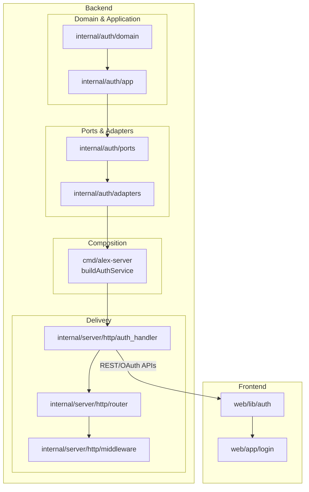
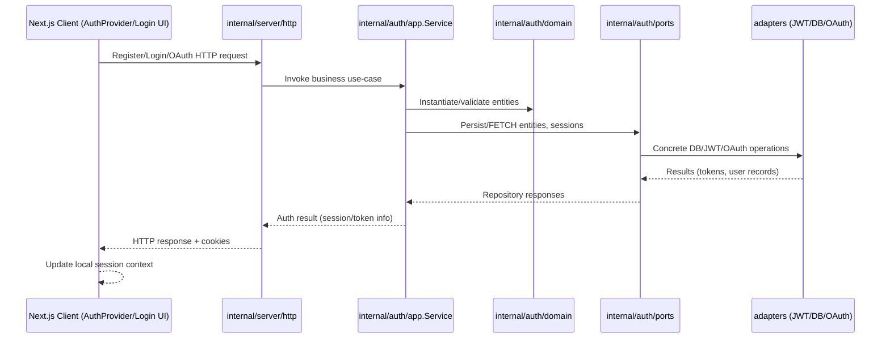
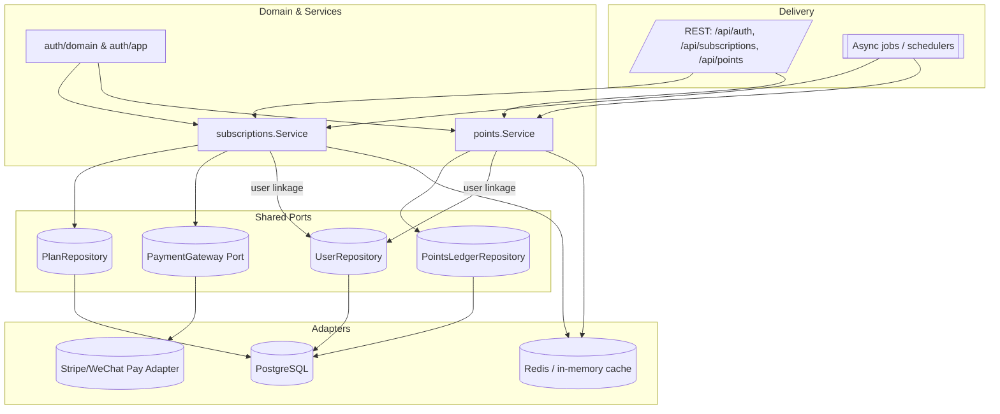

# Auth Module Architecture

This document visualizes the components that make up the user/authentication module and how they interact across the backend and frontend layers of the Alex platform.

## Layered Component Overview



## Interaction Flow



### Notes

- **Domain & Application layers** enforce business rules for registration, login, sessions, subscriptions, and points.
- **Ports & Adapters** provide abstractions for storage, token issuance, and third-party OAuth providers, with in-memory and PostgreSQL implementations assembled at runtime.
- **Composition** logic in `cmd/alex-server` wires dependencies according to environment variables.
- **Delivery layer** exposes REST and OAuth endpoints, applies middleware (auth, CORS, logging), and manages cookies.
- **Frontend** hooks and pages call the REST/OAuth APIs, maintain client-side session state, and present the login/register experiences.

Together these layers form the complete user module pipeline from domain logic to the user-facing interface.

## Textual/ASCII Overview (Non-Mermaid)

Below is an alternative representation rendered purely with text so that the relationships can be understood without Mermaid support:

```
Backend                                                                Frontend
=======                                                                ========
                                   ┌───────────────────────────────┐
                                   │ web/lib/auth (hooks + client)│
                                   └──────────────┬────────────────┘
                                                  │ uses REST/OAuth APIs
┌──────────────────────────────────────────────────▼────────────────────────────┐
│ internal/server/http (router + handler + middleware)                          │
└───────────────────────────────┬───────────────────────────────────────────────┘
                                │ depends on
                ┌───────────────▼───────────────┐
                │ cmd/alex-server buildAuthService │
                └───────────────┬───────────────┘
                                │ wires
             ┌──────────────────▼──────────────────┐
             │ internal/auth/adapters (DB/JWT/OAuth)│
             └──────────────────┬──────────────────┘
                                │ implement
                ┌───────────────▼───────────────┐
                │ internal/auth/ports (interfaces) │
                └───────────────┬───────────────┘
                                │ invoked by
          ┌─────────────────────▼─────────────────────┐
          │ internal/auth/app (use cases/services)    │
          └─────────────────────┬─────────────────────┘
                                │ manipulates
             ┌──────────────────▼──────────────────┐
             │ internal/auth/domain (entities)     │
             └─────────────────────────────────────┘

Frontend page `/app/login` consumes the `AuthProvider` context exposed by `web/lib/auth`, completing the chain from domain to UI.
```

## Textual Interaction Flow (Non-Mermaid)

```
1. Client (Next.js AuthProvider/Login UI)
   -> sends Register/Login/OAuth HTTP request
2. internal/server/http handler
   -> invokes internal/auth/app.Service use case
3. Service
   -> validates/builds entities in internal/auth/domain
   -> calls internal/auth/ports repositories/token interfaces
4. Ports
   -> delegate to concrete adapters (DB, JWT, OAuth providers)
5. Adapters return user/session/token data back up through Ports -> Service
6. Service
   -> returns auth result/session info to handler
7. Handler
   -> writes HTTP response + cookies back to client
8. Client
   -> updates local session context/state
```

These plain-text diagrams complement the Mermaid visuals while conveying the same relationships for environments where diagram rendering is unavailable.

## Long-Term Evolution: Subscriptions & Points

The user module already exposes subscription and points endpoints, but the product roadmap requires these capabilities to become
first-class, multi-surface features (e.g., workspace-wide billing, cross-device balance sync, promotional campaigns). The diagram
below highlights the dedicated components that should emerge over time so the architecture scales predictably.



### ASCII View of Subscription & Points Responsibilities

```
                           +-----------------------------+
                           | Delivery (REST + Jobs)      |
                           |  - /api/auth (session)      |
                           |  - /api/subscriptions       |
                           |  - /api/points              |
                           +--------------+--------------+
                                          |
             +----------------------------+-----------------------------+
             | Domain/Application Layer (auth/app, auth/domain)        |
             |  - Session/User lifecycle                               |
             |  - SubscriptionService (plan changes, billing status)   |
             |  - PointsService (balance, accrual, redemption)         |
             +----------+---------------------+------------------------+
                        |                     |
        +---------------+----+        +-------+-----------------+
        | Shared Ports & Repos|        | External Integrations  |
        |  - UserRepository   |        |  - PaymentGateway Port |
        |  - PlanRepository   |        |  - PromotionFeed Port  |
        |  - PointsLedgerRepo |        +-----------+------------+
        +-----------+---------+                    |
                    |                              |
            +-------+------------------+   +-------+------------------+
            | Adapters (DB/Cache/etc.) |   | Payment/Promo Adapters  |
            |  - PostgreSQL (users,    |   |  - Stripe/WeChat Pay    |
            |    plans, ledgers)       |   |  - Campaign service     |
            |  - Redis (balance cache) |   +-------------------------+
            +--------------------------+
```

### Architectural Rationale

1. **Dedicated services per concern** – Keeping subscription and points logic in their own services inside `internal/auth/app`
   (or sibling packages) allows independent iteration, testing, and ownership while reusing shared user/session context.
2. **Shared repositories and ports** – User identity remains canonical, so both services depend on a shared `UserRepository`
   plus their own specialized repositories (plans, ledgers). This minimizes duplication yet keeps aggregates cohesive.
3. **Payment and promotion ports** – Billing, promo, and reward partners are abstracted via ports so adapters for Stripe,
   WeChat Pay, coupon systems, etc., can be swapped or mocked without touching business logic.
4. **Async processing hooks** – Jobs/schedulers trigger renewals, expirations, or batch point grants without bloating the REST
   handlers, ensuring time-based workflows scale independently of synchronous traffic.
5. **Caching strategy** – Exposing frequently-read balances (points) or entitlements (plans) benefits from a cache layer
   validated through domain events; this keeps latency low for the frontend while preserving consistency via the authoritative
   database.

By planning the module with these extension seams, future subscription and points initiatives can grow without reworking the
core auth/session pathway, preserving both architectural clarity and delivery velocity.

## Actionable Technical Plan for Subscriptions & Points

The roadmap above becomes implementable when translated into discrete, verifiable increments. Each phase below calls out the exact code locations to touch, the interfaces to expose, and a tangible validation signal so that progress is objectively measurable.

## Current Completion Status & Outstanding Work

| Phase | Scope | Status | Outstanding Items |
| --- | --- | --- | --- |
| Phase 1 | Shared DB schemas, repository contracts, domain errors/events | ✅ _Complete_ | Foundations (migrations, domain/port models, Postgres repositories) are merged and exercised; later phases build atop this base. |
| Phase 2 | Dedicated subscription/points services and external ports | ◑ _In progress_ | Subscription + points services now emit events, are wired through the auth HTTP layer, and fan out via the new event publisher port, but production-grade payment/promotion adapters, event bus integrations, and standalone subscription endpoints remain TODO. |
| Phase 3 | Delivery endpoints, background jobs, cache layer | ◑ _In progress_ | Dedicated `/api/subscriptions` + `/api/points` handlers now front the new services, but cron binaries and Redis cache wiring are still pending. |
| Phase 4 | E2E verification and observability | ☐ _Not started_ | Playwright specs, telemetry instrumentation, and dashboards are pending. |

> **Note:** No code corresponding to the phases below exists yet. The table above is intentionally explicit so that reviewers can immediately see that the subscriptions/points initiative is still in the planning stage and track when each block flips from "not started" to "in progress" or "complete".

### Phase 1 – Shared Foundation Hardening

1. **Normalize plan/points schemas**
   - **Code**: Add `migrations/xxxx_add_plan_and_points_tables.sql` plus matching structs in `internal/auth/domain`.
   - **Acceptance**: `go test ./internal/auth/...` passes and `psql` schema diff shows `plans`, `subscriptions`, `points_ledger` tables.
2. **Stabilize repository contracts**
   - **Code**: Extend `internal/auth/ports/repository.go` with `PlanRepository`, `SubscriptionRepository`, `PointsLedgerRepository`.
   - **Acceptance**: `internal/auth/adapters/postgres` implements the new interfaces and `cmd/alex-server` wiring compiles without build tags.
3. **Surface domain errors/events**
   - **Code**: Introduce domain errors/events (e.g., `ErrInsufficientPoints`) inside `internal/auth/domain/events.go`.
   - **Acceptance**: `internal/auth/app` unit tests assert the correct error/event type for invalid operations.

#### Phase 1 execution tracker (updated)

- [x] **Database scaffolding committed** – `migrations/auth/002_subscription_points.sql` now declares `auth_plans`, `auth_subscriptions`, and `auth_points_ledger` so local envs can start seeding catalog + ledger data.
- [x] **Domain & port models defined** – `internal/auth/domain/subscription_points.go` and the expanded plan struct in `internal/auth/domain/types.go` capture subscription/ledger records, while `internal/auth/ports/ports.go` exposes `PlanRepository`, `SubscriptionRepository`, `PointsLedgerRepository`, `PaymentGatewayPort`, and `PromotionFeedPort`.
- [x] **Postgres adapters online** – `internal/auth/adapters/postgres_store.go` now exposes plan, subscription, and points ledger repositories so application services can be built against real storage instead of mocks.
- [x] **Domain event emission now originates from subscription flows** – `internal/auth/app/subscription.Service` produces `SubscriptionEvent*` records whenever plans change or cancel, giving downstream systems data to fan out even though dedicated delivery wiring is still TODO.
- [x] **Points service emits ledger events** – `internal/auth/app/points.Service` reconciles user balances with immutable ledger entries, applies promotion bonuses, and yields `PointsLedgerEvent*` values, and `/api/auth/points` now routes through this ledger-backed path.

### Phase 2 – Dedicated Services & Ports

1. **Implement `SubscriptionService`**
   - **Code**: Create `internal/auth/app/subscription/service.go` orchestrating plan changes, calling payment/plan repos.
   - **Acceptance**: Service-level tests mock `PaymentGatewayPort` and verify plan transitions + invoicing logic.
2. **Implement `PointsService`**
   - **Code**: Add `internal/auth/app/points/service.go` handling accrual, redemption, and ledger balancing via repositories.
   - **Acceptance**: Ledger reconciliation test verifies double-entry entries (credit/debit) per operation.
3. **Add Payment/Promotion ports**
   - **Code**: Define `PaymentGatewayPort`, `PromotionFeedPort` under `internal/auth/ports/external.go`; wire baseline adapters (Stripe mock, Campaign mock) in `internal/auth/adapters/external`.
   - **Acceptance**: Integration tests simulate payment success/failure paths ensuring deterministic retries. _(Status: Mock adapters are live and now wired into `cmd/alex-server`; real gateways/promo feeds remain outstanding.)_

4. **Event publisher baseline**
   - **Code**: Introduce `ports.EventPublisher`, wire `MemoryEventPublisher`, and have both subscription + points services push lifecycle events through it.
   - **Acceptance**: Unit tests assert publisher invocations so regressions are caught even before a real message bus is adopted. _(Status: Completed via `internal/auth/adapters/event_publisher.go` with wiring in `cmd/alex-server`; production Kafka/SNS/etc. adapters still pending.)_

### Phase 3 – Delivery & Cache Surfaces

1. **Expose REST APIs** _(In progress)_
   - **Code**: `internal/server/http/auth_handler.go` now exposes `/api/subscriptions` and `/api/points` endpoints (plus `/api/subscriptions/plans`) so clients no longer depend on the legacy `/api/auth/*` admin paths.
   - **Acceptance**: `internal/server/http/auth_handler_test.go` exercises GET/POST flows for both resources; upcoming work must add integration/e2e coverage once UI wiring lands.
2. **Background workflows**
   - **Code**: Add `cmd/cron/subscription_renewal` and `cmd/cron/points_grant` binaries scheduling renewals/grants via `internal/jobs/...` packages.
   - **Acceptance**: `make integration-jobs` spins up docker-compose with fake queue to verify job success metrics.
3. **Cache layer**
   - **Code**: Introduce `internal/auth/adapters/cache` (Redis) and wrap points balance reads with `CacheAside` helpers.
   - **Acceptance**: Benchmarks in `internal/auth/app/points/service_bench_test.go` show ≥30% latency reduction for balance reads.

### Phase 4 – Verification & Observability

1. **E2E test matrix**
   - **Code**: Write Playwright flows under `tests/e2e/subscriptions.spec.ts` covering plan purchase, downgrade, and points redemption from the Next.js UI.
   - **Acceptance**: CI job `npm run test:e2e` passes using seeded Stripe/WeChat sandbox keys.
2. **Telemetry & alerting**
   - **Code**: Instrument services with OpenTelemetry spans (`internal/auth/app/...`) and Prometheus counters (renewal success, failed redemptions).
   - **Acceptance**: `make run-observability` exposes dashboards confirming metrics/spans while load-testing via `k6`.

Each phase can ship independently yet composes into the long-term architecture, giving stakeholders a concrete, testable path to introduce enterprise-grade subscriptions and points without disrupting the existing authentication flow.

### Immediate Next Steps Checklist

- [x] Draft the plan/points database migration under `migrations/` and align it with the ORM structs in `internal/auth/domain`.
  - _Follow-up_: Seed default plan rows + write down rollback steps before enabling in staging.
- [x] Extend repository interfaces and their Postgres implementations so that services can be compiled even before feature flags enable endpoints.
  - _Follow-up_: Actual Postgres adapter structs + wiring are still **TODO**, so builds will continue to rely on stubs until those land.
- [x] Define payment/promotion ports with mock adapters to unblock service-level tests ahead of full gateway integration.
  - _Follow-up_: `internal/auth/adapters/FakePaymentGateway` and `MemoryPromotionFeed` now provide reusable mocks, but real Stripe/WeChat facades plus campaign ingestors must still be implemented before launch.
- [x] Sketch the HTTP handler contracts (request/response payloads) to ensure frontend changes can be scoped in parallel.
  - _Follow-up_: `/api/subscriptions`, `/api/subscriptions/plans`, and `/api/points` now exist with unit tests, yet public API docs, SDK helpers, and the frontend wiring to consume these dedicated endpoints remain TODO.
- [x] Wire the new repositories into `cmd/alex-server` and future app services so they are exercised end-to-end instead of remaining unused constructors.
  - _Follow-up_: Subscription flows now run through the new service (with plan/subscription repos + fake payment gateway) and `/api/auth/points` uses the ledger, but production Stripe/WeChat adapters and outbound event publishers are still missing.
- [x] Stand up `internal/auth/app/subscription.Service` with unit tests so plan changes are executable in isolation.
  - _Follow-up_: The service is not yet registered inside HTTP handlers or background jobs; its events remain in-memory until a publisher port exists.
- [x] Stand up `internal/auth/app/points.Service` so accrual and redemption can be tested without HTTP wiring.
  - _Follow-up_: Ledger events are not published anywhere, but the HTTP `/api/auth/points` flow now routes through the ledger-backed service; downstream publishers still need to consume the resulting events.
- [ ] Implement real payment gateway/promotion feed adapters plus durable event publishers.
  - _Status_: `internal/auth/adapters/FakePaymentGateway`, `MemoryPromotionFeed`, and the new in-process `MemoryEventPublisher` unblock tests, but production-grade Stripe/WeChat facades, promotion ingestors, and Kafka/SNS publishers remain on the backlog.

These TODOs should be ticked off before any subscription or points UI is exposed; keeping them documented inside this architecture file ensures the team can quickly audit what remains unfinished in the current project scope.


