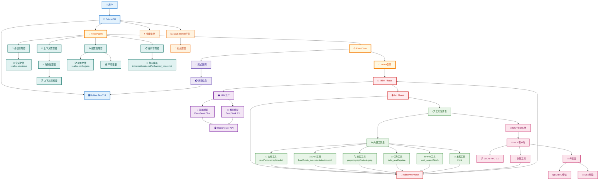

# ALEX 完整架构图

```mermaid
graph TD
    %% === 用户交互层 ===
    USER[👤 用户]
    CLI[🚀 Cobra CLI]
    TUI[🖥️ Bubble Tea TUI]
    
    %% === 核心控制层 ===
    AGENT[🤖 ReactAgent]
    CORE[⚙️ ReactCore]
    ENGINE[🔄 ReAct引擎]
    
    %% === ReAct循环组件 ===
    THINK[🤔 Think Phase]
    ACT[🎬 Act Phase] 
    OBSERVE[👀 Observe Phase]
    
    %% === LLM抽象层 ===
    LLM_FACTORY[🏭 LLM工厂]
    BASIC_MODEL[🧠 基础模型<br/>DeepSeek Chat]
    REASON_MODEL[🔬 推理模型<br/>DeepSeek R1]
    OPENROUTER[🛣️ OpenRouter API]
    
    %% === 工具生态系统 ===
    TOOL_REGISTRY[📋 工具注册表]
    
    %% 内置工具组
    BUILTIN_TOOLS[⚙️ 内置工具集]
    FILE_TOOLS[📁 文件工具<br/>read/update/replace/list]
    SHELL_TOOLS[🐚 Shell工具<br/>bash/code_execute/status/control]
    SEARCH_TOOLS[🔍 搜索工具<br/>grep/ripgrep/find/ast-grep]
    TODO_TOOLS[📝 任务工具<br/>todo_read/update]
    WEB_TOOLS[🌐 Web工具<br/>web_search/fetch]
    THINK_TOOLS[🤔 推理工具<br/>think]
    
    %% MCP工具组  
    MCP_SYSTEM[🔌 MCP协议系统]
    MCP_CLIENT[📡 MCP客户端]
    MCP_TRANSPORT[🚛 传输层]
    STDIO_TRANSPORT[📟 STDIO传输]
    SSE_TRANSPORT[📡 SSE传输]
    MCP_PROTOCOL[📋 JSON-RPC 2.0]
    EXTERNAL_TOOLS[🧩 外部工具]
    
    %% === 数据管理层 ===
    SESSION_MGR[💾 会话管理器]
    SESSION_FILES[📄 会话文件<br/>~/.alex-sessions/]
    
    CONTEXT_MGR[📝 上下文管理器] 
    MSG_PROCESSOR[⚡ 消息处理器]
    COMPRESSOR[🗜️ 上下文压缩器]
    
    CONFIG_MGR[⚙️ 配置管理器]
    CONFIG_FILE[📋 配置文件<br/>~/.alex-config.json]
    ENV_VARS[🌍 环境变量]
    
    PROMPT_MGR[📋 提示管理器]
    PROMPT_TEMPLATES[📝 提示模板<br/>initial.md/coder.md/enhanced_coder.md]
    
    %% === 评估与性能层 ===
    SWE_BENCH[📈 SWE-Bench评估]
    PERFORMANCE[⚡ 性能监控]
    BATCH_PROCESSOR[🔄 批处理器]
    
    %% === 流式回调系统 ===
    STREAM_CALLBACK[📡 流式回调]
    MESSAGE_QUEUE[📬 消息队列]
    
    %% ================== 连接关系 ==================
    
    %% 用户交互流
    USER --> CLI
    CLI --> TUI
    CLI --> AGENT
    
    %% 核心控制流
    AGENT --> CORE
    CORE --> ENGINE
    ENGINE --> THINK
    THINK --> ACT
    ACT --> OBSERVE
    OBSERVE --> THINK
    
    %% LLM交互流
    THINK --> LLM_FACTORY
    LLM_FACTORY --> BASIC_MODEL
    LLM_FACTORY --> REASON_MODEL
    BASIC_MODEL --> OPENROUTER
    REASON_MODEL --> OPENROUTER
    
    %% 工具调用流
    ACT --> TOOL_REGISTRY
    TOOL_REGISTRY --> BUILTIN_TOOLS
    TOOL_REGISTRY --> MCP_SYSTEM
    
    %% 内置工具展开
    BUILTIN_TOOLS --> FILE_TOOLS
    BUILTIN_TOOLS --> SHELL_TOOLS
    BUILTIN_TOOLS --> SEARCH_TOOLS
    BUILTIN_TOOLS --> TODO_TOOLS
    BUILTIN_TOOLS --> WEB_TOOLS
    BUILTIN_TOOLS --> THINK_TOOLS
    
    %% MCP系统展开
    MCP_SYSTEM --> MCP_CLIENT
    MCP_CLIENT --> MCP_TRANSPORT
    MCP_TRANSPORT --> STDIO_TRANSPORT
    MCP_TRANSPORT --> SSE_TRANSPORT
    MCP_CLIENT --> MCP_PROTOCOL
    MCP_CLIENT --> EXTERNAL_TOOLS
    
    %% 数据管理流
    AGENT --> SESSION_MGR
    SESSION_MGR --> SESSION_FILES
    
    AGENT --> CONTEXT_MGR
    CONTEXT_MGR --> MSG_PROCESSOR
    MSG_PROCESSOR --> COMPRESSOR
    
    AGENT --> CONFIG_MGR
    CONFIG_MGR --> CONFIG_FILE
    CONFIG_MGR --> ENV_VARS
    
    AGENT --> PROMPT_MGR
    PROMPT_MGR --> PROMPT_TEMPLATES
    
    %% 评估与监控流
    CLI --> SWE_BENCH
    CLI --> PERFORMANCE
    SWE_BENCH --> BATCH_PROCESSOR
    
    %% 流式响应流
    CORE --> STREAM_CALLBACK
    STREAM_CALLBACK --> MESSAGE_QUEUE
    MESSAGE_QUEUE --> TUI
    
    %% 工具结果反馈
    FILE_TOOLS --> OBSERVE
    SHELL_TOOLS --> OBSERVE
    SEARCH_TOOLS --> OBSERVE
    TODO_TOOLS --> OBSERVE
    WEB_TOOLS --> OBSERVE
    THINK_TOOLS --> OBSERVE
    EXTERNAL_TOOLS --> OBSERVE
    
    %% ================== 样式定义 ==================
    
    %% 用户层
    classDef userLayer fill:#e3f2fd,stroke:#1976d2,stroke-width:3px,color:#0d47a1
    
    %% 核心层
    classDef coreLayer fill:#fff8e1,stroke:#f57c00,stroke-width:4px,color:#e65100
    
    %% ReAct循环
    classDef reactLayer fill:#ffebee,stroke:#d32f2f,stroke-width:3px,color:#b71c1c
    
    %% LLM层
    classDef llmLayer fill:#f3e5f5,stroke:#7b1fa2,stroke-width:3px,color:#4a148c
    
    %% 工具层
    classDef toolLayer fill:#e8f5e8,stroke:#388e3c,stroke-width:2px,color:#1b5e20
    
    %% MCP层
    classDef mcpLayer fill:#fce4ec,stroke:#c2185b,stroke-width:2px,color:#880e4f
    
    %% 数据层
    classDef dataLayer fill:#e0f2f1,stroke:#00695c,stroke-width:2px,color:#004d40
    
    %% 评估层
    classDef evalLayer fill:#fff3e0,stroke:#ef6c00,stroke-width:2px,color:#bf360c
    
    %% 流式层
    classDef streamLayer fill:#ede7f6,stroke:#512da8,stroke-width:2px,color:#311b92
    
    %% ================== 样式应用 ==================
    
    class USER,CLI,TUI userLayer
    class AGENT,CORE,ENGINE coreLayer
    class THINK,ACT,OBSERVE reactLayer
    class LLM_FACTORY,BASIC_MODEL,REASON_MODEL,OPENROUTER llmLayer
    class TOOL_REGISTRY,BUILTIN_TOOLS,FILE_TOOLS,SHELL_TOOLS,SEARCH_TOOLS,TODO_TOOLS,WEB_TOOLS,THINK_TOOLS toolLayer
    class MCP_SYSTEM,MCP_CLIENT,MCP_TRANSPORT,STDIO_TRANSPORT,SSE_TRANSPORT,MCP_PROTOCOL,EXTERNAL_TOOLS mcpLayer
    class SESSION_MGR,SESSION_FILES,CONTEXT_MGR,MSG_PROCESSOR,COMPRESSOR,CONFIG_MGR,CONFIG_FILE,ENV_VARS,PROMPT_MGR,PROMPT_TEMPLATES dataLayer
    class SWE_BENCH,PERFORMANCE,BATCH_PROCESSOR evalLayer
    class STREAM_CALLBACK,MESSAGE_QUEUE streamLayer
```