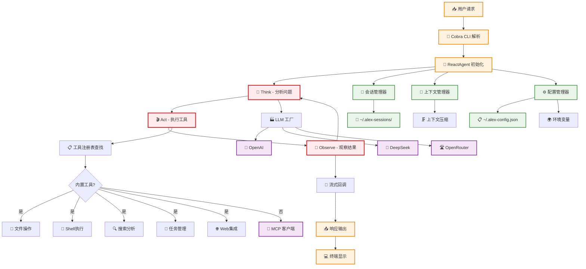

# ALEX Data Flow Architecture

```mermaid
graph TD
    %% 请求处理流程
    REQ[📥 用户请求] --> COBRA[🐍 Cobra CLI 解析]
    COBRA --> AGENT[🤖 ReactAgent 初始化]
    
    %% ReAct 核心处理循环
    AGENT --> THINK[🤔 Think - 分析问题]
    THINK --> ACT[🎬 Act - 执行工具]
    ACT --> OBS[👀 Observe - 观察结果]
    OBS --> THINK
    
    %% 工具执行子系统
    ACT --> TOOL_REG[📋 工具注册表查找]
    TOOL_REG --> BUILTIN{内置工具?}
    BUILTIN -->|是| FILE_OPS[📁 文件操作]
    BUILTIN -->|是| SHELL_EXEC[🐚 Shell执行]
    BUILTIN -->|是| SEARCH[🔍 搜索分析]
    BUILTIN -->|是| TODO[📝 任务管理]
    BUILTIN -->|是| WEB[🌐 Web集成]
    BUILTIN -->|否| MCP_CLIENT[🔌 MCP 客户端]
    
    %% LLM 交互子系统
    THINK --> LLM_FACTORY[🏭 LLM 工厂]
    LLM_FACTORY --> OPENAI[🤖 OpenAI]
    LLM_FACTORY --> DEEPSEEK[🧠 DeepSeek]  
    LLM_FACTORY --> OPENROUTER[🛣️ OpenRouter]
    
    %% 会话与上下文管理
    AGENT --> SESSION_MGR[💾 会话管理器]
    SESSION_MGR --> SESSION_FILE[📄 ~/.alex-sessions/]
    AGENT --> CONTEXT_MGR[📝 上下文管理器]
    CONTEXT_MGR --> COMPRESS[🗜️ 上下文压缩]
    
    %% 配置管理
    AGENT --> CONFIG_MGR[⚙️ 配置管理器]
    CONFIG_MGR --> CONFIG_FILE[📋 ~/.alex-config.json]
    CONFIG_MGR --> ENV_VARS[🌍 环境变量]
    
    %% 响应返回
    OBS --> STREAM_CB[📡 流式回调]
    STREAM_CB --> RESPONSE[📤 响应输出]
    RESPONSE --> TERMINAL[💻 终端显示]
    
    %% 样式定义
    classDef process fill:#fff3e0,stroke:#f57c00,stroke-width:2px
    classDef storage fill:#e8f5e8,stroke:#388e3c,stroke-width:2px  
    classDef external fill:#f3e5f5,stroke:#7b1fa2,stroke-width:2px
    classDef react fill:#ffebee,stroke:#d32f2f,stroke-width:3px
    
    class REQ,COBRA,AGENT,RESPONSE,TERMINAL process
    class SESSION_FILE,CONFIG_FILE,SESSION_MGR,CONTEXT_MGR,CONFIG_MGR storage
    class OPENAI,DEEPSEEK,OPENROUTER,MCP_CLIENT external
    class THINK,ACT,OBS react
```