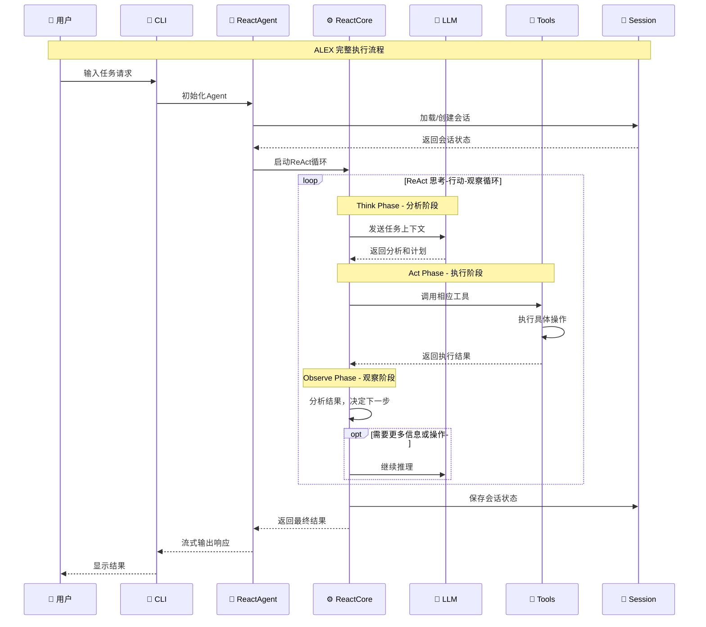

# ReAct Cycle Architecture
> Last updated: 2025-11-18

```mermaid
sequenceDiagram
    participant U as 👤 用户
    participant C as 🚀 CLI
    participant A as 🤖 ReactAgent  
    participant RC as ⚙️ ReactCore
    participant L as 🧠 LLM
    participant T as 🔧 Tools
    participant S as 💾 Session
    
    Note over U,S: ALEX 完整执行流程
    
    U->>C: 输入任务请求
    C->>A: 初始化Agent
    A->>S: 加载/创建会话
    S-->>A: 返回会话状态
    
    A->>RC: 启动ReAct循环
    
    loop ReAct 思考-行动-观察循环
        Note over RC,L: Think Phase - 分析阶段
        RC->>L: 发送任务上下文
        L-->>RC: 返回分析和计划
        
        Note over RC,T: Act Phase - 执行阶段  
        RC->>T: 调用相应工具
        T->>T: 执行具体操作
        T-->>RC: 返回执行结果
        
        Note over RC,RC: Observe Phase - 观察阶段
        RC->>RC: 分析结果，决定下一步
        
        opt 需要更多信息或操作
            RC->>L: 继续推理
        end
    end
    
    RC->>S: 保存会话状态
    RC-->>A: 返回最终结果
    A-->>C: 流式输出响应
    C-->>U: 显示结果
```
