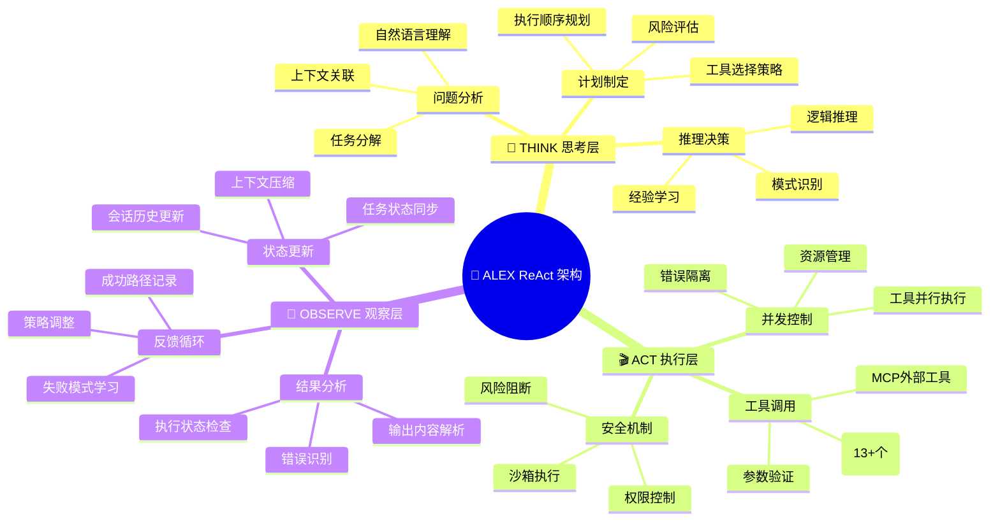

# ReAct 认知架构思维导图
> Last updated: 2025-11-18

```mermaid
mindmap
  root((🤖 ALEX ReAct 架构))
    🤔 THINK 思考层
      问题分析
        自然语言理解
        任务分解
        上下文关联
      计划制定
        工具选择策略
        执行顺序规划  
        风险评估
      推理决策
        逻辑推理
        模式识别
        经验学习
    🎬 ACT 执行层
      工具调用
        内置工具(13+个)
        MCP外部工具
        参数验证
      并发控制
        工具并行执行
        资源管理
        错误隔离
      安全机制
        权限控制
        沙箱执行
        风险阻断
    👀 OBSERVE 观察层
      结果分析
        执行状态检查
        输出内容解析
        错误识别
      反馈循环
        成功路径记录
        失败模式学习
        策略调整
      状态更新
        会话历史更新
        上下文压缩
        任务状态同步
```
