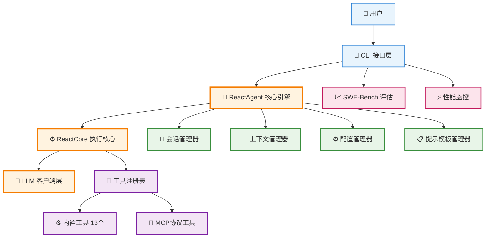

# ALEX System Overview Diagram
> Last updated: 2025-11-18

```mermaid
graph TD
    %% 用户交互层
    U[👤 用户] --> CLI[🚀 CLI 接口层]
    
    %% 核心引擎层  
    CLI --> RA[🤖 ReactAgent 核心引擎]
    RA --> RC[⚙️ ReactCore 执行核心]
    
    %% LLM 与工具层
    RC --> LLM[🧠 LLM 客户端层]
    RC --> TR[🔧 工具注册表]
    
    %% 工具生态系统
    TR --> BT[⚙️ 内置工具 13个]
    TR --> MCP[🔌 MCP协议工具]
    
    %% 数据管理层
    RA --> SM[💾 会话管理器]
    RA --> CM[📝 上下文管理器]
    RA --> CFG[⚙️ 配置管理器]
    RA --> PM[📋 提示模板管理器]
    
    %% 评估与性能层
    CLI --> SWE[📈 SWE-Bench 评估]
    CLI --> PERF[⚡ 性能监控]
    
    %% 样式定义
    classDef userLayer fill:#e8f4fd,stroke:#1976d2,stroke-width:2px
    classDef coreLayer fill:#fff3e0,stroke:#f57c00,stroke-width:3px
    classDef toolLayer fill:#f3e5f5,stroke:#7b1fa2,stroke-width:2px
    classDef dataLayer fill:#e8f5e8,stroke:#388e3c,stroke-width:2px
    classDef evalLayer fill:#fce4ec,stroke:#c2185b,stroke-width:2px
    
    class U,CLI userLayer
    class RA,RC,LLM coreLayer
    class TR,BT,MCP toolLayer
    class SM,CM,CFG,PM dataLayer
    class SWE,PERF evalLayer
```
