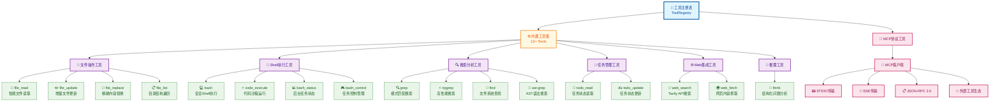

# ALEX Tool Ecosystem

```mermaid
graph TD
    %% 工具注册表
    REGISTRY[🔧 工具注册表<br/>ToolRegistry]
    
    %% 内置工具分类
    BUILTIN[⚙️ 内置工具集<br/>13+ Tools]
    
    %% 文件操作工具组
    FILE_GROUP[📁 文件操作工具]
    FILE_READ[📖 file_read<br/>智能文件读取]
    FILE_UPDATE[✏️ file_update<br/>增量文件更新]
    FILE_REPLACE[🔄 file_replace<br/>精确内容替换]
    FILE_LIST[📋 file_list<br/>目录结构遍历]
    
    %% Shell执行工具组
    SHELL_GROUP[🐚 Shell执行工具]
    BASH[💻 bash<br/>安全Shell执行]
    CODE_EXEC[⚡ code_execute<br/>代码沙箱运行]
    BASH_STATUS[📊 bash_status<br/>后台任务状态]
    BASH_CTRL[🎮 bash_control<br/>任务控制管理]
    
    %% 搜索分析工具组
    SEARCH_GROUP[🔍 搜索分析工具]
    GREP[🔍 grep<br/>模式匹配搜索]
    RIPGREP[⚡ ripgrep<br/>高性能搜索]
    FIND[📂 find<br/>文件系统查找]
    AST_GREP[🌳 ast-grep<br/>AST语法搜索]
    
    %% 任务管理工具组
    TODO_GROUP[📝 任务管理工具]
    TODO_READ[👀 todo_read<br/>任务状态读取]
    TODO_UPDATE[✍️ todo_update<br/>任务状态更新]
    
    %% Web集成工具组
    WEB_GROUP[🌐 Web集成工具]
    WEB_SEARCH[🔎 web_search<br/>Tavily API搜索]
    WEB_FETCH[🌍 web_fetch<br/>网页内容抓取]
    
    %% 推理工具组
    THINK_GROUP[🤔 推理工具]
    THINK[💭 think<br/>结构化问题分析]
    
    %% MCP协议工具组
    MCP_GROUP[🔌 MCP协议工具]
    MCP_CLIENT[📡 MCP客户端]
    STDIO_TRANSPORT[📟 STDIO传输]
    SSE_TRANSPORT[📡 SSE传输]
    JSON_RPC[📋 JSON-RPC 2.0]
    EXTERNAL_TOOLS[🧩 外部工具生态]
    
    %% 连接关系
    REGISTRY --> BUILTIN
    REGISTRY --> MCP_GROUP
    
    %% 内置工具展开
    BUILTIN --> FILE_GROUP
    BUILTIN --> SHELL_GROUP
    BUILTIN --> SEARCH_GROUP
    BUILTIN --> TODO_GROUP
    BUILTIN --> WEB_GROUP
    BUILTIN --> THINK_GROUP
    
    %% 文件工具展开
    FILE_GROUP --> FILE_READ
    FILE_GROUP --> FILE_UPDATE
    FILE_GROUP --> FILE_REPLACE
    FILE_GROUP --> FILE_LIST
    
    %% Shell工具展开
    SHELL_GROUP --> BASH
    SHELL_GROUP --> CODE_EXEC
    SHELL_GROUP --> BASH_STATUS
    SHELL_GROUP --> BASH_CTRL
    
    %% 搜索工具展开
    SEARCH_GROUP --> GREP
    SEARCH_GROUP --> RIPGREP
    SEARCH_GROUP --> FIND
    SEARCH_GROUP --> AST_GREP
    
    %% 任务管理工具展开
    TODO_GROUP --> TODO_READ
    TODO_GROUP --> TODO_UPDATE
    
    %% Web工具展开
    WEB_GROUP --> WEB_SEARCH
    WEB_GROUP --> WEB_FETCH
    
    %% 推理工具展开
    THINK_GROUP --> THINK
    
    %% MCP工具展开
    MCP_GROUP --> MCP_CLIENT
    MCP_CLIENT --> STDIO_TRANSPORT
    MCP_CLIENT --> SSE_TRANSPORT
    MCP_CLIENT --> JSON_RPC
    MCP_CLIENT --> EXTERNAL_TOOLS
    
    %% 样式定义
    classDef registryClass fill:#e1f5fe,stroke:#01579b,stroke-width:3px,color:#0d47a1
    classDef builtinClass fill:#fff8e1,stroke:#f57c00,stroke-width:2px,color:#e65100
    classDef groupClass fill:#f3e5f5,stroke:#7b1fa2,stroke-width:2px,color:#4a148c
    classDef toolClass fill:#e8f5e8,stroke:#388e3c,stroke-width:1px,color:#1b5e20
    classDef mcpClass fill:#fce4ec,stroke:#c2185b,stroke-width:2px,color:#880e4f
    
    class REGISTRY registryClass
    class BUILTIN builtinClass
    class FILE_GROUP,SHELL_GROUP,SEARCH_GROUP,TODO_GROUP,WEB_GROUP,THINK_GROUP groupClass
    class FILE_READ,FILE_UPDATE,FILE_REPLACE,FILE_LIST,BASH,CODE_EXEC,BASH_STATUS,BASH_CTRL,GREP,RIPGREP,FIND,AST_GREP,TODO_READ,TODO_UPDATE,WEB_SEARCH,WEB_FETCH,THINK toolClass
    class MCP_GROUP,MCP_CLIENT,STDIO_TRANSPORT,SSE_TRANSPORT,JSON_RPC,EXTERNAL_TOOLS mcpClass
```