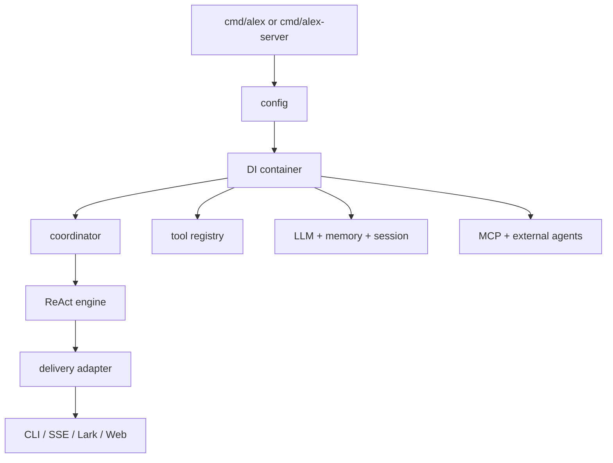

# Architecture

Updated: 2026-03-18

Runtime architecture of elephant.ai — for implementation and debugging.

---

## Layer Model

```
Delivery         CLI · Web/API/SSE · Lark gateway
    ↓
Application      Signal Graph · Decision Engine · Digest Service
                 Morning Brief · Self-Report · Coordination · Context · Tools · DI
    ↓
Domain           ReAct loop · Events · Approval gates
    ↓
Infrastructure   Unified Session · Memory + Distillation
                 LLM clients · MCP · Storage · Observability
    ↓
Shared           Config · Logging · IDs · Utilities
```

| Layer | Packages | Responsibility |
|-------|----------|----------------|
| Delivery | `internal/delivery/*`, `cmd/*`, `web/` | Inbound/outbound adapters |
| Application | `internal/app/*` | Orchestration, context building, tool registry, DI |
| Domain | `internal/domain/*` | ReAct loop, workflow model, domain events, ports |
| Infrastructure | `internal/infra/*` | LLM, tools, memory, MCP, storage, observability |
| Shared | `internal/shared/*` | Config, logging, IDs, utilities |

---

## Runtime Surfaces

| Surface | Entry point |
|---------|-------------|
| CLI/TUI | `cmd/alex/main.go` |
| Web/API/SSE | `cmd/alex-web/main.go` |
| Lark gateway | `cmd/alex-server/main.go` |
| Eval server | `cmd/eval-server` |
| Web UI | `web/` (Next.js) |

---

## Bootstrap Sequence

Managed by `internal/delivery/server/bootstrap/foundation.go` and `internal/app/di/container_builder.go`.

1. Load runtime config (`internal/shared/config`)
2. Initialize observability
3. Build DI container (`internal/app/di`)
4. Wire coordinator, tool registry, session, memory, checkpoint
5. Start optional subsystems (MCP, scheduler, timer)



---

## Agent Execution

Entry: `internal/app/agent/coordinator/coordinator.go` → `ExecuteTask`

### Phases

1. **Prepare** (`internal/app/agent/preparation/service.go`)
   - Load session, replay history, build context window, resolve system prompt, select model.

2. **Execute — ReAct loop** (`internal/domain/agent/react/engine.go`, `runtime.go`)
   - Think → plan tools → execute tools → observe → checkpoint.
   - Dispatches tool calls via domain ports.
   - Handles approvals, retries, context updates.

3. **Persist**
   - Save session/history, workflow snapshot, cost log.

### Context Assembly

| Concern | Package |
|---------|---------|
| Context window | `internal/app/context/manager_window.go` |
| System prompt | `internal/app/context/manager_prompt.go` |
| Compression | `internal/app/context/manager_compress.go` |

### Memory

Markdown-first: `internal/infra/memory/md_store.go`, `engine.go`.
Optional vector index: `indexer.go`, `index_store.go`.

---

## Tool Architecture

Registry: `internal/app/toolregistry/registry.go`, `registry_builtins.go`.

**Execution chain** (outer → inner): SLA measurement → ID propagation → retry/circuit breaker → approval → argument validation → concrete executor.

Builtins: `internal/infra/tools/builtin/*`.

### Core tools (always on)

`plan`, `clarify`, `request_user`, `memory_search`, `memory_get`, `skills`, `web_search`, `browser_action`, `read_file`, `write_file`, `replace_in_file`, `shell_exec`, `execute_code`, `channel`.

### Dynamic tools

- **Subagent/delegation**: `subagent`, `explore`, `bg_*`, `ext_*` — registered after coordinator creation.
- **MCP**: registered at runtime with `mcp__` prefix.

### Toolset modes

- `default` — sandbox-backed implementations.
- `local` / `lark-local` — local browser/file/shell implementations.

### Team orchestration (CLI-first)

`alex team` is the **only user-facing entrypoint** for multi-agent workflows.

```bash
alex team run       # dispatch team workflow
alex team status    # inspect runtime status
alex team inject    # send input to running role
alex team terminal  # attach to role terminal
```

Internal orchestration tools (`run_tasks`, `reply_agent`) are runtime
implementation details and must not appear in user-facing docs or skills.

---

## Lark Gateway — Three-Mode Conversation Brain

When `ConversationProcessEnabled=true`, the Lark gateway uses a personality-first conversation brain that chooses response modes:

```
User ──▶ Brain (personality-first LLM, 8s)
              │
              ├── respond(mode=direct)   ──▶ immediate reply (substantive, not telegraphic)
              ├── respond(mode=think)    ──▶ quick take + secondary LLM call (15s) + enriched reply
              ├── respond(mode=delegate) ──▶ informative ack + Worker (ReAct Agent, background)
              ├── respond(mode=stream)   ──▶ (reserved, falls back to direct)
              └── stop_worker            ──▶ cancel Worker + cancel active think mode

Signal Graph ──▶ ConversationBrainHandler ──▶ Brain LLM ──▶ proactive message
```

- **Brain** (`handleViaConversationProcess`): personality-first LLM (8s timeout, 10240 tokens) with `respond` and `stop_worker` tools. Includes SOUL.md/memory context, worker status, chat history (5 rounds), urgency detection, and sliding decision context. Chooses response mode per message.
- **Think mode**: sends quick take immediately, spawns goroutine for secondary LLM call (15s timeout, 2048 tokens). Enriched reply prefixed with `关于「question」：` for context linking. Cancellable via `stop_worker`.
- **Worker** (`spawnWorker` → `launchWorkerGoroutine` → `runTask`): full ReAct Agent with tool execution. Worker results narrated through brain personality via `narrateWithLLM`.
- **Slot state machine**: `idle → running → idle` (or `→ awaitingInput → running`). Brain can stop Worker via `intentionalCancelToken` + `cancel()`.

See: [`internal/delivery/channels/lark/README.md`](../../internal/delivery/channels/lark/README.md) for full details.

---

## Event Model

Domain events: `internal/domain/agent/events.go`.

Translation to workflow envelope: `internal/app/agent/coordinator/workflow_event_translator.go`.

**Delivery adapters:**

| Channel | Package |
|---------|---------|
| CLI/TUI | `internal/delivery/output/*` |
| HTTP/SSE | `internal/delivery/server/http/*`, broadcaster at `server/app/event_broadcaster.go` |
| Lark | `internal/delivery/channels/lark/*` |
| Web | `web/hooks/useSSE/`, pipeline at `web/lib/events/eventPipeline.ts` |

---

## Session / State

| Concern | Package |
|---------|---------|
| Session store | `internal/infra/session/filestore/store.go` |
| State snapshots | `internal/infra/session/state_store/file_store.go` |
| ReAct checkpoint | `internal/domain/agent/react/checkpoint.go` |
| Cost storage | `internal/infra/storage/cost_store.go` |

---

## Proactivity

Scheduler: `internal/app/scheduler/scheduler.go`, `executor.go`, `notifier.go`.

---

## Signal Graph (Strategic Expansion 2026-03-18)

```
  Lark WS ──┐
  Git Hook ──┼──▶ Source ──▶ RingBuffer ──▶ Scorer ──▶ Router ──▶ Handlers
  Calendar ──┘              (backpressure)  (2-tier)   (policy)
                                            kw → LLM   budget
                                            fast  slow  quiet hrs
```

| Component | Package |
|-----------|---------|
| Signal Graph | `internal/app/signals/graph.go` |
| Two-tier Scorer | `internal/app/signals/scorer.go` |
| Policy Router | `internal/app/signals/router.go` |
| Ring Buffer | `internal/app/signals/ringbuffer.go` |
| DigestService | `internal/app/digest/` |
| Morning Brief | `internal/app/morningbrief/` |
| Self-Report | `internal/app/selfreport/` |

---

## Decision Learning Engine

```
  Observe decision ──▶ Pattern match ──▶ Confidence check
       │                    │                   │
       ▼                    ▼                   ▼
  Store in history    Update pattern      ≥90%: auto-act
                      confidence          <90%: escalate
```

| Component | Package |
|-----------|---------|
| Decision Engine | `internal/app/decision/engine.go` |
| Pattern Store | `internal/app/decision/pattern_store.go` |
| Audit Log | `internal/app/decision/audit.go` |

---

## Memory Distillation

```
  Daily conversations ──▶ LLM extract ──▶ Facts
  Weekly facts ──────────▶ LLM analyze ──▶ Patterns
  Monthly patterns ──────▶ Personality model
```

| Component | Package |
|-----------|---------|
| Distillation Service | `internal/infra/memory/distillation/service.go` |
| Fact Extractor | `internal/infra/memory/distillation/extractor.go` |
| Pattern Analyzer | `internal/infra/memory/distillation/pattern_analyzer.go` |
| Distillation Store | `internal/infra/memory/distillation/store.go` |

---

## Unified Session Store

```
  CLI ──┐                  ┌── Session Store (file-per-session)
  Lark ──┼── Unified Store ─┤
  Web ──┘                  └── Surface Index (surface:id → session_id)
```

| Component | Package |
|-----------|---------|
| Unified Store | `internal/infra/session/unified/store.go` |
| Surface Index | `internal/infra/session/unified/index.go` |
| Dual-Write Migration | `internal/infra/session/unified/dualwrite.go` |

---

## IDs and Correlation

| ID | Scope |
|----|-------|
| `session_id` | Conversation |
| `task_id` / `parent_task_id` | Execution tree |
| `run_id` / `parent_run_id` | Workflow-event correlation |
| `log_id` | Cross-service log correlation |
| `correlation_id` / `causation_id` | Event causality chain |

**Debugging**: start with `log_id` + `task_id`; use `parent_*` for subagent tracing.

See: `docs/reference/DOMAIN_LAYERS_AND_IDS.md`, `internal/shared/utils/id/*`.

---

## Guardrails

- Domain ports (`internal/domain/agent/ports`) must stay free of memory/RAG concrete dependencies.
- Tool/preset policy enforcement belongs in app+infra layers, not domain.
- Event correlation fields must be preserved across translation and delivery.
- Config in YAML only.

---

