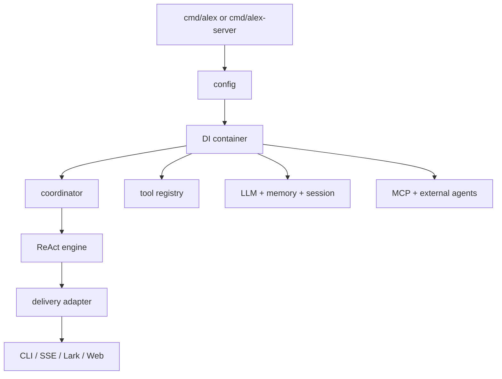

# Architecture

Updated: 2026-03-10

Runtime architecture of elephant.ai — for implementation and debugging.

---

## Layer Model

```
Delivery         CLI · Web/API/SSE · Lark gateway
    ↓
Application      Coordination · Context · Tools · DI
    ↓
Domain           ReAct loop · Events · Approval gates
    ↓
Infrastructure   LLM clients · Memory · MCP · Storage · Observability
    ↓
Shared           Config · Logging · IDs · Utilities
```

| Layer | Packages | Responsibility |
|-------|----------|----------------|
| Delivery | `internal/delivery/*`, `cmd/*`, `web/` | Inbound/outbound adapters |
| Application | `internal/app/*` | Orchestration, context building, tool registry, DI |
| Domain | `internal/domain/*` | ReAct loop, workflow model, domain events, ports |
| Infrastructure | `internal/infra/*` | LLM, tools, memory, MCP, storage, observability |
| Shared | `internal/shared/*` | Config, logging, IDs, utilities |

---

## Runtime Surfaces

| Surface | Entry point |
|---------|-------------|
| CLI/TUI | `cmd/alex/main.go` |
| Web/API/SSE | `cmd/alex-web/main.go` |
| Lark gateway | `cmd/alex-server/main.go` |
| Eval server | `cmd/eval-server` |
| Web UI | `web/` (Next.js) |

---

## Bootstrap Sequence

Managed by `internal/delivery/server/bootstrap/foundation.go` and `internal/app/di/container_builder.go`.

1. Load runtime config (`internal/shared/config`)
2. Initialize observability
3. Build DI container (`internal/app/di`)
4. Wire coordinator, tool registry, session, memory, checkpoint
5. Start optional subsystems (MCP, scheduler, timer)



---

## Agent Execution

Entry: `internal/app/agent/coordinator/coordinator.go` → `ExecuteTask`

### Phases

1. **Prepare** (`internal/app/agent/preparation/service.go`)
   - Load session, replay history, build context window, resolve system prompt, select model.

2. **Execute — ReAct loop** (`internal/domain/agent/react/engine.go`, `runtime.go`)
   - Think → plan tools → execute tools → observe → checkpoint.
   - Dispatches tool calls via domain ports.
   - Handles approvals, retries, context updates.

3. **Persist**
   - Save session/history, workflow snapshot, cost log.

### Context Assembly

| Concern | Package |
|---------|---------|
| Context window | `internal/app/context/manager_window.go` |
| System prompt | `internal/app/context/manager_prompt.go` |
| Compression | `internal/app/context/manager_compress.go` |

### Memory

Markdown-first: `internal/infra/memory/md_store.go`, `engine.go`.
Optional vector index: `indexer.go`, `index_store.go`.

---

## Tool Architecture

Registry: `internal/app/toolregistry/registry.go`, `registry_builtins.go`.

**Execution chain** (outer → inner): SLA measurement → ID propagation → retry/circuit breaker → approval → argument validation → concrete executor.

Builtins: `internal/infra/tools/builtin/*`.

### Core tools (always on)

`plan`, `clarify`, `request_user`, `memory_search`, `memory_get`, `skills`, `web_search`, `browser_action`, `read_file`, `write_file`, `replace_in_file`, `shell_exec`, `execute_code`, `channel`.

### Dynamic tools

- **Subagent/delegation**: `subagent`, `explore`, `bg_*`, `ext_*` — registered after coordinator creation.
- **MCP**: registered at runtime with `mcp__` prefix.

### Toolset modes

- `default` — sandbox-backed implementations.
- `local` / `lark-local` — local browser/file/shell implementations.

### Team orchestration (CLI-first)

```bash
alex team run       # dispatch team workflow
alex team status    # inspect runtime status
alex team inject    # send input to running role
alex team terminal  # attach to role terminal
```

---

## Event Model

Domain events: `internal/domain/agent/events.go`.

Translation to workflow envelope: `internal/app/agent/coordinator/workflow_event_translator.go`.

**Delivery adapters:**

| Channel | Package |
|---------|---------|
| CLI/TUI | `internal/delivery/output/*` |
| HTTP/SSE | `internal/delivery/server/http/*`, broadcaster at `server/app/event_broadcaster.go` |
| Lark | `internal/delivery/channels/lark/*` |
| Web | `web/hooks/useSSE/`, pipeline at `web/lib/events/eventPipeline.ts` |

---

## Session / State

| Concern | Package |
|---------|---------|
| Session store | `internal/infra/session/filestore/store.go` |
| State snapshots | `internal/infra/session/state_store/file_store.go` |
| ReAct checkpoint | `internal/domain/agent/react/checkpoint.go` |
| Cost storage | `internal/infra/storage/cost_store.go` |

---

## Proactivity

Scheduler: `internal/app/scheduler/scheduler.go`, `executor.go`, `notifier.go`.

---

## IDs and Correlation

| ID | Scope |
|----|-------|
| `session_id` | Conversation |
| `task_id` / `parent_task_id` | Execution tree |
| `run_id` / `parent_run_id` | Workflow-event correlation |
| `log_id` | Cross-service log correlation |
| `correlation_id` / `causation_id` | Event causality chain |

**Debugging**: start with `log_id` + `task_id`; use `parent_*` for subagent tracing.

See: `docs/reference/DOMAIN_LAYERS_AND_IDS.md`, `internal/shared/utils/id/*`.

---

## Guardrails

- Domain ports (`internal/domain/agent/ports`) must stay free of memory/RAG concrete dependencies.
- Tool/preset policy enforcement belongs in app+infra layers, not domain.
- Event correlation fields must be preserved across translation and delivery.
- Config in YAML only.

---

## Legacy Path Mapping

| Old | Current |
|-----|---------|
| `internal/agent/app` | `internal/app/agent` |
| `internal/agent/domain` | `internal/domain/agent` |
| `internal/server/*` | `internal/delivery/server/*` |
| `internal/toolregistry` | `internal/app/toolregistry` |
| `internal/tools/*` | `internal/infra/tools/*` |
| `internal/llm` | `internal/infra/llm` |
| `internal/memory` | `internal/infra/memory` |
