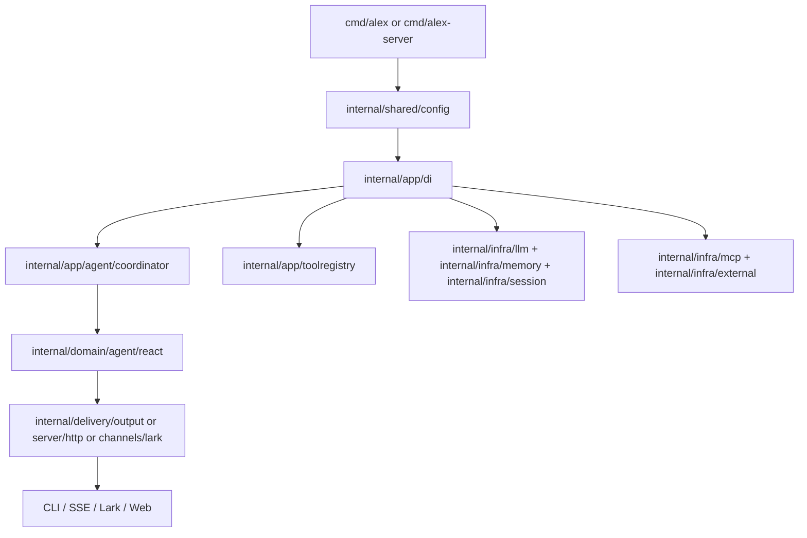

# Architecture

Updated: 2026-03-04

Practical map of elephant.ai runtime architecture for implementation and debugging.

---

## 1. Runtime Surfaces

| Surface | Entry point | Notes |
|---------|-------------|-------|
| CLI/TUI | `cmd/alex/main.go` | |
| Web/API/SSE | `cmd/alex-web/main.go` | Full HTTP API + SSE + web backend |
| Lark gateway | `cmd/alex-server/main.go` | Lark-first runtime + debug HTTP; supports `kernel-once` mode |
| Eval server | `cmd/eval-server` | `internal/delivery/eval` |
| Web UI | `web/` | Next.js dashboard, consumes SSE |

External integrations: LLM providers (`internal/infra/llm`), MCP servers (`internal/infra/mcp`), external agents (`internal/infra/external`), session persistence (`internal/infra/session`), memory engine (`internal/infra/memory`), observability (`internal/infra/observability`, `internal/shared/logging`).

## 2. Layer Model

| Layer | Responsibility | Packages |
|-------|---------------|----------|
| Delivery | Inbound/outbound adapters (CLI, HTTP/SSE, Lark, web) | `internal/delivery/*`, `cmd/*`, `web/` |
| Application | Orchestration, coordination, context building, tool registry, DI | `internal/app/*` |
| Domain | ReAct loop, workflow model, domain events, ports | `internal/domain/*` |
| Infrastructure | LLM clients, tools, memory, MCP, storage, observability | `internal/infra/*` |
| Shared | Config, logging, IDs, utilities | `internal/shared/*` |

## 3. Bootstrap and Dependency Wiring

Managed by `internal/delivery/server/bootstrap/foundation.go` and `internal/app/di/container_builder.go`.

Sequence:
1. Load runtime config (`internal/shared/config`).
2. Initialize observability.
3. Build DI container (`internal/app/di`).
4. Build coordinator, tool registry, session, memory, checkpoint dependencies.
5. Start optional subsystems (MCP, scheduler, timer, kernel depending on mode/config).

## 4. Agent Execution Chain

Entry point: `internal/app/agent/coordinator/coordinator.go` (`ExecuteTask`).

### Phases

1. **Prepare** (`internal/app/agent/preparation/service.go`)
   - Session loading, history replay, context window, system prompt, tool preset, model resolution.

2. **Execute -- ReAct loop** (`internal/domain/agent/react/engine.go`, `runtime.go`)
   - Think -> plan tools -> execute tools -> observe -> checkpoint.
   - Dispatches tool calls via domain tool registry ports.
   - Handles approvals, retries, context updates, finalization.

3. **Summarize + Persist**
   - Session/history persistence, workflow snapshot, cost logging.

### Context and Memory

Context window and system prompt assembly:
- `internal/app/context/manager_window.go`
- `internal/app/context/manager_prompt.go`

Compression and budget control:
- `internal/app/context/manager_compress.go`

Memory engine (Markdown-first):
- `internal/infra/memory/md_store.go`, `engine.go`
- Optional indexing: `indexer.go`, `index_store.go`

## 5. Tool Architecture

Registry: `internal/app/toolregistry/registry.go`, `registry_builtins.go`.

Execution wrapper chain (outer to inner): SLA measurement -> ID propagation -> retry/circuit breaker -> approval executor -> argument validation -> concrete tool executor.

Builtins: `internal/infra/tools/builtin/*`.

### Always-on core tools

`plan`, `clarify`, `request_user`, `memory_search`, `memory_get`, `skills`, `web_search`, `browser_action`, `read_file`, `write_file`, `replace_in_file`, `shell_exec`, `execute_code`, `channel`.

### Team orchestration contract

Product-facing multi-agent orchestration is **CLI-first**:
- `alex team run` — dispatch a team workflow from template/file/prompt
- `alex team status` — inspect runtime status, roles, events, artifacts
- `alex team inject` — send follow-up input to a running role
- `alex team terminal` — inspect or attach to a role terminal

Notes:
- Legacy `run_tasks` / `reply_agent` remain internal implementation details and are intentionally excluded from the default tool registry.
- LLM-facing guidance should prefer the `team-cli` skill so prompts align with the stable CLI contract.

### Subagent/delegation tools

`subagent`, `explore`, `bg_*`, `ext_*` -- dynamically registered after coordinator creation.

### MCP tools

Dynamically registered at runtime with `mcp__` prefix.

### Toolset switching

- `toolset: default` -- sandbox-backed implementations.
- `toolset: local` / `lark-local` -- local browser/file/shell implementations.

## 6. Event Model and Propagation

Domain events: `internal/domain/agent/events.go`.

Application translation to workflow envelope: `internal/app/agent/coordinator/workflow_event_translator.go`.

Downstream delivery:
- CLI/TUI: `internal/delivery/output/*`
- HTTP/SSE: `internal/delivery/server/http/*`, broadcaster at `internal/delivery/server/app/event_broadcaster.go`
- Lark: `internal/delivery/channels/lark/*`
- Web: SSE consumption via `web/hooks/useSSE/`, event pipeline at `web/lib/events/eventPipeline.ts`

## 7. Delivery Channels

### Web / HTTP / SSE

- Router: `internal/delivery/server/http/router.go`
- Async task execution: `internal/delivery/server/app/task_execution_service.go`
- Event broadcaster: `internal/delivery/server/app/event_broadcaster.go`
- SSE handler: `internal/delivery/server/http/sse_handler.go`
- Frontend: `web/hooks/useSSE/useSSE.ts`, `useSSEConnection.ts`; event types at `web/lib/types/events/*`

### Lark

- Gateway: `internal/delivery/channels/lark/gateway.go`
- Bootstrap wiring: `internal/delivery/server/bootstrap/lark_gateway.go`
- Progress listeners: `progress_listener.go`, `background_progress_listener.go`, `plan_clarify_listener.go`

## 8. Session / State Persistence

- Session store: `internal/infra/session/filestore/store.go`
- State snapshots / turn history: `internal/infra/session/state_store/file_store.go`
- ReAct checkpoint: `internal/domain/agent/react/checkpoint.go`
- Cost storage: `internal/infra/storage/cost_store.go`

## 9. Proactivity Subsystems

Scheduler: `internal/app/scheduler/scheduler.go`, `executor.go`, `notifier.go`.

Kernel periodic loop:
- Engine: `internal/app/agent/kernel/engine.go`
- Bootstrap: `internal/delivery/server/bootstrap/kernel.go`
- Single cycle: `internal/delivery/server/bootstrap/kernel_once.go`

## 10. IDs and Correlation

Key IDs carried end-to-end:

| ID | Scope |
|----|-------|
| `session_id` | Conversation scope |
| `task_id` / `parent_task_id` | Execution tree |
| `run_id` / `parent_run_id` | Workflow-event correlation |
| `log_id` | Log correlation across service/LLM/request |
| `correlation_id` / `causation_id` | Event causality chain |

Debugging: start with `log_id` + `task_id`; use `parent_*` fields for subagent fan-out tracing.

References: `docs/reference/DOMAIN_LAYERS_AND_IDS.md`, `internal/shared/utils/id/*`.

## 11. Architecture Guardrails

- Keep domain ports (`internal/domain/agent/ports`) free of memory/RAG concrete dependencies.
- Keep tool/preset policy enforcement in app+infra layers, not domain.
- Keep event correlation fields unchanged across translation and delivery.
- Config in YAML only.

## 12. Legacy Path Mapping

Some older docs reference pre-refactor paths:

| Old | Current |
|-----|---------|
| `internal/agent/app` | `internal/app/agent` |
| `internal/agent/domain` | `internal/domain/agent` |
| `internal/server/*` | `internal/delivery/server/*` |
| `internal/toolregistry` | `internal/app/toolregistry` |
| `internal/tools/*` | `internal/infra/tools/*` |
| `internal/llm` | `internal/infra/llm` |
| `internal/memory` | `internal/infra/memory` |
