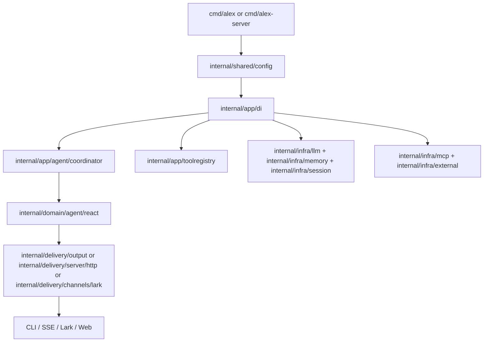

# Architecture and Agent Execution Flow
> Last updated: 2026-02-10

This document is the current architecture source of truth for elephant.ai runtime wiring and execution flow.

---

## 1) System Context

**Delivery surfaces:**
- CLI/TUI: `cmd/alex`
- Server (HTTP/SSE): `cmd/alex-server`, `internal/delivery/server/http`
- Lark gateway: `internal/delivery/channels/lark`
- Web UI: `web/`
- Eval server: `cmd/eval-server`, `internal/delivery/eval`

**External integrations:**
- LLM providers: `internal/infra/llm`
- MCP servers: `internal/infra/mcp`
- External agents (Codex/Claude Code): `internal/infra/external`
- Session persistence: `internal/infra/session`
- Memory engine: `internal/infra/memory`
- Observability: `internal/infra/observability`, `internal/shared/logging`

---

## 2) Layer Model

| Layer | Responsibility | Primary packages |
| --- | --- | --- |
| Delivery | Inbound/outbound adapters for CLI, HTTP/SSE, Lark, web | `internal/delivery/*`, `cmd/*`, `web/` |
| Application | Orchestration, coordination, policy composition | `internal/app/*` |
| Domain | ReAct loop, workflows, ports, domain events | `internal/domain/*` |
| Infrastructure | Concrete adapters (LLM, tools, memory, storage, external, MCP) | `internal/infra/*` |
| Shared | Cross-cutting config/logging/utilities | `internal/shared/*` |

---

## 3) Runtime Bootstrap

### CLI (`cmd/alex`)
1. Load env and runtime config (`internal/shared/config`).
2. Build DI container (`internal/app/di`).
3. Start container lifecycle (`Container.Start`) to initialize async MCP bootstrap.
4. Run TUI/CLI command path with coordinator + tool registry.

### Server (`cmd/alex-server`)
1. Load env/config.
2. Execute server bootstrap (`internal/delivery/server/bootstrap`).
3. Assemble HTTP handlers, SSE broadcaster, Lark gateway, auth/session dependencies.
4. Serve HTTP endpoints + SSE stream; optionally run Lark mode.

---

## 4) Agent Execution Flow (Think -> Act -> Observe)

**Coordinator:** `internal/app/agent/coordinator`
- Builds task runtime context (session/history/memory/tool policy).
- Wraps domain events into workflow envelopes for delivery channels.

**Domain runtime:** `internal/domain/agent/react`
- Executes iterative ReAct loop.
- Dispatches tool calls via domain tool registry ports.
- Handles approvals, retries, context updates, and finalization.

**Context + memory:** `internal/app/context` + `internal/infra/memory`
- Maintains short-term context snapshots and history.
- Applies memory gate/policy before loading long-term memory into prompt context.

---

## 5) Tooling Architecture

**Core registry:** `internal/app/toolregistry`
- Builtins are registered in `registry_builtins.go`.
- Tool execution is wrapped by validation, approval, retry, ID propagation, and optional SLA collection.

**Always-on core tools (baseline):**
- `plan`, `clarify`, `request_user`
- `memory_search`, `memory_get`, `skills`
- `web_search` (can be disabled by profile/runtime validation)
- `browser_action`, `read_file`, `write_file`, `replace_in_file`, `shell_exec`, `execute_code`
- `channel`

**Conditionally added:**
- `subagent`, `explore`, `bg_dispatch`, `bg_status`, `bg_collect`, `ext_reply`, `ext_merge`
  - registered after coordinator is constructed.

**MCP tools:**
- Dynamically registered with `mcp__` prefix at runtime.

**Toolset switching:**
- `toolset: default` -> sandbox-backed implementations.
- `toolset: local` / `lark-local` -> local browser/file/shell implementations.

---

## 6) Event Flow and Delivery

- Domain emits typed events from `internal/domain/agent/events.go` and `events_external.go`.
- Application translates to workflow envelopes in `internal/app/agent/coordinator/workflow_event_translator.go`.
- Delivery adapters fan out:
  - CLI/TUI: `internal/delivery/output`
  - HTTP/SSE: `internal/delivery/server/http`
  - Lark: `internal/delivery/channels/lark`
  - Web consumes SSE stream (`web/hooks/useSSE`).

---

## 7) IDs and Correlation

Primary runtime IDs:
- `session_id`: conversation scope.
- `task_id` / `parent_task_id`: execution tree.
- `run_id` / `parent_run_id`: workflow-event correlation.
- `log_id`: log correlation across service/LLM/request logs.

Use `log_id + task_id` as the first debugging pair; use `parent_*` fields for subagent fan-out tracing.

---

## 8) Architecture Guardrails

- Keep `internal/domain/agent/ports` free of memory/RAG concrete dependencies.
- Keep tool/preset policy enforcement in app+infra layers, not domain data models.
- Keep config examples and operational config in YAML (`.yaml`).

---

## 9) Legacy Path Mapping

Some older docs still reference pre-refactor paths. Current mapping:
- `internal/agent/app` -> `internal/app/agent`
- `internal/agent/domain` -> `internal/domain/agent`
- `internal/server/*` -> `internal/delivery/server/*`
- `internal/toolregistry` -> `internal/app/toolregistry`
- `internal/tools/*` -> `internal/infra/tools/*`
- `internal/llm` -> `internal/infra/llm`
- `internal/memory` -> `internal/infra/memory`
