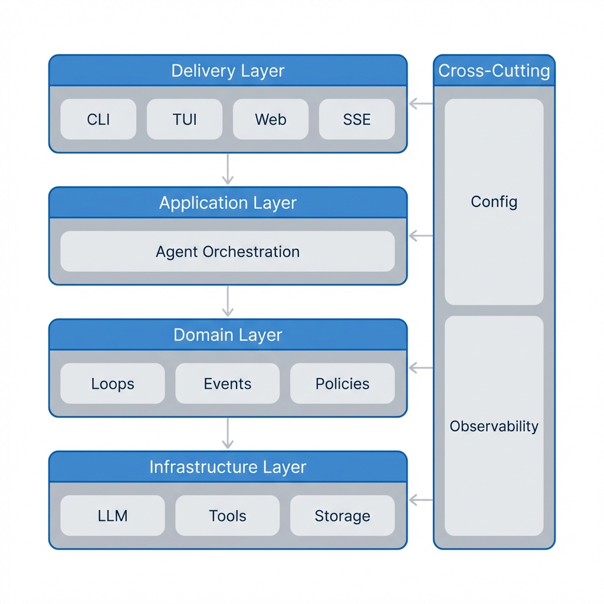
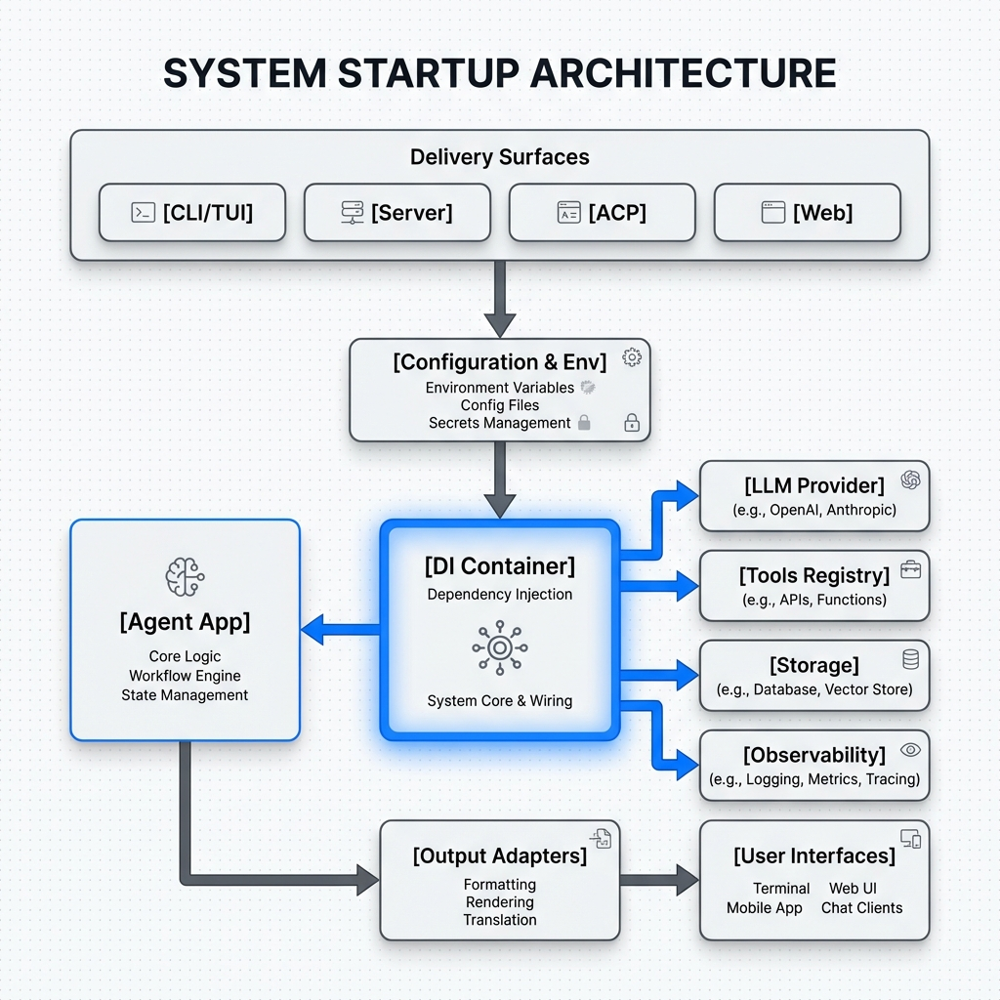
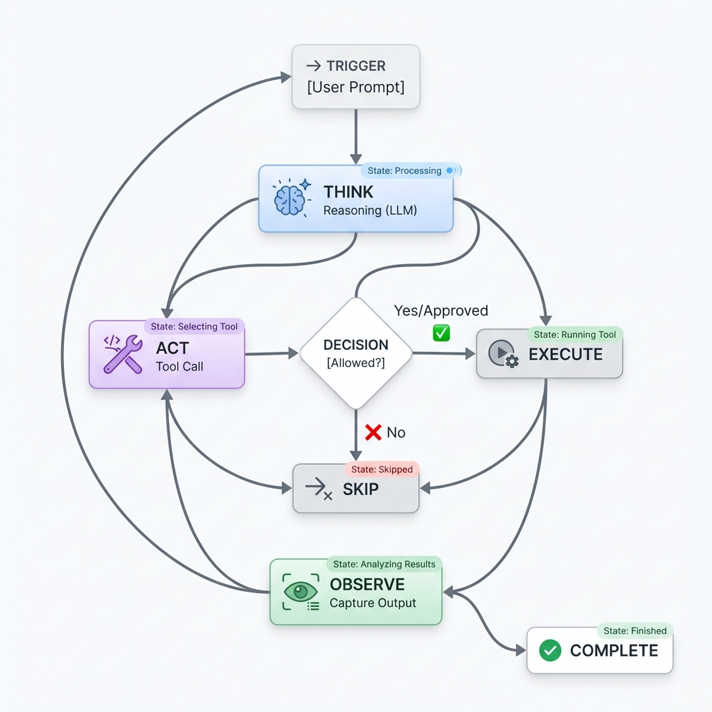
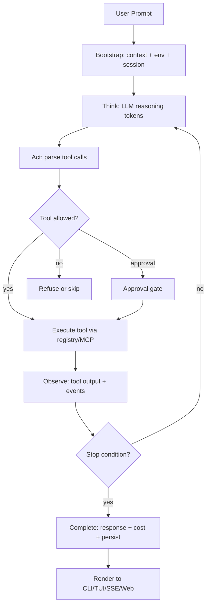
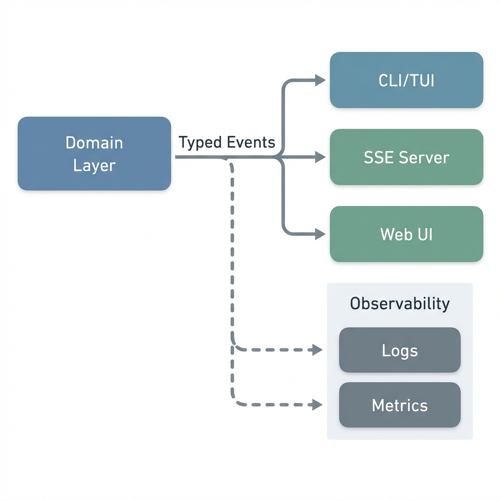

# Architecture and Agent Execution Flow
> Last updated: 2026-01-23

This document consolidates the runtime architecture and the agent execution flow for elephant.ai.
It complements the deeper dives in `docs/reference/CONFIG.md` and `docs/reference/ACP.md`.

---

## 1) System Context (Delivery Surfaces + External Dependencies)

**Delivery surfaces (shared runtime):**
- CLI/TUI: `cmd/alex`
- Server (SSE/HTTP): `cmd/alex-server`
- Web UI: `web/` (consumes the server event stream)
- ACP (Agent Client Protocol): `internal/acp` (stdio + HTTP/SSE for external clients)

**External dependencies (pluggable):**
- LLM providers (OpenAI-compatible, Claude, etc.) via `internal/llm`
- MCP servers (tooling over JSON-RPC) via `internal/mcp`
- Storage backends (sessions, cost, telemetry) via `internal/storage`
- Observability sinks (logs, metrics, traces) via `internal/observability`

---

## 2) Architecture Layers (Clear Separation of Concerns)

**Delivery Layer**
- Adapters that render events to CLI/TUI, HTTP/SSE, and web.
- Key packages: `internal/output`, `internal/server`, `web/`

**Application Layer**
- Coordinates use cases and orchestrates the agent loop.
- Key packages: `internal/agent/app/coordinator`

**Domain Layer**
- Think -> Act -> Observe loop, events, and policies.
- Key packages: `internal/agent/domain`, `internal/agent/ports`, `internal/agent/types`

**Infrastructure Layer**
- Concrete adapters for LLMs, tools, MCP, sessions, memory, storage, and telemetry.
- Key packages: `internal/llm`, `internal/tools`, `internal/toolregistry`, `internal/mcp`,
  `internal/session`, `internal/context`, `internal/memory`, `internal/rag`,
  `internal/storage`, `internal/observability`, `internal/logging`

**Wiring and bootstrap**
- Dependency injection container: `internal/di`
- Configuration and environment: `internal/config`, `internal/environment`



---

## 3) Module Map (What Lives Where)

| Area | Responsibility | Primary Packages |
| --- | --- | --- |
| Delivery surfaces | CLI/TUI, server handlers, SSE streaming, web UI | `cmd/`, `internal/output`, `internal/server`, `web/` |
| Agent application | Use case orchestration, session commands, streaming results | `internal/agent/app/coordinator` |
| Agent domain | ReAct loop, events, policies, approvals | `internal/agent/domain`, `internal/agent/ports`, `internal/agent/presets` |
| LLM integration | Provider SDKs, retries, streaming, cost tracking | `internal/llm`, `internal/subscription` |
| Tools + MCP | Built-in tools, MCP tools, registry | `internal/tools`, `internal/toolregistry`, `internal/mcp` |
| Context + memory | Short-term context, long-term RAG, session state | `internal/context`, `internal/memory`, `internal/rag`, `internal/session` |
| Observability + storage | Logs, metrics, tracing, cost storage | `internal/logging`, `internal/observability`, `internal/storage` |
| Config + env | Config merge, env snapshot | `internal/config`, `internal/environment` |

---

## 4) Startup Flow (Runtime Boot Sequence)

At startup each delivery surface follows the same skeleton:
1) Load configuration from YAML + env + flags (`internal/config`).
2) Snapshot environment and runtime metadata (`internal/environment`).
3) Build the DI container (`internal/di`) and register core adapters.
4) Wire LLM providers, tool registry, MCP supervisor, storage, observability.
5) Resolve the agent coordinator (`internal/agent/app/coordinator`).
6) Attach delivery renderers (CLI/TUI, SSE, web).



```mermaid
flowchart TD
    A[CLI/TUI | Server | ACP | Web] --> B[internal/config + internal/environment]
    B --> C[internal/di Container]
    C --> D[internal/agent/app/coordinator.AgentCoordinator]
    C --> E[internal/llm + internal/subscription]
    C --> F[internal/toolregistry + internal/tools + internal/mcp]
    C --> G[internal/session + internal/context + internal/memory + internal/rag]
    C --> H[internal/storage + internal/observability]
    D --> I[internal/output + internal/server]
    I --> J[Terminal | HTTP/SSE | Web UI]
```

---

## 5) Agent Execution Flow (Think -> Act -> Observe)

The agent loop is implemented in the domain layer and orchestrated by the application layer.
Each step emits typed events which are rendered by delivery adapters.

### ReAct Execution Loop

**High-level steps:**
1) **Bootstrap**: Build the system prompt, load session context, capture environment.
2) **Think**: Request reasoning tokens from the configured LLM.
3) **Act**: Parse tool intentions, resolve tool metadata, and dispatch tool execution.
4) **Observe**: Capture tool results, compress logs, update context/memory.
5) **Control**: Apply policies (max steps, approvals, mode restrictions).
6) **Complete**: Emit final response, cost summary, and persistence signals.

### Memory & Sessions

- Session state and transcript persistence live in `internal/session` and `internal/context`.
- Retrieval and long-running memory live in `internal/rag` and the memory stores wired in `internal/di`.
- Compression and context windowing happens before each loop iteration to keep prompts bounded.





---

## 6) Event Stream & Observability

- Domain emits typed events (`internal/agent/domain/events.go`).
- Output adapters stream them to:
  - CLI/TUI (`internal/output`)
  - HTTP/SSE (`internal/server`)
  - Web UI (`web/`)
- Observability attaches metrics and traces to LLM calls and tool invocations
  via `internal/observability` and `internal/logging`.



---

## 7) Execution Modes and Safety

- Session tool modes (full/read-only/safe/sandbox) are enforced via presets in
  `internal/agent/presets`.
- Tool approvals are mediated via `internal/agent/ports` and enforced by the
  tool registry (`internal/toolregistry`) with delivery-specific approvers for
  CLI/TUI, web, and ACP.
- Sandbox execution (when enabled) is routed through `internal/sandbox` adapters.

---

## 8) Suggested Reading Order

1) `docs/reference/ARCHITECTURE_AGENT_FLOW.md` (this doc) for the reasoning loop narrative + system map.
2) `docs/reference/CONFIG.md` for configuration and init wiring.
3) `docs/reference/ACP.md` for external client integration.
