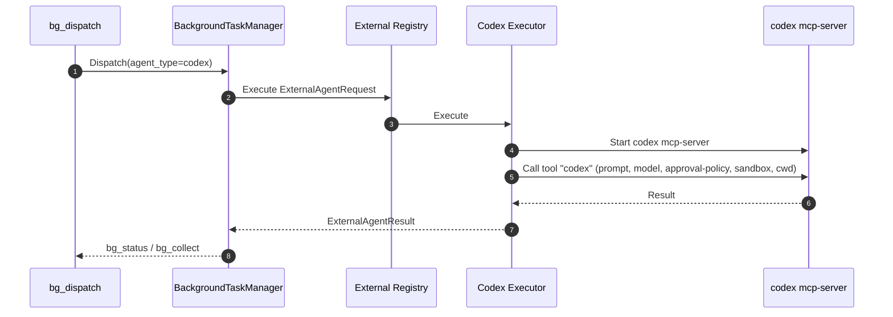
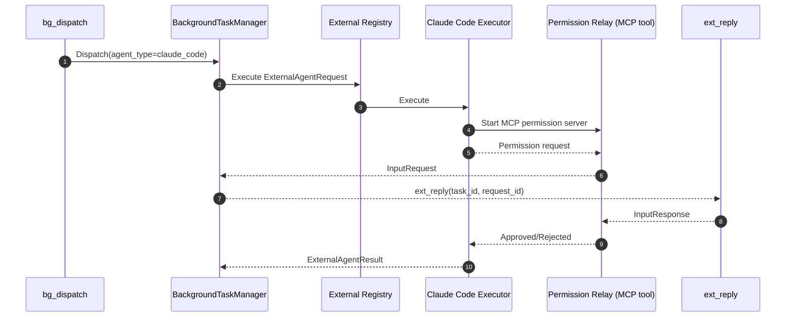

# External Agents: Codex & Claude Code

Updated: 2026-01-31

## Scope
- How to call Codex and Claude Code as **external agents** in elephant.ai.
- How to call Codex/Claude as **core LLM providers** (runtime config).

## Quick start (external agents)
1) Install CLI binaries
- Codex CLI: `npm i -g @openai/codex`
- Claude Code CLI: `npm install -g @anthropic-ai/claude-code`

2) Enable external agents in `config.yaml`

```yaml
runtime:
  external_agents:
    claude_code:
      enabled: true
      binary: "claude"
      default_mode: "interactive" # or "autonomous"
      default_model: "claude-3-5-sonnet"
      autonomous_allowed_tools:
        - "Read"
        - "Glob"
        - "Grep"
        - "WebSearch"
      max_budget_usd: 5
      max_turns: 50
      timeout: "30m"
      env:
        ANTHROPIC_API_KEY: "${ANTHROPIC_API_KEY}"
    codex:
      enabled: true
      binary: "codex"
      default_model: "o3"
      approval_policy: "on-request"
      sandbox: "workspace-write"
      timeout: "30m"
      env:
        OPENAI_API_KEY: "${OPENAI_API_KEY}"
```

3) Dispatch background tasks with `bg_dispatch`

```yaml
# tool call arguments (YAML form)
# agent_type: "claude_code" or "codex"
# config is a string map passed to the executor
bg_dispatch:
  task_id: "ext-1"
  description: "Investigate flaky tests"
  prompt: "Find root cause and propose fix"
  agent_type: "claude_code"
  config:
    mode: "interactive"
    model: "claude-3-5-sonnet"
    max_turns: "40"
```

4) Watch status / collect
- `bg_status` to see progress
- `bg_collect` to fetch results

5) Respond to permission/clarification requests
- Use `ext_reply` with `task_id` + `request_id`.

## External agent call flow (Mermaid)

### Codex external agent


### Claude Code external agent (permission flow)


## External agent config reference

| Agent | Config key | Purpose | Code |
| --- | --- | --- | --- |
| claude_code | `binary` | CLI binary path (default `claude`) | `internal/external/claudecode/executor.go` |
| claude_code | `default_mode` | `interactive` or `autonomous` | `internal/external/claudecode/executor.go` |
| claude_code | `default_model` | Claude model name | `internal/external/claudecode/executor.go` |
| claude_code | `autonomous_allowed_tools` | Auto-approve tool list | `internal/external/claudecode/permission.go` |
| claude_code | `max_budget_usd` / `max_turns` | Execution limits | `internal/external/claudecode/executor.go` |
| claude_code | `timeout` | Process timeout | `internal/external/claudecode/executor.go` |
| claude_code | `env` | Env passed to CLI (e.g., `ANTHROPIC_API_KEY`) | `internal/external/registry.go` |
| codex | `binary` | CLI binary path (default `codex`) | `internal/external/codex/executor.go` |
| codex | `default_model` | Codex model name | `internal/external/codex/executor.go` |
| codex | `approval_policy` | Command approval policy | `internal/external/codex/executor.go` |
| codex | `sandbox` | Codex sandbox mode | `internal/external/codex/executor.go` |
| codex | `timeout` | Process timeout | `internal/external/codex/executor.go` |
| codex | `env` | Env passed to CLI (e.g., `OPENAI_API_KEY`) | `internal/external/registry.go` |

## Per-task overrides (config map)
- `claude_code` supports: `mode`, `model`, `max_turns`, `max_budget_usd`, `allowed_tools`.
- `codex` supports: `model`, `approval_policy`, `sandbox`.

## External agent entry points
- Tool dispatch: `internal/tools/builtin/orchestration/bg_dispatch.go`
- Status/collect: `internal/tools/builtin/orchestration/bg_status.go`, `internal/tools/builtin/orchestration/bg_collect.go`
- Permission reply: `internal/tools/builtin/orchestration/ext_reply.go`
- Background manager: `internal/agent/domain/react/background.go`
- External registry: `internal/external/registry.go`
- Codex executor: `internal/external/codex/executor.go`
- Claude Code executor: `internal/external/claudecode/executor.go`

## Core LLM provider usage (not external agents)
If you want the **main agent** to call Codex/Claude as the runtime LLM provider:

```yaml
runtime:
  llm_provider: "codex"        # or "openai-responses"
  llm_model: "gpt-5.2-codex"
  api_key: "${CODEX_API_KEY}"
  base_url: "${CODEX_BASE_URL}"
```

```yaml
runtime:
  llm_provider: "anthropic"
  llm_model: "claude-3-5-sonnet"
  api_key: "${ANTHROPIC_API_KEY}"
  base_url: "${ANTHROPIC_BASE_URL}"
```

`llm_provider: auto` / `cli` will try CLI/OAuth credentials first (Codex/Claude), then env keys. See `docs/reference/CONFIG.md`.

## Official docs (for CLI behavior)
- OpenAI Codex CLI + MCP:
  - `https://developers.openai.com/codex/cli`
  - `https://developers.openai.com/codex/mcp`
- Claude Code CLI:
  - `https://docs.anthropic.com/en/docs/claude-code/getting-started`
