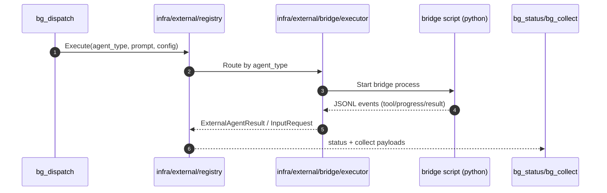

# External Agents: Codex & Claude Code

Updated: 2026-02-10

## Scope
- Run Codex / Claude Code as **external agents** (background delegated execution).
- Distinguish external-agent usage from core `llm_provider` selection.

## 1) Runtime architecture

Current external-agent path is bridge-based:
- Registry: `internal/infra/external/registry.go`
- Executor: `internal/infra/external/bridge/executor.go`
- Permission relay: `internal/infra/external/bridge/permission.go`
- Python bridges:
  - Claude Code: `scripts/cc_bridge/cc_bridge.py`
  - Codex: `scripts/codex_bridge/codex_bridge.py`

Delegation entry tools:
- `bg_dispatch`, `bg_status`, `bg_collect`, `ext_reply`, `ext_merge`
- Implemented in `internal/infra/tools/builtin/orchestration/*`

Domain background runtime:
- `internal/domain/agent/react/background.go`

## 2) Config (YAML)

```yaml
runtime:
  external_agents:
    claude_code:
      enabled: true
      default_mode: "interactive"  # or autonomous
      default_model: "claude-3-5-sonnet"
      autonomous_allowed_tools: ["Read", "Glob", "Grep", "WebSearch"]
      max_budget_usd: 5
      max_turns: 50
      timeout: "30m"
      env:
        ANTHROPIC_API_KEY: "${ANTHROPIC_API_KEY}"
    codex:
      enabled: true
      default_model: "gpt-5.2-codex"
      approval_policy: "on-request"
      sandbox: "workspace-write"
      timeout: "30m"
      env:
        OPENAI_API_KEY: "${OPENAI_API_KEY}"
```

## 3) Dispatch + collect flow

1. Call `bg_dispatch` with `agent_type: codex` or `claude_code`.
2. Poll/inspect with `bg_status`.
3. Collect output with `bg_collect`.
4. For interactive permission/input requests, respond via `ext_reply`.



## 4) Per-task override keys

- `claude_code`: `mode`, `model`, `max_turns`, `max_budget_usd`, `allowed_tools`
- `codex`: `model`, `approval_policy`, `sandbox`

## 5) Core LLM provider mode (not external agents)

If you want the main agent runtime itself to use Codex/Claude as LLM provider:

```yaml
runtime:
  llm_provider: "codex"
  llm_model: "gpt-5.2-codex"
  api_key: "${CODEX_API_KEY}"
```

```yaml
runtime:
  llm_provider: "anthropic"
  llm_model: "claude-3-5-sonnet"
  api_key: "${ANTHROPIC_API_KEY}"
```

See `docs/reference/CONFIG.md` for provider precedence and `auto`/`cli` selection behavior.
