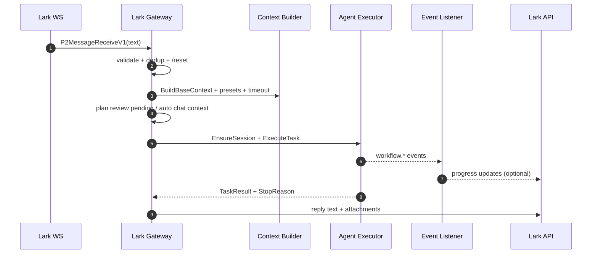
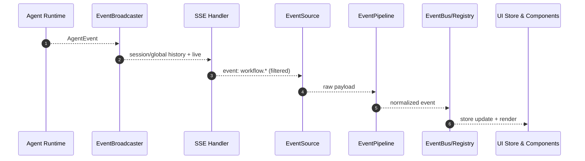

# Lark/Web Agent 功能与事件流梳理

Updated: 2026-01-31

## Scope
- Lark 渠道 agent 功能与事件流（网关、计划确认、进度、附件）。
- Web 渠道事件流（SSE 后端 -> 前端事件管线 -> UI 展示）。

## Lark 功能概览
- 会话与去重: 仅处理 text；群/私聊开关；消息去重 LRU+TTL；session_mode 支持 fresh/stable；memoryID 基于 chatID 哈希；按 memoryID 加锁串行处理。`internal/channels/lark/gateway.go`, `internal/channels/base.go`
- 交互体验: 开始/结束随机 emoji reaction；可选工具进度消息（单条消息持续更新，2s 频控）；群聊可拉取近期聊天上下文拼接。`internal/channels/lark/emoji_reactions.go`, `internal/channels/lark/progress_listener.go`, `internal/channels/lark/chat_context.go`
- 计划确认: plan review 读取/保存 pending（Postgres），在 await_user_input 输出计划确认，后续反馈以 <plan_feedback> 注入。`internal/channels/lark/gateway.go`, `internal/channels/lark/plan_review_store.go`, `internal/channels/lark/plan_review_postgres.go`
- 回复与附件: 主回复来自 BuildReplyCore + thinking fallback；附件按图片/文件上传 Lark；A2UI 附件会过滤；附件摘要追加到正文。`internal/channels/lark/gateway.go`
- 配置项入口: `channels.lark`（enabled/app_id/app_secret/session_mode/react_emoji/show_tool_progress/auto_chat_context/plan_review_*）。`docs/reference/CONFIG.md`

## Lark 事件流（Mermaid）

## Web 功能概览
- 后端事件广播: EventBroadcaster 监听 agent 事件并广播 SSE；维护历史回放；丢弃高频流式历史；缓冲满时发 stream dropped。`internal/server/app/event_broadcaster.go`
- SSE 过滤与序列化: allowlist 事件 + node 过滤；去重 seq/event_id；心跳；支持 replay 模式；附件去重+缓存+URL 化；final answer 以 delta 发送。`internal/server/http/sse_handler_stream.go`, `internal/server/http/sse_render.go`, `internal/server/http/sse_render_attachments.go`
- 前端事件管线: EventSource -> SSEClient -> EventPipeline(校验/去重/归一化) -> EventRegistry(副作用) -> EventBus -> 状态/组件。`web/lib/events/*`, `web/hooks/useSSE/useSSE.ts`
- 前端聚合与展示: useAgentStreamStore 聚合 tool/iteration/step/final；ConversationEventStream 按 seq 排序、主流/子 agent 分流；EventLine/ToolOutputCard/TaskCompleteCard 渲染。`web/hooks/useAgentStreamStore.ts`, `web/components/agent/*`

## Web 事件流（Mermaid）

## Lark 事件流表（步骤与关键点）
| Step | 行为 | 关键点 | 代码位置 |
| --- | --- | --- | --- |
| 1 | 收到 Lark 消息 | 仅 text；群/私聊开关；去重 | `internal/channels/lark/gateway.go` |
| 2 | 会话与上下文 | session_mode + memoryID；BuildBaseContext + presets/timeout | `internal/channels/lark/gateway.go`, `internal/channels/base.go` |
| 3 | 计划确认/上下文注入 | plan review pending；auto chat context 拼接 | `internal/channels/lark/gateway.go`, `internal/channels/lark/chat_context.go` |
| 4 | 执行任务 | ExecuteTask + listener | `internal/channels/lark/gateway.go` |
| 5 | 进度/表情 | progress listener 更新一条消息；start/end reaction | `internal/channels/lark/progress_listener.go`, `internal/channels/lark/emoji_reactions.go` |
| 6 | 回复与附件 | reply + attachment upload；A2UI 过滤 | `internal/channels/lark/gateway.go` |

## Web 事件流表（步骤与关键点）
| Step | 行为 | 关键点 | 代码位置 |
| --- | --- | --- | --- |
| 1 | 事件产生 | agent/domain 事件 -> workflow envelope | `internal/agent/domain/events.go` |
| 2 | 广播与历史 | SSE 广播 + history + drops | `internal/server/app/event_broadcaster.go` |
| 3 | SSE 过滤 | allowlist + blocked node + debug 模式 | `internal/server/http/sse_handler_stream.go` |
| 4 | 序列化与清洗 | payload 清洗；附件去重+缓存 | `internal/server/http/sse_render.go`, `internal/server/http/sse_render_attachments.go` |
| 5 | 前端接收 | SSEClient + EventPipeline 归一化/去重 | `web/lib/events/sseClient.ts`, `web/lib/events/eventPipeline.ts` |
| 6 | 状态聚合 | store 维护 tool/iteration/step/final | `web/hooks/useAgentStreamStore.ts`, `web/lib/events/reducer.ts` |
| 7 | UI 展示 | ConversationEventStream + EventLine + 卡片 | `web/components/agent/ConversationEventStream.tsx`, `web/components/agent/EventLine/index.tsx` |

## 事件类型与前端展示规则（摘要）
- 事件类型定义: `web/lib/types/events/base.ts`, `web/lib/types/events/payloads.ts`
- SSE allowlist 事件: `internal/server/http/sse_handler.go`
- main stream 显示规则 + subagent 分流: `web/components/agent/eventStreamUtils.ts`
- subagent 事件锚点: tool_name=subagent 的 tool started/completed 作为锚点；子 agent 事件按 parent_run_id 分组。`web/components/agent/ConversationEventStream.tsx`, `web/components/agent/eventStreamUtils.ts`

