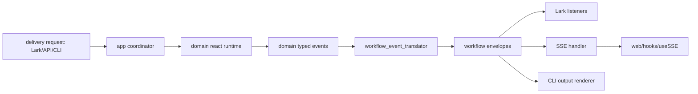

# Lark / Web / CLI Agent Event Flow

Updated: 2026-02-10

## Scope
- Lark gateway request handling and event feedback.
- Web SSE event lifecycle from backend to frontend.
- Shared coordinator + domain event translation chain.

---

## 1) Current architecture map

| Layer | Responsibility | Main paths |
| --- | --- | --- |
| Delivery | Channel ingress/egress and rendering | `internal/delivery/channels/lark`, `internal/delivery/server/http`, `internal/delivery/output`, `web/` |
| Application | Task orchestration + event translation | `internal/app/agent/coordinator` |
| Domain | ReAct runtime + typed events | `internal/domain/agent/react`, `internal/domain/agent/events.go` |
| Infra | LLM/tools/memory/session/external integrations | `internal/infra/*` |

---

## 2) Lark flow

1. Lark message enters `internal/delivery/channels/lark/gateway.go`.
2. Gateway builds/locks session context and invokes app coordinator.
3. Coordinator executes domain runtime and emits workflow envelopes.
4. Lark listeners stream progress/reactions and final output back to chat.

Key files:
- `internal/delivery/channels/lark/gateway.go`
- `internal/delivery/channels/lark/progress_listener.go`
- `internal/delivery/channels/lark/background_progress_listener.go`
- `internal/delivery/channels/lark/plan_clarify_listener.go`

---

## 3) Web flow (HTTP + SSE)

1. Task APIs receive requests via `internal/delivery/server/http/api_handler*.go`.
2. Server app layer (`internal/delivery/server/app`) runs async task execution.
3. Event broadcaster persists + fans out workflow envelopes.
4. SSE handler (`internal/delivery/server/http/sse_handler*.go`) streams events.
5. Frontend ingests events with `web/hooks/useSSE` and renders timeline/components.

---

## 4) Shared event translation chain

---

## 5) Correlation fields to keep intact

- `session_id`
- `task_id` / `parent_task_id`
- `run_id` / `parent_run_id`
- `log_id`

These IDs are required for subagent cards, event grouping, and log traceability.

---

## 6) Legacy path mapping

If older docs/scripts reference these paths, use current equivalents:
- `internal/agent/app/*` -> `internal/app/agent/*`
- `internal/agent/domain/*` -> `internal/domain/agent/*`
- `internal/server/http/*` -> `internal/delivery/server/http/*`
- `internal/channels/*` -> `internal/delivery/channels/*`
- `internal/llm/*` -> `internal/infra/llm/*`
