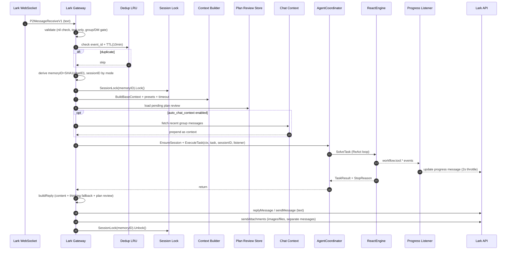
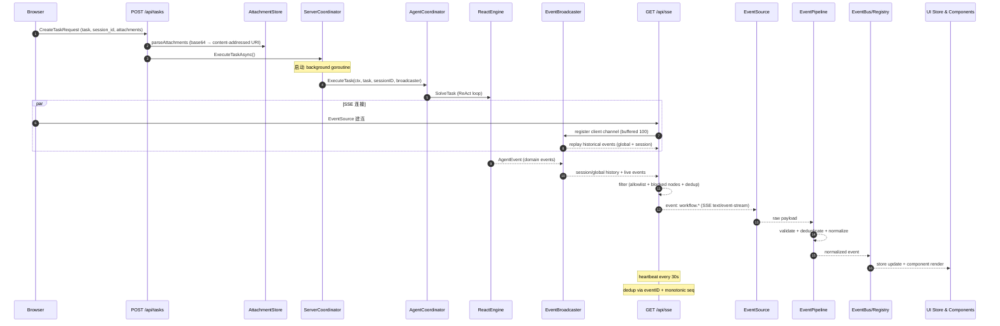
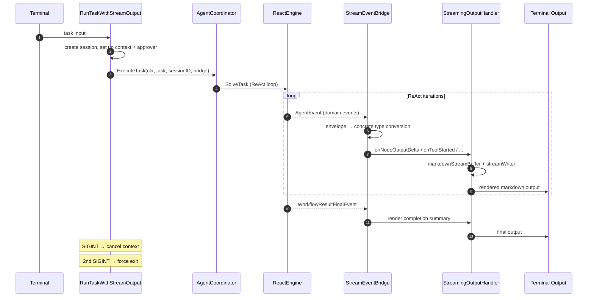
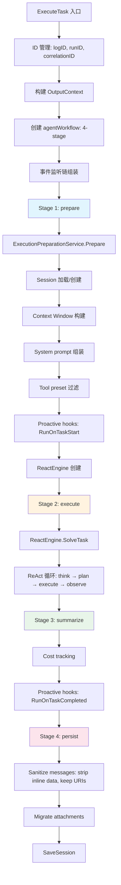
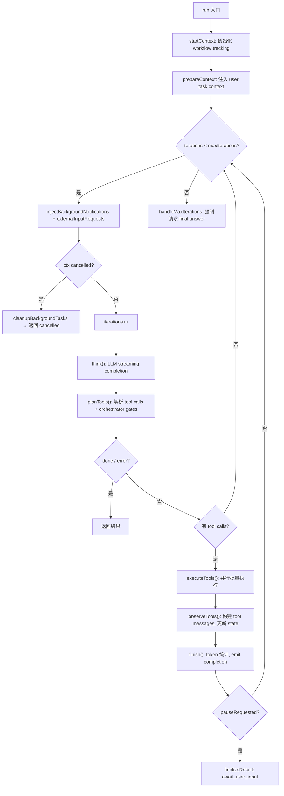

# Lark/Web/CLI Agent 功能与事件流梳理

Updated: 2026-01-31

## Scope

- **Lark 渠道**: 网关接入、会话管理、计划确认、进度反馈、附件投递。
- **Web 渠道**: SSE 后端广播 → 前端事件管线 → UI 展示。
- **CLI 渠道**: 终端流式输出、markdown 渲染、信号处理。
- **共享核心**: Coordinator 4-stage workflow、ReAct 循环、事件翻译链、工具执行。

---

## 一、架构总览

```
┌──────────────────────────────────────────────────────────────┐
│                   Delivery Layer (Channels)                   │
│  ┌─────────┐   ┌──────────────┐   ┌──────────────────────┐  │
│  │ Lark GW │   │ HTTP Server  │   │   CLI (stream_output) │  │
│  └────┬────┘   └──────┬───────┘   └──────────┬───────────┘  │
│       │               │                      │               │
│       └───────────────┼──────────────────────┘               │
│                       ▼                                      │
│           channels.AgentExecutor interface                    │
└──────────────────────────────────────────────────────────────┘
                        │
                        ▼
┌──────────────────────────────────────────────────────────────┐
│              Agent Application Layer                          │
│  ┌──────────────────────────────────────────────────────┐    │
│  │        AgentCoordinator.ExecuteTask()                 │    │
│  │   ┌──────────────────────────────────────────────┐   │    │
│  │   │  agentWorkflow (4 stages):                    │   │    │
│  │   │   prepare → execute → summarize → persist     │   │    │
│  │   └──────────────────────────────────────────────┘   │    │
│  └──────────────────────────────────────────────────────┘    │
│                                                              │
│  Event Listener Chain:                                       │
│   ReactEngine.emitEvent()                                    │
│     → workflowEventTranslator (domain → envelope)            │
│       → SerializingEventListener (sequential delivery)       │
│         → planSessionTitleRecorder (captures titles)         │
│           → caller-provided listener (SSE/CLI/Lark)          │
└──────────────────────────────────────────────────────────────┘
                        │
                        ▼
┌──────────────────────────────────────────────────────────────┐
│                  Domain Layer (ReAct)                         │
│  ReactEngine → reactRuntime.run()                            │
│    for each iteration:                                       │
│      think()  → LLM streaming completion                     │
│      planTools()  → parse tool calls, orchestrator gates     │
│      executeTools() → parallel batch execution               │
│      observeTools() → build tool messages, update state      │
│      finish() → token counting, emit completion              │
└──────────────────────────────────────────────────────────────┘
                        │
                        ▼
┌──────────────────────────────────────────────────────────────┐
│             Infrastructure Adapters                           │
│  LLM (OpenAI/Claude/ARK/DeepSeek/Ollama)                    │
│  Tools (file ops, shell, browser, search, code exec, MCP)   │
│  Memory (Postgres/file/in-memory)                            │
│  Storage (sessions, history, cost)                           │
│  Attachments (local/Cloudflare R2)                           │
│  Observability (traces, metrics, cost)                       │
└──────────────────────────────────────────────────────────────┘
```

---

## 二、Lark 渠道

### 2.1 功能概览

| 功能 | 说明 | 代码位置 |
|---|---|---|
| 会话与去重 | 仅处理 text；群/私聊开关；LRU+TTL 去重；session_mode(fresh/stable)；memoryID = SHA1(chatID)；按 memoryID 加锁串行 | `internal/channels/lark/gateway.go`, `internal/channels/base.go` |
| 交互体验 | 开始/结束随机 emoji reaction；工具进度消息（单条持续更新，2s 频控）；群聊可拉取近期上下文拼接 | `internal/channels/lark/emoji_reactions.go`, `progress_listener.go`, `chat_context.go` |
| 计划确认 | plan review 读取/保存 pending（Postgres）；await_user_input 输出计划确认；后续反馈以 `<plan_feedback>` 注入 | `internal/channels/lark/gateway.go`, `plan_review_store.go`, `plan_review_postgres.go` |
| 回复与附件 | BuildReplyCore + thinking fallback；附件按图片/文件上传 Lark；A2UI 附件过滤；附件摘要追加正文 | `internal/channels/lark/gateway.go` |
| 配置入口 | `channels.lark`（enabled/app_id/app_secret/session_mode/react_emoji/show_tool_progress/auto_chat_context/plan_review_*） | `docs/reference/CONFIG.md` |

### 2.2 核心数据结构

```go
// internal/channels/lark/gateway.go
type Gateway struct {
    channels.BaseGateway           // 提供 per-session mutex (sync.Map)
    cfg             Config
    agent           AgentExecutor  // channels.AgentExecutor 接口
    client          *lark.Client   // REST API (发送回复)
    wsClient        *larkws.Client // WebSocket (接收事件)
    eventListener   agent.EventListener
    emojiPicker     *emojiPicker
    dedupMu         sync.Mutex
    dedupCache      *lru.Cache[string, time.Time]
    planReviewStore PlanReviewStore
}
```

### 2.3 Lark 事件流（详细 Mermaid）



### 2.4 Lark 事件流表

| Step | 行为 | 关键点 | 代码位置 |
|---|---|---|---|
| 1 | 收到 Lark 消息 | WebSocket `P2MessageReceiveV1`；仅 text；群/私聊开关 | `gateway.go` |
| 2 | 去重 | LRU cache + 10min TTL；mutex 保护 | `gateway.go` |
| 3 | 会话标识 | memoryID=SHA1(chatID)；sessionID 按 mode(fresh=新/stable=固定) | `gateway.go` |
| 4 | 串行锁 | `BaseGateway.SessionLock(memoryID)` — 同一 chat 串行处理 | `base.go` |
| 5 | 上下文组装 | `BuildBaseContext` + session history=false + Lark client/chatID 注入 | `gateway.go`, `base.go` |
| 6 | 计划确认检查 | 加载 pending plan review；有则构建 `<plan_feedback>` 块注入 | `gateway.go`, `plan_review_store.go` |
| 7 | 群聊上下文 | auto_chat_context 开启时拉取近期消息拼接 | `chat_context.go` |
| 8 | Session + Presets | `EnsureSession` + `ApplyPresets` + `ApplyTimeout` | `gateway.go` |
| 9 | 执行任务 | `ExecuteTask` 进入 Coordinator → ReAct 循环 | `gateway.go` |
| 10 | 进度/表情 | progress listener 更新一条消息(2s 频控)；start/end emoji reaction | `progress_listener.go`, `emoji_reactions.go` |
| 11 | 回复与附件 | `buildReply` + text 回复；图片/文件分别上传 Lark API | `gateway.go` |

### 2.5 并发模型

```
per-chat: SessionLock(memoryID) — sync.Map → *sync.Mutex
dedup:    dedupMu (sync.Mutex) 保护 dedupCache (LRU)
进度:     progress_listener 内部 2s 频控 + debounce
```

---

## 三、Web 渠道

### 3.1 功能概览

| 功能 | 说明 | 代码位置 |
|---|---|---|
| 任务创建 | POST /api/tasks → 解析附件(base64→content-addressed store) → `ExecuteTaskAsync` 异步执行 | `api_handler_tasks.go` |
| 事件广播 | `EventBroadcaster` 监听 agent 事件并广播 SSE；维护历史回放；缓冲满时发 stream.dropped | `event_broadcaster.go` |
| SSE 过滤与序列化 | allowlist ~25 事件 + 内部 node 过滤；去重 seq/event_id；心跳 30s；replay 模式；附件去重+缓存+URL 化；final answer 以 delta 发送 | `sse_handler_stream.go`, `sse_render.go`, `sse_render_attachments.go` |
| 前端事件管线 | EventSource → SSEClient → EventPipeline(校验/去重/归一化) → EventRegistry(副作用) → EventBus → 状态/组件 | `web/lib/events/*`, `web/hooks/useSSE/useSSE.ts` |
| 前端聚合与展示 | useAgentStreamStore 聚合 tool/iteration/step/final；ConversationEventStream 按 seq 排序、主流/子 agent 分流；EventLine/ToolOutputCard/TaskCompleteCard 渲染 | `web/hooks/useAgentStreamStore.ts`, `web/components/agent/*` |

### 3.2 核心数据结构

```go
// internal/server/http/router_deps.go
type RouterDeps struct {
    Coordinator    *app.ServerCoordinator
    Broadcaster    *app.EventBroadcaster
    RunTracker     app.RunTracker
    HealthChecker  *app.HealthCheckerImpl
    AuthHandler    *AuthHandler
    AuthService    *authapp.Service
    ConfigHandler  *ConfigHandler
    Evaluation     *app.EvaluationService
    Obs            *observability.Observability
    MemoryService  memory.Service
    AttachmentCfg  attachments.StoreConfig
    SandboxBaseURL string
    DataCache      *DataCache
}
```

### 3.3 HTTP 中间件栈

```
CORS → Compression → StreamGuard → RequestTimeout → RateLimit → Logging → Observability → Mux
```

### 3.4 Web 事件流（详细 Mermaid）



### 3.5 Web 事件流表

| Step | 行为 | 关键点 | 代码位置 |
|---|---|---|---|
| 1 | 创建任务 | POST /api/tasks → 解析附件 → context 注入 | `api_handler_tasks.go` |
| 2 | 异步执行 | `ExecuteTaskAsync` → background goroutine → Coordinator | `server_coordinator.go` |
| 3 | 事件广播 | `EventBroadcaster` 维护历史 + 实时广播；缓冲满发 `stream.dropped` | `event_broadcaster.go` |
| 4 | SSE 连接 | 设置 SSE headers；注册 client channel (buffered 100)；replay 历史 | `sse_handler.go` |
| 5 | 事件过滤 | allowlist ~25 event types；过滤内部 `react:` node；去重 eventID + seq | `sse_handler_stream.go` |
| 6 | 序列化 | payload 清洗；附件去重+缓存+URL 化；final answer delta 发送 | `sse_render.go`, `sse_render_attachments.go` |
| 7 | 前端接收 | `SSEClient` → `EventPipeline` 校验/去重/归一化 | `web/lib/events/sseClient.ts`, `eventPipeline.ts` |
| 8 | 状态聚合 | `useAgentStreamStore` 维护 tool/iteration/step/final | `useAgentStreamStore.ts`, `reducer.ts` |
| 9 | UI 展示 | `ConversationEventStream` 按 seq 排序 + 主流/子 agent 分流 | `ConversationEventStream.tsx`, `EventLine/index.tsx` |

### 3.6 SSE 过滤规则

```go
// shouldStreamEvent:
// 1. 仅通过 WorkflowEventEnvelope 和 WorkflowInputReceivedEvent
// 2. Allowlist 约 25 种事件类型
// 3. 过滤内部 react:iter:*:tools node IDs
// 4. 去重: seenEventIDs map + lastSeqByRun 单调递增
```

---

## 四、CLI 渠道

### 4.1 功能概览

| 功能 | 说明 | 代码位置 |
|---|---|---|
| 流式输出 | `StreamEventBridge` 实现 `EventListener`；将 envelope 事件转回具体类型渲染 | `cmd/alex/stream_output.go` |
| Markdown 渲染 | `markdownStreamBuffer` 缓冲 delta + 换行刷新；`streamWriter` 微缓冲(8 rune/12ms) 平滑终端输出 | `cmd/alex/stream_output.go` |
| 工具/子 agent 展示 | `activeTools` map 追踪进行中工具；`SubagentDisplay` 展示子 agent 进度 | `cmd/alex/stream_output.go` |
| 信号处理 | 第一次 SIGINT/SIGTERM → graceful cancel context；第二次 → force exit | `cmd/alex/stream_output.go` |
| 审批门控 | CLI 注入 `tools.Approver`；危险操作交互式确认 | `cmd/alex/` |

### 4.2 核心数据结构

```go
// cmd/alex/stream_output.go
type StreamingOutputHandler struct {
    container       *Container
    renderer        *output.CLIRenderer
    ctx             context.Context
    out             io.Writer
    activeTools     map[string]ToolInfo
    subagentDisplay *SubagentDisplay
    verbose         bool
    mdBuffer        *markdownStreamBuffer
    streamWriter    *streamWriter
}

type StreamEventBridge struct {
    handler *StreamingOutputHandler
    // 实现 agent.EventListener.OnEvent()
    // 1. SubtaskEvent → orchestration display
    // 2. WorkflowEventEnvelope → handleEnvelopeEvent (转回具体类型)
    // 3. Legacy domain events → direct handling
}
```

### 4.3 CLI 事件流



---

## 五、共享核心 — Coordinator

### 5.1 AgentCoordinator 结构

```go
// internal/agent/app/coordinator/coordinator.go
type AgentCoordinator struct {
    llmFactory          llm.LLMClientFactory
    toolRegistry        tools.ToolRegistry
    sessionStore        storage.SessionStore
    contextMgr          agent.ContextManager
    historyMgr          storage.HistoryManager
    parser              tools.FunctionCallParser
    costTracker         storage.CostTracker
    config              appconfig.Config
    logger              agent.Logger
    clock               agent.Clock
    memoryService       memory.Service
    externalExecutor    agent.ExternalAgentExecutor
    iterationHook       agent.IterationHook
    prepService         preparationService
    costDecorator       *cost.CostTrackingDecorator
    attachmentMigrator  materialports.Migrator
    attachmentPersister ports.AttachmentPersister
    hookRegistry        *hooks.Registry
}
```

### 5.2 ExecuteTask 生命周期



### 5.3 4-Stage Workflow

| Stage | 行为 | 失败影响 |
|---|---|---|
| **prepare** | Session 加载、context window、system prompt、tool preset、proactive hooks | 任务无法启动 |
| **execute** | ReactEngine.SolveTask — ReAct 循环 | 返回部分结果或错误 |
| **summarize** | 成本统计、proactive hooks（post-task memory） | 不影响任务结果 |
| **persist** | sanitize messages + 附件迁移 + SaveSession | session 可能丢失 |

每个 stage 通过 `agentWorkflow` 记录 start/succeed/fail 转换，产生 `WorkflowLifecycleUpdatedEvent` 和 `WorkflowNodeStarted/CompletedEvent`。

### 5.4 事件监听链（从内到外）

```
ReactEngine.emitEvent()
  │  原始 domain events (WorkflowToolStartedEvent, WorkflowNodeOutputDeltaEvent, ...)
  ▼
workflowEventTranslator
  │  domain events → WorkflowEventEnvelope
  │  pass-through: ContextSnapshotEvent, PreAnalysisEmojiEvent, 已有 Envelope
  │  过滤: react:iter:*:tools 内部 node
  │  附加: subflow stats 聚合
  ▼
SerializingEventListener
  │  保证事件顺序投递 (sequential delivery)
  ▼
planSessionTitleRecorder
  │  从 plan() 调用中捕获 session title
  ▼
caller-provided EventListener
  │  Lark: progress_listener + emoji_reactions
  │  Web:  EventBroadcaster → SSE clients
  │  CLI:  StreamEventBridge → terminal
```

---

## 六、共享核心 — ReAct 循环

### 6.1 ReactEngine & reactRuntime

```go
// internal/agent/domain/react/engine.go
type ReactEngine struct {
    maxIterations       int
    logger              agent.Logger
    clock               agent.Clock
    eventListener       EventListener
    completion          completionConfig    // temperature, maxTokens, topP, stopSequences
    attachmentMigrator  materialports.Migrator
    attachmentPersister ports.AttachmentPersister
    workflow            WorkflowTracker
    seq                 domain.SeqCounter   // atomic 单调递增
    iterationHook       agent.IterationHook
    backgroundExecutor  func(...)           // subagent delegation
    externalExecutor    agent.ExternalAgentExecutor
}

// internal/agent/domain/react/runtime.go
type reactRuntime struct {
    engine, ctx, task, state, services, tracker
    startTime       time.Time
    finalizer       sync.Once     // 确保 finalization 只执行一次

    // UI 编排状态 (Plan → Clarify → ReAct → Finalize)
    runID, planEmitted, planVersion, planComplexity
    planReviewEnabled, lastPlanReviewVersion
    currentTaskID, clarifyEmitted map, pendingTaskID
    pauseRequested  bool

    // 后台任务管理
    bgManager       *BackgroundTaskManager
}
```

### 6.2 ReAct 主循环



### 6.3 Think 阶段

```
1. splitMessagesForLLM() — 拆分消息窗口
2. emit WorkflowDiagnosticContextSnapshotEvent (完整 LLM 上下文快照)
3. services.LLM.StreamComplete() — 流式 completion
   OnContentDelta 回调:
     → emit WorkflowNodeOutputDeltaEvent (实时 delta)
4. 流结束后 emit final delta (Final: true)
```

### 6.4 Orchestrator Gates (Plan → Clarify → Tools)

```
                  ┌─────────────────────────────┐
                  │  plan() 必须在任何 action    │
                  │  tool 之前单独调用            │
                  └──────────────┬──────────────┘
                                 │
                  ┌──────────────▼──────────────┐
           对于    │  clarify() 对每个 task 的   │
         complex   │  第一次 tool 调用前必须执行  │
          tasks    └──────────────┬──────────────┘
                                 │
                  ┌──────────────▼──────────────┐
                  │  action tools 正常执行       │
                  └──────────────┬──────────────┘
                                 │
                  ┌──────────────▼──────────────┐
                  │  request_user() 触发         │
                  │  pauseRequested → 暂停循环   │
                  │  返回 await_user_input       │
                  └─────────────────────────────┘

Plan Review (complex plans):
  → 注入 <plan_review_pending> marker
  → 暂停等待用户确认
  → 下次消息以 <plan_feedback> 注入
```

### 6.5 Tool 批量执行

```go
// internal/agent/domain/react/tool_batch.go
newToolCallBatch() → 展开参数, 创建 subagent snapshots

execute():
  if limit <= 1 or single call:
    sequential execution
  else:
    fan-out via jobs channel + limit worker goroutines
    sync.WaitGroup 等待完成
    sync.RWMutex 保护 attachments
    sync.Mutex 保护 state

每个 worker:
  runCall() → toolRegistry.Get(name)
    → 设置 attachment context
    → tool.Execute()
    → emit WorkflowToolCompletedEvent
```

---

## 七、事件类型完整分类

### 7.1 事件常量 (`internal/agent/types/events.go`)

| 分类 | 事件类型 | 说明 |
|---|---|---|
| **核心生命周期** | `workflow.input.received` | 用户提交新任务 |
| | `workflow.lifecycle.updated` | workflow 状态转换 |
| **节点生命周期** | `workflow.node.started` | 节点/迭代开始 |
| | `workflow.node.completed` | 节点/迭代完成 |
| | `workflow.node.failed` | 节点/迭代失败 |
| | `workflow.node.output.delta` | LLM 流式 delta 输出 |
| | `workflow.node.output.summary` | LLM 回复完成摘要 |
| **工具生命周期** | `workflow.tool.started` | 工具开始执行 |
| | `workflow.tool.progress` | 工具执行进度(流式工具) |
| | `workflow.tool.completed` | 工具执行完成 |
| **子流程** | `workflow.subflow.progress` | 子 agent 进度 |
| | `workflow.subflow.completed` | 子 agent 完成 |
| **终结事件** | `workflow.result.final` | 任务完成(支持 streaming 模式) |
| | `workflow.result.cancelled` | 任务取消 |
| **诊断** | `workflow.diagnostic.error` | 错误诊断 |
| | `workflow.diagnostic.preanalysis_emoji` | 预分析 emoji |
| | `workflow.diagnostic.context_compression` | 上下文压缩 |
| | `workflow.diagnostic.context_snapshot` | LLM 上下文快照 |
| | `workflow.diagnostic.environment_snapshot` | 主机环境快照 |
| | `workflow.diagnostic.tool_filtering` | 工具过滤 |
| **产物** | `workflow.artifact.manifest` | 产物清单 |
| **执行器(ACP)** | `workflow.executor.update` | 外部执行器更新 |
| | `workflow.executor.user_message` | 外部执行器用户消息 |
| **主动式** | `proactive.context.refresh` | 循环中主动记忆刷新 |
| **后台任务** | `background.task.dispatched` | 后台任务派发 |
| | `background.task.completed` | 后台任务完成 |
| **流基础设施** | `workflow.stream.dropped` | EventBroadcaster 缓冲满丢弃 |

### 7.2 BaseEvent 结构

```go
type BaseEvent struct {
    // 标识
    eventID string    // "evt-{ksuid}" 全局唯一
    seq     uint64    // run 内单调递增

    // 时间
    timestamp time.Time

    // 层级
    sessionID   string           // 会话作用域
    runID       string           // 当前 agent 执行
    parentRunID string           // 父 agent runID (core 为空)
    agentLevel  agent.AgentLevel // "core" / "subagent"

    // 因果链
    correlationID string  // 根 runID
    causationID   string  // 触发此 run 的 call_id

    // 运维
    logID string
}
```

### 7.3 WorkflowEventEnvelope（统一流式合约）

```go
type WorkflowEventEnvelope struct {
    BaseEvent
    Version        int            // 合约版本 (当前=1)
    Event          string         // 语义事件类型 (e.g. workflow.node.started)
    WorkflowID     string         // workflow 实例
    RunID          string         // = WorkflowID (兼容)
    NodeID         string         // 节点或 tool call 标识
    NodeKind       string         // step/plan/tool/subflow/result/diagnostic/generation/artifact
    IsSubtask      bool           // 是否子任务
    SubtaskIndex   int
    TotalSubtasks  int
    SubtaskPreview string
    MaxParallel    int
    Payload        map[string]any // 事件特定数据
}
```

### 7.4 前端事件展示规则

- 事件类型定义: `web/lib/types/events/base.ts`, `payloads.ts`
- SSE allowlist: `internal/server/http/sse_handler.go`
- 主流显示规则 + 子 agent 分流: `web/components/agent/eventStreamUtils.ts`
- 子 agent 锚点: `tool_name=subagent` 的 tool started/completed 作为锚点；子 agent 事件按 `parent_run_id` 分组

---

## 八、上下文组装与记忆注入

### 8.1 准备阶段

```
ExecutionPreparationService.Prepare()
  → Session 加载/创建
  → ContextManager.BuildWindow() — context window 构建
  → System prompt 组装 (persona + tool mode + env summary)
  → Tool preset 解析与过滤
  → Cost tracking 装饰
```

### 8.2 主动式记忆注入

| 时机 | 机制 | 代码 |
|---|---|---|
| Task 开始前 | `hookRegistry.RunOnTaskStart()` — 记忆召回，注入 user message (Source=Proactive) | coordinator.go |
| 每次迭代 | `iterationHook.OnIteration()` — 中循环记忆刷新 → `ProactiveContextRefreshEvent` | runtime.go |
| Session 覆写 | `captureStaleSession()` — 保存旧 session 快照到 memory service | coordinator.go |

### 8.3 Lark 特有注入

- **Auto chat context**: 拉取 Lark 群聊近期消息拼接
- **Plan review feedback**: 构建 `<plan_feedback>` 结构化块

---

## 九、附件生命周期

### 9.1 存储

```go
// internal/attachments/store.go
type Store struct {
    provider        string          // "local" / "cloudflare"
    localDir        string
    cloudClient     *minio.Client   // Cloudflare R2 (S3 兼容)
    cloudBucket     string
    cloudKeyPrefix  string
    cloudPublicBase string
    presignTTL      time.Duration
}

StoreBytes(): content-addressed (SHA256 hash as filename) → 返回 fetchable URI
Handler():    HTTP handler — 本地直接 serve / Cloudflare redirect
```

### 9.2 全渠道附件流转

```
         创建                      执行中                     持久化
  ┌──────────────┐    ┌───────────────────────┐    ┌─────────────────────┐
  │ API: base64  │    │ Tool result 产生      │    │ sanitize: strip     │
  │ → StoreBytes │    │ attachments           │    │ inline data,        │
  │ → URI        │    │ → attachmentPersister │    │ keep URIs           │
  │              │    │   eager write to store │    │ → attachmentMigrator│
  │ Lark: 不涉及 │    │                       │    │   durable storage   │
  └──────┬───────┘    └───────────┬───────────┘    └──────────┬──────────┘
         │                        │                           │
         ▼                        ▼                           ▼
  appcontext.            events 携带                   session.Save()
  WithUserAttachments()  Attachments map
```

### 9.3 渠道投递

| 渠道 | 方式 |
|---|---|
| Lark | resolve bytes → 按 MIME 分为 image/file → uploadImage / uploadFile → 独立消息发送 |
| Web | SSE 附件去重+缓存+URL 化；前端渲染 |
| CLI | 附件元信息展示；不直接 render |

---

## 十、端到端消息流总结

### 10.1 Lark 端到端

```
Lark WebSocket
  → handleMessage → dedupe → session lock
  → BuildBaseContext → EnsureSession → ApplyPresets/Timeout
  → auto chat context + plan review
  → coordinator.ExecuteTask(ctx, task, sessionID, listener)
    → wrapWithWorkflowEnvelope(listener)
    → agentWorkflow: prepare → execute → summarize → persist
    → prepareExecution → proactive hooks
    → ReactEngine.SolveTask
      → [think → planTools → executeTools → observeTools] × N
      → emit events through listener chain
    → SaveSession (sanitized)
  → buildReply → sendMessage/replyMessage → sendAttachments
  → unlock
```

### 10.2 Web 端到端

```
POST /api/tasks
  → parseAttachments → ServerCoordinator.ExecuteTaskAsync (goroutine)
    → coordinator.ExecuteTask(ctx, task, sessionID, broadcaster)
      → [同上 coordinator/ReAct 流程]
      → events → EventBroadcaster

GET /api/sse
  → register client channel → replay history → stream live
  → select { clientChan, heartbeat(30s), ctx.Done() }
  → serialize → filter (allowlist + dedup) → write SSE → flush

Browser:
  → EventSource → SSEClient → EventPipeline → EventBus → UI
```

### 10.3 CLI 端到端

```
RunTaskWithStreamOutput
  → create session, set up context + approver
  → StreamEventBridge implements EventListener
  → coordinator.ExecuteTask(ctx, task, sessionID, bridge)
    → [同上 coordinator/ReAct 流程]
    → events → bridge.OnEvent → handler.onXxx → markdown buffer → terminal
  → signal handling: Ctrl+C → cancel, 2nd Ctrl+C → force exit
```

---

## 十一、关键 Port/Adapter 接口边界

| 接口 | 作用 | 位置 |
|---|---|---|
| `channels.AgentExecutor` | 渠道 ↔ coordinator 边界 | `internal/channels/` |
| `agent.EventListener` | 事件生产者 ↔ 消费者边界 | `internal/agent/ports/agent/` |
| `tools.ToolExecutor` | ReAct engine ↔ 工具实现 | `internal/agent/ports/tools/` |
| `tools.ToolRegistry` | 工具注册 ↔ 查找 | `internal/agent/ports/tools/` |
| `tools.Approver` | 工具 ↔ 审批 UI | `internal/agent/ports/tools/` |
| `llm.LLMClient` | ReAct engine ↔ LLM providers | `internal/llm/` |
| `storage.SessionStore` | coordinator ↔ 持久化 | `internal/agent/ports/storage/` |
| `memory.Service` | coordinator ↔ 记忆存储 | `internal/memory/` |
| `domain.WorkflowTracker` | ReAct domain ↔ workflow 基础设施 | `internal/agent/domain/` |

---

## 十二、并发安全模式汇总

| 组件 | 模式 | 说明 |
|---|---|---|
| Lark per-chat | `sync.Map → *sync.Mutex` | 同一 chat 串行处理 |
| Lark dedup | `sync.Mutex` + LRU cache | 消息去重 |
| Event listener chain | `SerializingEventListener` | 顺序投递保证 |
| Tool batch | `sync.WaitGroup` + worker goroutines | 并行工具执行 |
| Tool attachments | `sync.RWMutex` | 工具执行中附件读写 |
| Tool state | `sync.Mutex` | 工具执行中状态更新 |
| Workflow bridge | `sync.RWMutex` | context 读写 |
| Translator context | `sync.RWMutex` | workflow context 缓存 |
| Subflow tracker | `sync.Mutex` | subflow 计数器 |
| SeqCounter | `atomic.Uint64` | 事件序号单调递增 |
| EventBroadcaster | buffered channel (100) | SSE client 异步投递 |
| DI Container MCP | background goroutine + retry | MCP 异步初始化 |

---

## 十三、错误处理与取消

### 13.1 取消传播

```
context.Cancel()
  → reactRuntime.handleCancellation() 检测 ctx.Err()
  → finalizeResult("cancelled", ...)
  → cleanupBackgroundTasks()
  → emit WorkflowResultCancelledEvent
  → agentWorkflow stages 感知 context 取消
```

### 13.2 错误分类

| 类型 | 事件 | 可恢复 |
|---|---|---|
| LLM 调用失败 | `WorkflowNodeFailedEvent` (phase=think) | 看 `Recoverable` 字段 |
| 工具执行失败 | `WorkflowToolCompletedEvent` (Error≠nil) | 工具结果作为 observation 反馈 LLM |
| Max iterations | `WorkflowResultFinalEvent` (StopReason=max_iterations) | 强制请求 final answer |
| Stage 失败 | `WorkflowNodeCompletedEvent` (Status=failed) | prepare 致命; persist 可容忍 |
