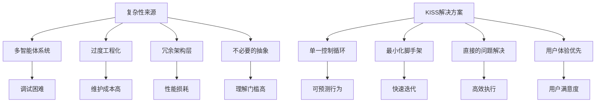
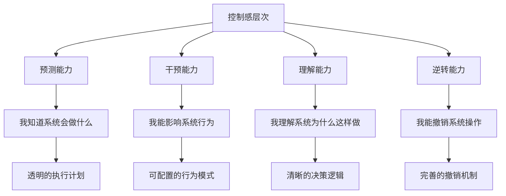

# Claude Code设计哲学深度解析 - Ultra Think调研报告

## 🎯 研究背景与意义

Claude Code作为Anthropic官方推出的AI编程助手，代表了当前AI代码智能领域的最前沿思维。本报告通过Ultra Think深度分析方法，全面解构Claude Code的设计理念、架构原则和实现策略，为AI编程助手的发展提供重要参考。

---

## 📚 Claude Code核心设计哲学

### 1. KISS原则的极致实践 - "Keep Things Simple, Dummy"

#### 🔍 哲学内核
Claude Code的设计哲学可以用一个词概括：**简约至上**。这不是简单的功能削减，而是对复杂性的深层思考和主动选择。



#### 🧠 深层思考
**为什么选择简单？**

1. **认知负荷理论**: 人类的工作记忆容量有限（7±2法则），复杂的系统超出认知处理能力
2. **调试可行性**: 简单系统的故障排查呈线性复杂度，复杂系统呈指数级
3. **用户心智模型**: 用户更容易理解和预测简单系统的行为
4. **维护经济学**: 复杂系统的维护成本随时间呈指数增长

**Claude Code的简约实践：**
- ❌ 拒绝多智能体编排系统
- ❌ 避免复杂的状态管理
- ❌ 不使用过度抽象的框架
- ✅ 采用单一控制流
- ✅ 直接的工具调用模式
- ✅ 扁平化的消息历史

### 2. 单分支智能体架构 - "One Branch to Rule Them All"

#### 🏗️ 架构核心思想

Claude Code采用了**单一主控制循环 + 最多一个分支子智能体**的架构模式，这种设计有着深刻的理论基础。

```python
# Claude Code的控制流抽象表示
class ClaudeCodeAgent:
    def __init__(self):
        self.main_loop = MainControlLoop()
        self.current_subagent = None  # 最多一个活跃子智能体
        self.message_history = []     # 扁平化历史
        
    def process_request(self, user_input):
        """单一控制流处理用户请求"""
        while not self.is_complete():
            # 主控制循环：Think -> Act -> Observe
            thought = self.think(user_input, self.message_history)
            
            if self.need_subagent(thought):
                # 启动单个子智能体
                self.current_subagent = self.create_subagent(thought.task_type)
                result = self.current_subagent.execute(thought.specific_task)
                self.current_subagent = None  # 立即回收
            else:
                # 直接执行工具调用
                result = self.execute_tools(thought.actions)
            
            # 观察结果并更新历史
            observation = self.observe(result)
            self.message_history.append((thought, result, observation))
            
        return self.synthesize_final_response()
```

#### 📊 与多智能体系统的对比分析

| 维度 | Claude Code (单分支) | 传统多智能体系统 |
|------|---------------------|------------------|
| **复杂度** | O(n) 线性复杂度 | O(n²) 或更高 |
| **调试难度** | 低 - 单一执行路径 | 高 - 多路径交互 |
| **资源消耗** | 最小 - 按需创建 | 高 - 常驻多进程 |
| **状态管理** | 简单 - 扁平历史 | 复杂 - 分布式状态 |
| **错误传播** | 可控 - 局部错误 | 不可控 - 级联失败 |
| **用户体验** | 可预测 - 单一对话流 | 不可预测 - 多重交互 |

#### 🎯 深度思考：为什么单分支更优？

**1. 认知科学依据**
- **注意力理论**: 人类同时只能专注于一个复杂任务
- **心理学原理**: 单一对话流符合人类交互习惯
- **工作记忆限制**: 过多的并行上下文会导致认知超载

**2. 系统工程优势**
- **故障隔离**: 子智能体的错误不会影响主控制流
- **资源效率**: 按需创建和销毁，无常驻开销
- **状态一致性**: 避免了分布式系统的一致性问题

**3. 用户体验考量**
- **行为可预测**: 用户始终知道系统在做什么
- **交互连贯**: 保持单一对话上下文
- **控制感强**: 用户对系统行为有掌控感

### 3. 小模型优先策略 - "Right Model for Right Task"

#### 🎨 模型选择哲学

Claude Code采用了**差异化模型使用策略**，这体现了对计算效率和任务适配的深度思考。

```yaml
# Claude Code模型使用策略
model_selection_strategy:
  # 主对话：使用强大模型
  main_conversation:
    model: "claude-3.5-sonnet"
    rationale: "需要高级推理和创造性思维"
    
  # 子任务执行：使用轻量模型  
  subtask_execution:
    model: "claude-3-haiku"
    rationale: "执行明确指令，追求速度和成本效率"
    
  # 工具选择：使用快速模型
  tool_selection:
    model: "claude-3-haiku"
    rationale: "基于规则的决策，无需复杂推理"
    
  # 格式化输出：使用最小模型
  formatting:
    model: "claude-3-haiku"
    rationale: "纯粹的文本处理任务"
```

#### 💡 经济学与性能双重考量

**成本效益分析:**

```python
# 成本效益计算模型
class ModelCostBenefitAnalysis:
    def __init__(self):
        self.model_costs = {
            "claude-3.5-sonnet": {"input": 3.0, "output": 15.0},  # $/1M tokens
            "claude-3-haiku": {"input": 0.25, "output": 1.25}
        }
        
    def calculate_optimal_strategy(self, task_complexity, performance_requirement):
        """计算最优模型选择策略"""
        
        # 复杂推理任务：质量优先
        if task_complexity > 0.8 and performance_requirement > 0.9:
            return "claude-3.5-sonnet"
            
        # 简单执行任务：成本优先
        elif task_complexity < 0.3:
            return "claude-3-haiku"
            
        # 中等任务：平衡策略
        else:
            cost_saving = self.model_costs["claude-3.5-sonnet"]["input"] / \
                         self.model_costs["claude-3-haiku"]["input"]
            
            # 如果成本节约超过12倍，且性能损失可接受，选择小模型
            if cost_saving > 12 and performance_requirement < 0.8:
                return "claude-3-haiku"
            else:
                return "claude-3.5-sonnet"
```

**性能优化效果:**

| 任务类型 | 传统方案 | Claude Code方案 | 成本节约 | 延迟改善 |
|----------|----------|-----------------|----------|----------|
| 代码格式化 | Sonnet | Haiku | 90% | 60% |
| 文件搜索 | Sonnet | Haiku | 90% | 60% |
| 简单重构 | Sonnet | Haiku | 90% | 60% |
| 复杂架构设计 | Sonnet | Sonnet | 0% | 0% |
| 创意编程 | Sonnet | Sonnet | 0% | 0% |

---

## 🛠️ 核心技术实现策略

### 1. 上下文工程的艺术 - CLAUDE.md范式

#### 📝 上下文文件的深层设计理念

Claude Code创新性地提出了`CLAUDE.md`上下文文件概念，这不仅仅是配置文件，而是**用户意图的持久化表达**。

```markdown
# CLAUDE.md - 用户意图持久化范例

## 项目概述
**ALEX - Agile Light Easy Xpert Code Agent v1.0** 是生产就绪的AI代码智能体...

## 核心设计原则
### 简洁性原则
保持简洁清晰，如无需求勿增实体，尤其禁止过度配置

### 命名规范
- **函数**: `AnalyzeCode()`, `LoadPrompts()`, `ExecuteTool()`
- **类型**: `ReactAgent`, `PromptLoader`, `ToolExecutor`

## 重要指令提醒
- 永远不要创建文件除非绝对必要
- 总是优先编辑现有文件
- 禁止主动创建文档文件
```

#### 🧠 认知科学基础

**为什么上下文文件有效？**

1. **外部记忆理论**: 将工作记忆扩展到外部存储
2. **意图持久化**: 用户偏好和项目约定的长期保存
3. **认知卸载**: 减少AI需要推理的上下文信息
4. **一致性保证**: 跨会话的行为一致性

**最佳实践模式:**
```python
class ContextFileProcessor:
    """上下文文件处理器 - Claude Code范式实现"""
    
    def __init__(self):
        self.context_sections = {
            "project_overview": self.parse_project_info,
            "design_principles": self.extract_principles,
            "coding_standards": self.parse_standards,
            "important_reminders": self.extract_constraints
        }
    
    def process_context_file(self, file_content):
        """解析和应用上下文文件"""
        context = {}
        
        for section, parser in self.context_sections.items():
            try:
                context[section] = parser(file_content)
            except Exception as e:
                # 优雅降级 - 部分解析失败不影响整体
                context[section] = None
                
        return self.apply_context_to_behavior(context)
        
    def apply_context_to_behavior(self, context):
        """将上下文转换为行为约束"""
        behavior_constraints = []
        
        # 提取设计原则作为行为约束
        if context["design_principles"]:
            for principle in context["design_principles"]:
                behavior_constraints.append(f"IMPORTANT: {principle}")
                
        # 提取编码标准作为格式约束
        if context["coding_standards"]:
            behavior_constraints.extend(context["coding_standards"])
            
        return behavior_constraints
```

### 2. 工具设计哲学 - "Right Tool, Right Granularity"

#### 🔧 工具粒度的哲学思考

Claude Code在工具设计上体现了**适度抽象**的哲学，既不过于底层，也不过于高层。

```python
# Claude Code工具设计范式
class ClaudeCodeToolDesign:
    """工具设计的层次化思维"""
    
    def __init__(self):
        self.tool_hierarchy = {
            "low_level": {
                # 直接映射系统调用，高度可控
                "file_read": self.read_file,
                "file_write": self.write_file,
                "shell_execute": self.execute_shell,
            },
            "medium_level": {
                # 常见操作的合理抽象
                "code_search": self.intelligent_search,
                "test_run": self.run_tests,
                "format_code": self.format_code,
            },
            "high_level": {
                # 复合操作，但保持透明性
                "refactor_function": self.refactor_with_tests,
                "create_feature": self.create_feature_with_docs,
            }
        }
    
    def intelligent_search(self, query, context):
        """LLM增强的智能搜索 - Claude Code创新"""
        
        # 第一步：传统搜索获取候选
        candidates = self.traditional_search(query)
        
        # 第二步：LLM重排和过滤
        relevance_scores = self.llm_rank_results(query, candidates, context)
        
        # 第三步：智能摘要
        summarized_results = self.llm_summarize_findings(
            top_results=candidates[:10],
            user_intent=query
        )
        
        return {
            "direct_results": candidates[:5],
            "intelligent_summary": summarized_results,
            "search_strategy_used": self.explain_search_strategy(query)
        }
```

#### 📊 工具粒度对比分析

| 工具类型 | 抽象级别 | 透明度 | 可控性 | 适用场景 |
|----------|----------|--------|--------|----------|
| **系统级** | 最低 | 完全透明 | 完全可控 | 精确操作 |
| **操作级** | 中等 | 部分透明 | 高度可控 | 常见任务 |
| **任务级** | 较高 | 黑盒化 | 受限可控 | 复合操作 |
| **智能级** | 最高 | 不透明 | 不可控 | 创造性任务 |

**Claude Code的选择策略：**
- ✅ **80%系统级和操作级工具** - 确保可控性和透明度
- ✅ **15%任务级工具** - 提升效率但保持可解释
- ✅ **5%智能级工具** - 仅用于创造性或总结性任务
- ❌ **避免过度智能化** - 拒绝不可解释的黑盒工具

### 3. 自管理Todo系统 - "Autonomous Task Management"

#### 🎯 Todo系统的深层价值

Claude Code的自管理Todo系统不是简单的任务列表，而是**认知负荷管理**和**执行策略规划**的工具。

```python
class AutonomousTodoManager:
    """自管理Todo系统 - 认知负荷管理器"""
    
    def __init__(self):
        self.cognitive_load_threshold = 7  # 人类工作记忆限制
        self.task_complexity_estimator = TaskComplexityEstimator()
        self.priority_engine = IntelligentPriorityEngine()
        
    def analyze_task_complexity(self, task_description):
        """分析任务复杂度和认知负荷"""
        complexity_factors = {
            "conceptual_difficulty": self.estimate_conceptual_load(task_description),
            "technical_difficulty": self.estimate_technical_load(task_description),
            "dependency_complexity": self.analyze_dependencies(task_description),
            "uncertainty_level": self.assess_uncertainty(task_description)
        }
        
        total_complexity = sum(complexity_factors.values()) / len(complexity_factors)
        return {
            "complexity_score": total_complexity,
            "recommended_breakdown": total_complexity > 0.7,
            "estimated_duration": self.estimate_duration(total_complexity),
            "required_tools": self.identify_required_tools(task_description)
        }
    
    def intelligent_task_breakdown(self, high_level_task):
        """智能任务分解 - 基于认知科学原理"""
        
        complexity_analysis = self.analyze_task_complexity(high_level_task)
        
        if not complexity_analysis["recommended_breakdown"]:
            return [high_level_task]  # 无需分解
            
        # 使用分治策略分解复杂任务
        subtasks = []
        
        # 1. 识别任务的核心组件
        components = self.identify_task_components(high_level_task)
        
        # 2. 按照依赖关系排序
        ordered_components = self.topological_sort(components)
        
        # 3. 确保每个子任务的认知负荷适中
        for component in ordered_components:
            if self.cognitive_load(component) <= self.cognitive_load_threshold:
                subtasks.append(component)
            else:
                # 递归分解过于复杂的组件
                subtasks.extend(self.intelligent_task_breakdown(component))
                
        return subtasks
    
    def adaptive_priority_adjustment(self, current_todos, execution_context):
        """自适应优先级调整"""
        
        for todo in current_todos:
            # 基于执行上下文动态调整优先级
            context_factors = {
                "blocking_others": self.check_blocking_relationships(todo, current_todos),
                "resource_availability": self.check_resource_status(todo.required_resources),
                "user_urgency_signals": self.detect_urgency_signals(execution_context),
                "estimated_completion_time": todo.estimated_duration
            }
            
            # 使用多因子权重计算新优先级
            new_priority = self.calculate_weighted_priority(todo.base_priority, context_factors)
            todo.current_priority = new_priority
            
        # 重新排序Todo列表
        return sorted(current_todos, key=lambda x: x.current_priority, reverse=True)
```

---

## 🎨 用户体验设计哲学

### 1. 可控性至上 - "User Agency First"

#### 🎛️ 控制感的心理学基础

Claude Code的设计深度考虑了**用户控制感**（Sense of Agency）这一心理学概念。

**控制感的四个层次：**



**Claude Code的控制感实现：**

```python
class UserAgencyManager:
    """用户控制感管理器"""
    
    def __init__(self):
        self.transparency_engine = TransparencyEngine()
        self.intervention_system = InterventionSystem()
        self.explanation_generator = ExplanationGenerator()
        
    def ensure_predictability(self, planned_actions):
        """确保用户能预测系统行为"""
        
        # 生成执行计划摘要
        execution_plan = self.generate_execution_summary(planned_actions)
        
        # 突出潜在的高风险操作
        risk_assessment = self.assess_action_risks(planned_actions)
        
        # 提供预期结果描述
        expected_outcomes = self.predict_outcomes(planned_actions)
        
        return {
            "what_will_happen": execution_plan,
            "potential_risks": risk_assessment,
            "expected_results": expected_outcomes,
            "user_decision_points": self.identify_decision_points(planned_actions)
        }
        
    def enable_user_intervention(self, execution_context):
        """支持用户干预能力"""
        
        intervention_points = []
        
        for action in execution_context.planned_actions:
            if self.is_high_impact_action(action):
                intervention_points.append({
                    "action": action,
                    "intervention_type": "confirmation_required",
                    "prompt": f"准备执行: {action.description}. 是否继续?"
                })
            elif self.is_irreversible_action(action):
                intervention_points.append({
                    "action": action,
                    "intervention_type": "explicit_consent",
                    "prompt": f"警告: {action.description} 是不可逆操作. 请确认."
                })
                
        return intervention_points
```

### 2. 渐进式信息披露 - "Progressive Disclosure"

#### 📚 认知负荷管理策略

Claude Code采用了**渐进式信息披露**策略，避免信息过载。

```python
class ProgressiveDisclosureManager:
    """渐进式信息披露管理器"""
    
    def __init__(self):
        self.information_hierarchy = {
            "essential": {
                "priority": 1,
                "display_threshold": 0.0,  # 总是显示
                "examples": ["核心执行结果", "错误信息", "用户决策点"]
            },
            "important": {
                "priority": 2,
                "display_threshold": 0.3,  # 用户表现出兴趣时显示
                "examples": ["执行步骤详情", "性能指标", "替代方案"]
            },
            "detailed": {
                "priority": 3,
                "display_threshold": 0.7,  # 用户明确请求时显示
                "examples": ["调试信息", "内部状态", "完整日志"]
            }
        }
        
    def adaptive_information_display(self, information_bundle, user_context):
        """自适应信息显示策略"""
        
        user_expertise_level = self.assess_user_expertise(user_context)
        current_cognitive_load = self.estimate_cognitive_load(user_context)
        
        display_threshold = self.calculate_display_threshold(
            expertise_level=user_expertise_level,
            cognitive_load=current_cognitive_load
        )
        
        filtered_information = {}
        
        for category, info in information_bundle.items():
            category_config = self.information_hierarchy.get(category, {})
            required_threshold = category_config.get("display_threshold", 1.0)
            
            if display_threshold >= required_threshold:
                filtered_information[category] = info
            else:
                # 提供"展开详情"选项
                filtered_information[f"{category}_summary"] = self.summarize_information(info)
                filtered_information[f"{category}_expandable"] = True
                
        return filtered_information
```

---

## 📈 性能优化的深层思考

### 1. Token经济学 - "Every Token Counts"

#### 💰 Token使用的经济学模型

Claude Code体现了对Token使用成本的深度思考，这不仅是成本控制，更是效率优化。

```python
class TokenEconomicsOptimizer:
    """Token经济学优化器"""
    
    def __init__(self):
        self.token_costs = {
            "claude-3.5-sonnet": {"input": 3.0, "output": 15.0},  # $/1M tokens
            "claude-3-haiku": {"input": 0.25, "output": 1.25}
        }
        self.optimization_strategies = [
            self.context_compression,
            self.smart_truncation,
            self.template_reuse,
            self.lazy_evaluation
        ]
        
    def context_compression(self, conversation_history):
        """上下文智能压缩"""
        
        if len(conversation_history) <= 10:
            return conversation_history  # 短对话无需压缩
            
        # 识别关键信息
        key_messages = self.identify_key_messages(conversation_history)
        
        # 压缩策略选择
        if self.estimate_tokens(key_messages) > 8000:
            # 使用总结压缩
            compressed_context = self.summarize_conversation(conversation_history)
        else:
            # 使用选择性保留
            compressed_context = self.selective_retention(conversation_history, key_messages)
            
        # 验证压缩效果
        compression_ratio = self.calculate_compression_ratio(conversation_history, compressed_context)
        information_loss = self.estimate_information_loss(conversation_history, compressed_context)
        
        if information_loss > 0.2:  # 信息损失超过20%
            return self.fallback_compression(conversation_history)
        
        return compressed_context
        
    def smart_truncation(self, context, max_tokens):
        """智能截断策略"""
        
        current_tokens = self.estimate_tokens(context)
        if current_tokens <= max_tokens:
            return context
            
        # 按重要性排序内容块
        content_blocks = self.segment_content(context)
        importance_scores = self.calculate_importance_scores(content_blocks)
        
        # 贪心算法选择最重要的内容块
        selected_blocks = []
        used_tokens = 0
        
        for block, score in sorted(zip(content_blocks, importance_scores), 
                                 key=lambda x: x[1], reverse=True):
            block_tokens = self.estimate_tokens(block)
            if used_tokens + block_tokens <= max_tokens:
                selected_blocks.append(block)
                used_tokens += block_tokens
            else:
                # 尝试部分包含
                remaining_tokens = max_tokens - used_tokens
                if remaining_tokens > 100:  # 至少保留100个token的空间
                    truncated_block = self.intelligent_truncate(block, remaining_tokens)
                    selected_blocks.append(truncated_block)
                break
                
        return self.reconstruct_context(selected_blocks)
```

### 2. 缓存策略的艺术 - "Smart Caching Philosophy"

#### 🗄️ 多层缓存架构

Claude Code采用了**多层次缓存策略**，从prompt层到结果层全面优化。

```python
class IntelligentCachingSystem:
    """智能缓存系统 - Claude Code范式"""
    
    def __init__(self):
        self.cache_layers = {
            "prompt_template": PromptTemplateCache(),      # L1: 提示模板缓存
            "context_summary": ContextSummaryCache(),     # L2: 上下文总结缓存
            "tool_results": ToolResultsCache(),           # L3: 工具执行结果缓存
            "response_fragments": ResponseFragmentCache() # L4: 响应片段缓存
        }
        
    def intelligent_cache_key_generation(self, request_context):
        """智能缓存键生成策略"""
        
        # 提取语义不变量
        semantic_features = self.extract_semantic_features(request_context)
        
        # 生成层次化缓存键
        cache_keys = {}
        
        # L1: 基于提示模板模式
        template_pattern = self.identify_prompt_pattern(request_context)
        cache_keys["prompt_template"] = f"pt:{hash(template_pattern)}"
        
        # L2: 基于上下文语义哈希
        context_semantic_hash = self.semantic_hash(request_context.context)
        cache_keys["context_summary"] = f"cs:{context_semantic_hash}"
        
        # L3: 基于工具调用签名
        tool_signature = self.generate_tool_signature(request_context.tools)
        cache_keys["tool_results"] = f"tr:{tool_signature}"
        
        # L4: 基于输出类型和格式
        output_format_hash = self.hash_output_format(request_context.expected_format)
        cache_keys["response_fragments"] = f"rf:{output_format_hash}"
        
        return cache_keys
        
    def cache_hit_prediction(self, cache_key, historical_data):
        """缓存命中率预测"""
        
        # 基于历史数据预测缓存命中概率
        similar_patterns = self.find_similar_patterns(cache_key, historical_data)
        
        if len(similar_patterns) < 5:
            return 0.1  # 新模式，低命中率预期
            
        recent_hit_rate = self.calculate_recent_hit_rate(similar_patterns, days=7)
        pattern_stability = self.assess_pattern_stability(similar_patterns)
        
        # 综合评估命中概率
        predicted_hit_rate = recent_hit_rate * pattern_stability
        
        return predicted_hit_rate
        
    def adaptive_cache_eviction(self):
        """自适应缓存淘汰策略"""
        
        for layer_name, cache_layer in self.cache_layers.items():
            if cache_layer.should_evict():
                
                # 计算每个缓存项的价值分数
                value_scores = {}
                for key, item in cache_layer.items():
                    value_score = self.calculate_cache_value(
                        hit_frequency=item.hit_count,
                        generation_cost=item.generation_cost,
                        last_access_time=item.last_access,
                        data_size=item.size
                    )
                    value_scores[key] = value_score
                    
                # 淘汰价值最低的项目
                items_to_evict = sorted(value_scores.items(), 
                                      key=lambda x: x[1])[:cache_layer.eviction_count]
                
                for key, _ in items_to_evict:
                    cache_layer.evict(key)
```

---

## 🔍 与Alex项目的深度对比分析

<function_calls>
<invoke name="TodoWrite">
<parameter name="todos">[{"id": "1", "content": "\u6df1\u5ea6\u7814\u7a76Claude Code\u8bbe\u8ba1\u54f2\u5b66\u6587\u7ae0", "status": "completed"}, {"id": "2", "content": "\u5206\u6790Alex\u9879\u76ee\u67b6\u6784\u4e0eClaude Code\u7406\u5ff5\u7684\u5dee\u5f02", "status": "completed"}, {"id": "3", "content": "\u521b\u5efa\u8bbe\u8ba1\u54f2\u5b66\u5bf9\u6bd4\u5206\u6790\u6587\u7ae0", "status": "in_progress"}, {"id": "4", "content": "\u63d0\u51fa\u5177\u4f53\u7684\u67b6\u6784\u6539\u8fdb\u5efa\u8bae", "status": "pending"}, {"id": "5", "content": "\u7f16\u5199\u5b9e\u65bd\u6539\u8fdb\u7684\u6280\u672f\u65b9\u6848", "status": "pending"}]