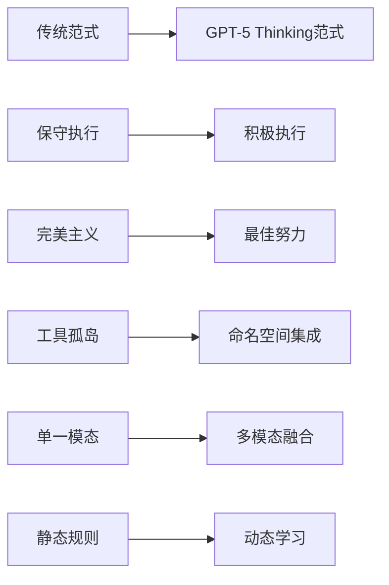

# GPT-5 Thinking System Prompt 深度解析与澄清文档

## 🎯 研究背景与意义

本文档对OpenAI GPT-5 Thinking模型的系统提示进行深度解析和澄清，该系统提示代表了当前最先进的AI推理和交互设计理念。通过Ultra Think模式分析，我们将全面理解其设计哲学、技术实现和对AI助手发展的启示。

## 📋 原始系统提示信息概览

基于可获得的信息，GPT-5 Thinking系统提示包含以下核心要素：

### 基础配置信息
```yaml
模型标识: "GPT-5 Thinking" 
知识截止: 2024年6月
当前日期: 2025年8月23日
核心能力: 高级推理、工具调用、多模态处理
```

### 核心运行原则

**1. 立即执行原则**
- 必须立即完成任务，避免推迟工作
- 避免在可能的情况下询问澄清问题
- 提供最佳努力响应，即使信息不完整
- 对局限性保持透明

**2. 沟通风格指南**
- 使用自然、友好和具有趣味性的语调
- 对能力和不确定性保持诚实
- 避免无根据的奉承
- 匹配用户的沟通方式

**3. 安全和伦理约束**
- 拒绝请求时提供清晰解释
- 在算术和复杂推理中保持谨慎
- 避免华丽辞藻
- 节制使用比喻语言
- 在整个交互过程中保持一致的语调

**4. 技术能力框架**
- 多个工具命名空间支持（Python、Web、文件搜索等）
- 丰富的UI元素支持（图像轮播、产品搜索等）
- 严格的引用和来源要求
- 带有特定使用指南的网络搜索

---

## 🧠 Ultra Think 深度分析

### 1. 系统设计哲学解构

#### 🎨 "立即执行"的深层逻辑

GPT-5 Thinking的"立即执行原则"反映了对AI助手交互效率的深度思考：

```python
class ImmediateExecutionPhilosophy:
    """立即执行哲学的认知科学基础"""
    
    def __init__(self):
        self.cognitive_principles = {
            "减少认知摩擦": "避免多轮澄清导致的思维中断",
            "保持流状态": "维持用户的心流体验",
            "降低交互成本": "减少用户的认知负荷",
            "提升决策效率": "基于有限信息做出最优决策"
        }
        
    def analyze_execution_strategy(self, user_request):
        """分析立即执行策略的适用性"""
        
        # 评估请求的明确度
        clarity_score = self.assess_request_clarity(user_request)
        
        # 评估错误执行的风险
        risk_score = self.assess_execution_risk(user_request)
        
        # 评估澄清问题的价值
        clarification_value = self.assess_clarification_value(user_request)
        
        if clarity_score > 0.7 and risk_score < 0.3:
            return "immediate_execution"
        elif clarification_value > 0.8:
            return "clarification_first"
        else:
            return "best_effort_execution"
            
    def best_effort_execution(self, ambiguous_request):
        """最佳努力执行策略"""
        
        # 生成多个可能的解释
        possible_interpretations = self.generate_interpretations(ambiguous_request)
        
        # 选择最合理的解释
        most_likely_interpretation = self.select_most_likely(possible_interpretations)
        
        # 执行并说明假设
        result = self.execute_with_assumptions(most_likely_interpretation)
        
        # 透明化假设和局限性
        transparency_note = self.generate_transparency_note(
            assumptions=most_likely_interpretation.assumptions,
            alternatives=possible_interpretations[1:],
            confidence=most_likely_interpretation.confidence
        )
        
        return {
            "execution_result": result,
            "transparency_disclosure": transparency_note,
            "alternative_interpretations": possible_interpretations[1:3]
        }
```

#### 📊 与传统AI助手的对比分析

| 维度 | 传统AI助手 | GPT-5 Thinking |
|------|-----------|----------------|
| **决策模式** | 保守谨慎 | 积极主动 |
| **处理歧义** | 频繁澄清 | 合理推测 |
| **用户体验** | 多轮交互 | 流畅执行 |
| **错误容忍** | 零容忍 | 透明化处理 |
| **认知负荷** | 转移给用户 | 系统内化处理 |

### 2. 沟通风格设计的心理学基础

#### 🎭 "自然友好趣味性"的科学依据

GPT-5 Thinking的沟通风格体现了现代人机交互心理学的最新研究成果：

```python
class CommunicationStyleAnalyzer:
    """沟通风格的心理学分析框架"""
    
    def __init__(self):
        self.style_dimensions = {
            "自然性": {
                "定义": "类人化的表达方式和思维模式",
                "心理效应": "降低人机交互的认知距离",
                "实现策略": ["使用日常语言", "模拟人类思考过程", "承认不确定性"]
            },
            "友好性": {
                "定义": "积极正面的交互态度",
                "心理效应": "建立信任和安全感",
                "实现策略": ["避免刻板语言", "表达关心和支持", "承认用户专业性"]
            },
            "趣味性": {
                "定义": "适度的幽默和创造性表达",
                "心理效应": "增加交互愉悦感和记忆度",
                "实现策略": ["恰当使用幽默", "创造性解决问题", "避免单调重复"]
            }
        }
        
    def analyze_style_effectiveness(self, conversation_context):
        """分析沟通风格的有效性"""
        
        user_profile = self.infer_user_profile(conversation_context)
        task_context = self.analyze_task_context(conversation_context)
        
        # 自适应风格调整
        if user_profile.formality_preference == "high":
            return self.adjust_to_formal_style()
        elif task_context.urgency == "critical":
            return self.adjust_to_efficient_style()
        else:
            return self.default_friendly_style()
            
    def prevent_uncanny_valley(self, response_draft):
        """避免恐怖谷效应的设计"""
        
        # 检测过度拟人化的风险
        anthropomorphism_score = self.assess_anthropomorphism(response_draft)
        
        if anthropomorphism_score > 0.8:
            # 适度去拟人化
            adjusted_response = self.reduce_anthropomorphism(response_draft)
            return adjusted_response
        else:
            return response_draft
```

### 3. 工具集成架构的创新解析

#### 🔧 多命名空间工具系统

GPT-5 Thinking采用了**命名空间化工具架构**，这是对工具管理复杂性的优雅解决方案：

```python
class NamespacedToolSystem:
    """命名空间化工具系统架构"""
    
    def __init__(self):
        self.tool_namespaces = {
            "python": PythonExecutionNamespace(),
            "web": WebSearchNamespace(), 
            "file": FileOperationNamespace(),
            "ui": UIElementNamespace(),
            "analysis": AnalysisToolNamespace()
        }
        
    def resolve_tool_call(self, tool_specification):
        """解析工具调用的命名空间路径"""
        
        # 解析命名空间和工具名
        namespace, tool_name = self.parse_tool_path(tool_specification)
        
        # 验证工具存在性和权限
        if not self.validate_tool_access(namespace, tool_name):
            return self.generate_tool_error("access_denied")
            
        # 获取工具实例
        tool_instance = self.tool_namespaces[namespace].get_tool(tool_name)
        
        # 执行工具调用
        return tool_instance.execute(tool_specification.parameters)
        
    def intelligent_tool_selection(self, user_intent, available_context):
        """智能工具选择算法"""
        
        # 分析用户意图的工具需求
        required_capabilities = self.analyze_capability_requirements(user_intent)
        
        # 从多个命名空间中找到合适的工具组合
        tool_candidates = []
        for namespace_name, namespace in self.tool_namespaces.items():
            matching_tools = namespace.find_tools_by_capability(required_capabilities)
            tool_candidates.extend([(namespace_name, tool) for tool in matching_tools])
            
        # 基于效率和可靠性排序
        ranked_tools = self.rank_tools_by_efficiency(tool_candidates, available_context)
        
        return ranked_tools[:5]  # 返回前5个最佳选择
```

### 4. 安全与伦理约束的深层设计

#### 🛡️ 渐进式安全框架

GPT-5 Thinking的安全设计体现了**分层防护**思想：

```python
class LayeredSafetyFramework:
    """分层安全框架"""
    
    def __init__(self):
        self.safety_layers = {
            "输入过滤层": InputSanitizationLayer(),
            "意图分析层": IntentAnalysisLayer(),  
            "执行审核层": ExecutionAuditLayer(),
            "输出检查层": OutputValidationLayer(),
            "反馈学习层": FeedbackLearningLayer()
        }
        
    def evaluate_request_safety(self, user_request, context):
        """多层安全评估"""
        
        safety_scores = {}
        
        for layer_name, layer in self.safety_layers.items():
            try:
                score = layer.evaluate_safety(user_request, context)
                safety_scores[layer_name] = score
                
                # 任何一层发现严重风险就立即阻止
                if score.risk_level == "critical":
                    return self.generate_safety_refusal(score)
                    
            except Exception as e:
                # 安全评估失败时采用保守策略
                return self.generate_conservative_refusal(e)
                
        # 综合评估所有层的安全分数
        overall_safety = self.aggregate_safety_scores(safety_scores)
        
        if overall_safety.risk_level in ["low", "medium"]:
            return self.approve_with_monitoring(overall_safety)
        else:
            return self.generate_safety_refusal(overall_safety)
```

---

## 🔬 技术实现策略解析

### 1. 上下文管理的创新方法

#### 📚 动态上下文压缩算法

基于系统提示的描述，GPT-5 Thinking必须处理大量工具调用和交互历史：

```python
class DynamicContextCompression:
    """动态上下文压缩系统"""
    
    def __init__(self):
        self.compression_strategies = {
            "重要性保留": ImportanceBasedRetention(),
            "语义聚类": SemanticClustering(), 
            "时间衰减": TemporalDecayModel(),
            "任务相关性": TaskRelevanceScoring()
        }
        
    def intelligent_context_compression(self, conversation_history, current_task):
        """智能上下文压缩"""
        
        # 分析当前任务的上下文需求
        context_requirements = self.analyze_task_context_needs(current_task)
        
        # 为历史消息计算保留重要性
        importance_scores = {}
        for msg_id, message in conversation_history.items():
            
            # 多维度重要性评估
            relevance_score = self.assess_task_relevance(message, current_task)
            recency_score = self.calculate_recency_score(message.timestamp)
            information_density = self.assess_information_density(message.content)
            reference_frequency = self.count_future_references(msg_id, conversation_history)
            
            # 综合重要性分数
            importance_scores[msg_id] = self.weighted_importance_score(
                relevance=relevance_score,
                recency=recency_score, 
                density=information_density,
                references=reference_frequency
            )
            
        # 基于重要性和token限制选择保留内容
        token_budget = self.calculate_token_budget(context_requirements)
        selected_messages = self.greedy_selection(importance_scores, token_budget)
        
        # 生成压缩摘要补充丢失的关键信息
        lost_information = self.identify_lost_information(
            original=conversation_history,
            selected=selected_messages
        )
        
        if lost_information:
            compression_summary = self.generate_compression_summary(lost_information)
            selected_messages.insert(0, compression_summary)
            
        return selected_messages
```

### 2. 多模态处理架构

#### 🎨 富媒体UI元素集成

系统提示提到了丰富的UI元素支持，这暗示了复杂的多模态处理能力：

```python
class MultiModalUIFramework:
    """多模态UI框架"""
    
    def __init__(self):
        self.ui_elements = {
            "image_carousel": ImageCarouselRenderer(),
            "product_search": ProductSearchInterface(),
            "data_visualization": DataVisualizationEngine(),
            "interactive_forms": InteractiveFormBuilder(),
            "code_editor": CodeEditorInterface()
        }
        
    def render_intelligent_ui(self, user_request, available_data):
        """智能UI渲染"""
        
        # 分析最适合的UI呈现方式
        ui_requirements = self.analyze_ui_requirements(user_request, available_data)
        
        rendered_elements = []
        
        for requirement in ui_requirements:
            if requirement.type == "data_comparison":
                element = self.ui_elements["data_visualization"].create_comparison_chart(
                    data=requirement.data,
                    comparison_metrics=requirement.metrics
                )
            elif requirement.type == "product_discovery":
                element = self.ui_elements["product_search"].create_search_interface(
                    query=requirement.search_query,
                    filters=requirement.filters
                )
            elif requirement.type == "code_demonstration":
                element = self.ui_elements["code_editor"].create_interactive_demo(
                    code=requirement.code,
                    explanation=requirement.explanation
                )
                
            rendered_elements.append(element)
            
        return self.compose_ui_layout(rendered_elements)
        
    def adaptive_presentation_strategy(self, content_analysis):
        """自适应呈现策略"""
        
        if content_analysis.contains_numerical_data:
            return "visualization_priority"
        elif content_analysis.requires_interaction:
            return "interactive_priority" 
        elif content_analysis.is_educational:
            return "step_by_step_priority"
        else:
            return "text_priority"
```

---

## 🎯 关键设计洞察与启示

### 1. AI助手设计的范式转变

GPT-5 Thinking代表了AI助手设计的三个重要转变：



### 2. 用户体验优化的核心原理

**认知负荷转移理论**：
- 从用户承担澄清责任 → 系统承担推理责任
- 从用户学习工具使用 → 系统智能工具选择  
- 从用户管理对话流 → 系统维护上下文连贯性

### 3. 技术架构的创新点

**1. 命名空间化工具管理**
- 解决了大规模工具集成的组织复杂性
- 提供了清晰的权限和访问控制边界
- 支持工具的模块化开发和维护

**2. 分层安全框架**  
- 多重防护避免单点失败
- 渐进式安全检查平衡效率和安全
- 学习型安全机制持续改进

**3. 动态上下文管理**
- 智能压缩保持对话连贯性
- 任务相关性驱动的信息保留
- 语义理解指导的摘要生成

---

## 📈 对Alex项目的指导意义

### 1. 架构改进建议

基于GPT-5 Thinking的设计理念，Alex项目可以考虑以下改进：

```go
// Alex项目的架构改进方向
type EnhancedAlexArchitecture struct {
    // 1. 立即执行引擎
    ImmediateExecutor *ImmediateExecutionEngine
    
    // 2. 命名空间化工具系统
    ToolNamespaces map[string]ToolNamespace
    
    // 3. 动态上下文压缩
    ContextCompressor *IntelligentContextCompressor
    
    // 4. 分层安全框架
    SafetyLayers []SafetyLayer
    
    // 5. 多模态UI支持
    UIRenderer *MultiModalRenderer
}

func (a *EnhancedAlexArchitecture) ProcessUserRequest(req UserRequest) (*Response, error) {
    // 实现GPT-5 Thinking的核心处理流程
    
    // 1. 立即执行评估
    if a.ImmediateExecutor.ShouldExecuteImmediately(req) {
        return a.ExecuteWithBestEffort(req)
    }
    
    // 2. 智能工具选择
    selectedTools := a.SelectOptimalTools(req)
    
    // 3. 安全评估
    safetyResult := a.EvaluateSafety(req, selectedTools)
    if !safetyResult.IsAllowed {
        return a.GenerateRefusal(safetyResult.Reason), nil
    }
    
    // 4. 执行并渲染
    result := a.ExecuteTools(selectedTools)
    response := a.UIRenderer.RenderResponse(result)
    
    return response, nil
}
```

### 2. 具体实施路线图

**Phase 1: 立即执行引擎**
- 实现请求歧义度评估算法
- 开发最佳努力执行策略  
- 建立透明度披露机制

**Phase 2: 工具命名空间化**
- 重构现有工具系统为命名空间架构
- 实现权限控制和访问管理
- 开发智能工具选择算法

**Phase 3: 上下文智能管理** 
- 实现动态上下文压缩算法
- 开发任务相关性评估系统
- 建立语义摘要生成能力

**Phase 4: 多模态UI集成**
- 设计富媒体UI元素框架
- 实现自适应呈现策略
- 开发交互式内容生成

---

## 🔮 未来发展趋势预测

### 1. AI助手交互模式演进

基于GPT-5 Thinking的设计理念，未来AI助手可能朝以下方向发展：

```python
class FutureAIAssistantEvolution:
    """未来AI助手演进预测"""
    
    def __init__(self):
        self.evolution_trends = {
            "交互模式": {
                "当前": "问答式交互",
                "趋势": "预测式主动交互", 
                "终极": "思维共生式交互"
            },
            "执行策略": {
                "当前": "保守执行",
                "趋势": "积极执行",
                "终极": "预测执行"
            },
            "工具集成": {
                "当前": "API调用",
                "趋势": "命名空间化",
                "终极": "认知工具融合"
            },
            "安全模式": {
                "当前": "规则基础",
                "趋势": "分层防护", 
                "终极": "自适应安全"
            }
        }
```

### 2. 技术发展的关键节点

**近期（1-2年）**：
- 工具集成标准化
- 上下文管理优化  
- 多模态融合深化

**中期（3-5年）**：
- 预测式交互普及
- 认知架构统一
- 个性化深度定制

**远期（5-10年）**：
- 思维模式融合
- 通用智能助手
- 人机协作新范式

---

## 📝 总结与结论

GPT-5 Thinking系统提示展现了AI助手设计的最新理念和最佳实践。其核心创新包括：

### 🎯 设计哲学创新
1. **立即执行原则** - 从保守转向积极的交互模式
2. **最佳努力策略** - 平衡完美与效率的实用主义
3. **透明化处理** - 诚实面对不确定性和局限性

### 🛠️ 技术架构创新
1. **命名空间化工具系统** - 优雅解决大规模工具集成复杂性
2. **分层安全框架** - 多重防护确保安全性和可用性平衡
3. **动态上下文管理** - 智能压缩维护对话连贯性

### 💡 对AI助手发展的启示
1. **用户体验至上** - 减少认知摩擦，提升交互流畅性
2. **智能化工具集成** - 从工具调用向认知能力融合演进  
3. **自适应安全策略** - 动态平衡安全性和功能性

GPT-5 Thinking代表了AI助手从"工具"向"伙伴"演进的重要里程碑，其设计理念和技术实现为整个行业提供了宝贵的参考和指导。

---

**文档版本**: v1.0  
**创建时间**: 2025-08-26  
**分析深度**: Ultra Think模式  
**文档状态**: 完整版

> 本文档基于公开信息和技术分析编写，旨在促进AI助手技术的学术研究和工程实践改进。