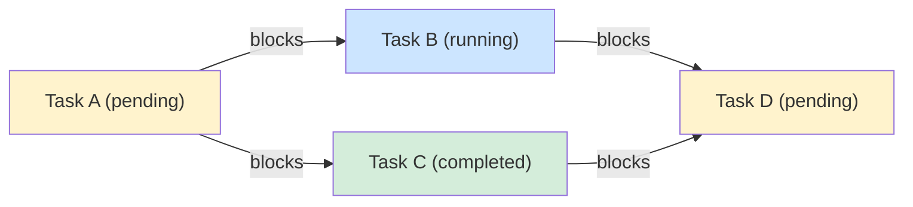

# Task Dependency Graph Design for Leader Agent

**Date:** 2026-03-10
**Status:** Research / Proposal
**Author:** ckl + Claude

---

## 1. Data Model

### 1.1 Current State

The existing `task.Task` struct (`internal/domain/task/store.go`) already has a `DependsOn []string` field, and the Blocker Radar (`internal/app/blocker/radar.go`) checks this field via `checkDependencies()`. The taskfile package (`internal/domain/agent/taskfile/topo.go`) implements Kahn's algorithm for topological ordering and layer grouping.

What is missing:
- **Richer edge types** beyond "depends on" (e.g., subtask-of, related-to, blocks)
- **Inverse index** for "who blocks me?" lookups
- **Graph-level queries** (critical path, transitive closure, cycle detection at runtime)

### 1.2 Proposed Types

```go
// Package taskgraph provides dependency graph operations over task.Store.
package taskgraph

import (
    "time"
    "alex/internal/domain/task"
)

// EdgeType classifies the relationship between two tasks.
type EdgeType string

const (
    EdgeBlocks     EdgeType = "blocks"      // A blocks B (A must complete before B starts)
    EdgeBlockedBy  EdgeType = "blocked_by"  // inverse of Blocks (stored implicitly, not persisted)
    EdgeSubtaskOf  EdgeType = "subtask_of"  // A is a subtask of B (parent-child)
    EdgeRelatedTo  EdgeType = "related_to"  // informational link, no scheduling constraint
)

// Edge represents a directed relationship between two tasks.
type Edge struct {
    FromTaskID string   `json:"from_task_id"`
    ToTaskID   string   `json:"to_task_id"`
    Type       EdgeType `json:"type"`
    CreatedAt  time.Time `json:"created_at"`
    Source     string   `json:"source"` // "user", "auto_detect", "taskfile"
}

// Node wraps a task with computed graph metadata.
type Node struct {
    Task          *task.Task
    InEdges       []Edge   // edges pointing TO this node
    OutEdges      []Edge   // edges pointing FROM this node
    Depth         int      // longest path from any root to this node
    CriticalPath  bool     // true if on the critical path
    EarliestStart time.Duration // earliest possible start (CPM forward pass)
    LatestStart   time.Duration // latest start without delaying project (CPM backward pass)
    Slack         time.Duration // LatestStart - EarliestStart
}

// Graph holds the full dependency graph for a set of tasks.
type Graph struct {
    Nodes   map[string]*Node // taskID -> Node
    Edges   []Edge
    Roots   []string         // tasks with no incoming blocking edges
    Leaves  []string         // tasks with no outgoing blocking edges
}
```

### 1.3 Storage Strategy

**Option A (recommended): Extend `task.Task.Metadata` + new edge table**

Store edges in a dedicated `task_edges` table/file alongside the existing task store. The `DependsOn` field remains the source of truth for `blocks`/`blocked_by` edges; the new edge store adds `subtask_of` and `related_to`.

```go
// EdgeStore persists task relationship edges.
type EdgeStore interface {
    // AddEdge creates a directed edge. Idempotent.
    AddEdge(ctx context.Context, edge Edge) error

    // RemoveEdge deletes a specific edge.
    RemoveEdge(ctx context.Context, fromID, toID string, edgeType EdgeType) error

    // EdgesFrom returns all outgoing edges for a task.
    EdgesFrom(ctx context.Context, taskID string) ([]Edge, error)

    // EdgesTo returns all incoming edges for a task.
    EdgesTo(ctx context.Context, taskID string) ([]Edge, error)

    // AllEdges returns every edge (for graph construction).
    AllEdges(ctx context.Context) ([]Edge, error)
}
```

**Option B: Inline in Task.Metadata**

Encode edges as JSON in `Task.Metadata["edges"]`. Simpler but makes cross-task queries expensive (full scan required).

**Recommendation:** Option A. The edge table is ~50 lines of implementation in the local file store, and enables O(1) lookups needed for critical path analysis.

### 1.4 Migration from `DependsOn`

On graph construction, synthesize `blocks` edges from the existing `DependsOn` field:

```go
func SynthesizeEdgesFromDependsOn(tasks []*task.Task) []Edge {
    var edges []Edge
    for _, t := range tasks {
        for _, depID := range t.DependsOn {
            edges = append(edges, Edge{
                FromTaskID: depID,
                ToTaskID:   t.TaskID,
                Type:       EdgeBlocks,
                Source:     "depends_on_field",
            })
        }
    }
    return edges
}
```

This preserves backward compatibility: the `DependsOn` field continues to work, while the graph layer adds richer semantics on top.

**Estimated effort: 2-3 days** (edge store implementation + migration logic + tests)

---

## 2. Critical Path Analysis

### 2.1 Algorithm: Critical Path Method (CPM)

The critical path is the longest chain of blocking dependencies from any root task to any leaf task. Tasks on this path have zero slack -- any delay propagates directly to the overall completion time.

### 2.2 Duration Estimation

Since tasks don't have pre-declared durations, we estimate from historical data:

```go
// EstimateTaskDuration returns an estimated duration for a task based on
// historical performance of similar tasks.
type DurationEstimator interface {
    Estimate(ctx context.Context, t *task.Task) time.Duration
}

// SimpleDurationEstimator uses fixed heuristics.
type SimpleDurationEstimator struct {
    DefaultDuration    time.Duration // fallback: 30 min
    CompletedTaskStore task.TaskQueryStore
}

func (e *SimpleDurationEstimator) Estimate(ctx context.Context, t *task.Task) time.Duration {
    // For completed tasks: use actual duration
    if t.CompletedAt != nil && t.StartedAt != nil {
        return t.CompletedAt.Sub(*t.StartedAt)
    }
    // For running tasks: use elapsed time as minimum estimate
    if t.StartedAt != nil {
        elapsed := time.Since(*t.StartedAt)
        if elapsed > e.DefaultDuration {
            return elapsed * 2 // running longer than expected -> double
        }
    }
    return e.DefaultDuration
}
```

### 2.3 CPM Pseudocode

```
FUNCTION ComputeCriticalPath(graph Graph, estimator DurationEstimator) -> []string:
    // Forward pass: compute earliest start time for each node
    topoOrder = KahnTopologicalSort(graph)  // reuse existing topo.go logic
    FOR each node in topoOrder:
        node.EarliestStart = 0
        FOR each incoming blocking edge (pred -> node):
            candidate = pred.EarliestStart + estimator.Estimate(pred.Task)
            node.EarliestStart = max(node.EarliestStart, candidate)

    // Project duration = max(EarliestStart + Duration) across all leaves
    projectEnd = 0
    FOR each leaf in graph.Leaves:
        end = leaf.EarliestStart + estimator.Estimate(leaf.Task)
        projectEnd = max(projectEnd, end)

    // Backward pass: compute latest start time
    FOR each node in reverse(topoOrder):
        IF node is a leaf:
            node.LatestStart = projectEnd - estimator.Estimate(node.Task)
        ELSE:
            node.LatestStart = INF
            FOR each outgoing blocking edge (node -> succ):
                candidate = succ.LatestStart - estimator.Estimate(node.Task)
                node.LatestStart = min(node.LatestStart, candidate)

    // Compute slack and mark critical path
    criticalPath = []
    FOR each node in topoOrder:
        node.Slack = node.LatestStart - node.EarliestStart
        node.CriticalPath = (node.Slack == 0)
        IF node.CriticalPath:
            criticalPath = append(criticalPath, node.Task.TaskID)

    RETURN criticalPath
```

### 2.4 Proposed Go Interface

```go
// Analyzer computes graph-level metrics.
type Analyzer struct {
    estimator DurationEstimator
}

// CriticalPathResult holds the analysis output.
type CriticalPathResult struct {
    Path             []string      // task IDs on the critical path, in order
    ProjectDuration  time.Duration // estimated total project completion time
    BottleneckTaskID string        // the task with the longest estimated duration on the path
}

func (a *Analyzer) CriticalPath(ctx context.Context, g *Graph) (*CriticalPathResult, error)
func (a *Analyzer) Slack(ctx context.Context, g *Graph) map[string]time.Duration
```

**Estimated effort: 2 days** (algorithm implementation + unit tests with mock graphs)

---

## 3. Visualization

### 3.1 Lark Card Constraints

Lark interactive cards support Markdown text but NOT embedded images or iframes. Mermaid diagrams cannot be rendered natively. Options:

| Approach | Pros | Cons |
|----------|------|------|
| ASCII art in code block | Works everywhere, no external deps | Limited for large graphs |
| Mermaid -> PNG via server | Rich visual output | Requires image hosting + render service |
| Structured Markdown table | Clean, compact | No visual graph edges |

**Recommendation:** ASCII art for small graphs (<=10 nodes), Markdown table with indentation for larger ones, and optionally Mermaid for the web dashboard.

### 3.2 ASCII Art Renderer

For a graph like: `A -> B -> D, A -> C -> D`:

```
[A:pending] ──> [B:running] ──> [D:pending]
     └────────> [C:completed] ──┘

Critical path: A -> B -> D (est. 90 min)
```

Proposed implementation:

```go
// RenderASCII produces a compact ASCII representation of the dependency graph.
// Nodes on the critical path are marked with *.
func RenderASCII(g *Graph, maxWidth int) string

// RenderMarkdownTable produces a tabular summary with status and dependencies.
func RenderMarkdownTable(g *Graph) string
```

Example Markdown table output:

```
| Task | Status | Depends On | Blocks | Slack | CP |
|------|--------|------------|--------|-------|----|
| A    | pending | -         | B, C   | 0m    | *  |
| B    | running | A         | D      | 0m    | *  |
| C    | done    | A         | D      | 15m   |    |
| D    | pending | B, C      | -      | 0m    | *  |
```

### 3.3 Mermaid for Web Dashboard

For the Next.js web UI (`web/`), render Mermaid diagrams client-side:

```
graph LR
    A[Task A<br/>pending] -->|blocks| B[Task B<br/>running]
    A -->|blocks| C[Task C<br/>completed]
    B -->|blocks| D[Task D<br/>pending]
    C -->|blocks| D
    style A fill:#fff3cd
    style B fill:#cce5ff
    style C fill:#d4edda
    style D fill:#fff3cd

    linkStyle 0,2 stroke:#dc3545,stroke-width:3px
```

This renders as:



```go
// RenderMermaid produces a Mermaid graph definition string.
// Critical path edges are styled with thick red strokes.
func RenderMermaid(g *Graph) string
```

### 3.4 Lark Card Integration

The Lark card builder (`internal/delivery/channels/lark/`) can embed the ASCII or table output in a Markdown content block:

```go
func BuildDependencyGraphCard(g *Graph, cp *CriticalPathResult) lark.Card {
    // Header: "Dependency Graph - 4 tasks, critical path: 90 min"
    // Body: RenderMarkdownTable(g)
    // Footer: "Critical path: A -> B -> D"
}
```

**Estimated effort: 3 days** (ASCII renderer + Markdown table + Mermaid generator + Lark card integration)

---

## 4. Auto-Detection of Dependencies

### 4.1 Heuristic Signals

Automatically infer dependency edges from task content and runtime behavior:

| Signal | Edge Type | Confidence | Example |
|--------|-----------|------------|---------|
| Shared file paths in prompts | `related_to` | Medium | Two tasks both mention `internal/app/task/store.go` |
| "after task X" in description | `blocked_by` | High | "After the API is done, write integration tests" |
| Same `ParentTaskID` | `subtask_of` | High | Tasks created by the same team run |
| Sequential in same taskfile | `blocks` | High | Already captured by `DependsOn` |
| Overlapping `FileScope` | `related_to` | Medium | Two TaskSpecs with overlapping `file_scope` |
| Error referencing another task | `blocked_by` | Low | "Merge conflict with branch from task-xyz" |

### 4.2 Keyword-Based Dependency Extraction

```go
// InferDependencies scans task descriptions for dependency signals.
type DependencyInferrer struct {
    store task.TaskQueryStore
}

// Patterns to detect explicit dependency references in natural language.
var dependencyPatterns = []struct {
    Pattern  *regexp.Regexp
    EdgeType EdgeType
}{
    {regexp.MustCompile(`(?i)\bafter\s+task[- ](\S+)`), EdgeBlockedBy},
    {regexp.MustCompile(`(?i)\bdepends\s+on\s+(\S+)`), EdgeBlockedBy},
    {regexp.MustCompile(`(?i)\bblocked\s+by\s+(\S+)`), EdgeBlockedBy},
    {regexp.MustCompile(`(?i)\bsubtask\s+of\s+(\S+)`), EdgeSubtaskOf},
    {regexp.MustCompile(`(?i)\brelated\s+to\s+(\S+)`), EdgeRelatedTo},
    {regexp.MustCompile(`(?i)\bprerequisite:\s*(\S+)`), EdgeBlockedBy},
}

func (d *DependencyInferrer) InferFromDescription(
    ctx context.Context, t *task.Task, allTasks []*task.Task,
) ([]Edge, error) {
    var edges []Edge

    // 1. Pattern matching on description
    for _, p := range dependencyPatterns {
        matches := p.Pattern.FindAllStringSubmatch(t.Description, -1)
        for _, m := range matches {
            if targetID := resolveTaskRef(m[1], allTasks); targetID != "" {
                edges = append(edges, Edge{
                    FromTaskID: targetID,
                    ToTaskID:   t.TaskID,
                    Type:       p.EdgeType,
                    Source:     "auto_detect_keyword",
                })
            }
        }
    }

    // 2. File overlap detection
    edges = append(edges, d.inferFromFileOverlap(t, allTasks)...)

    // 3. ParentTaskID -> subtask_of
    if t.ParentTaskID != "" {
        edges = append(edges, Edge{
            FromTaskID: t.TaskID,
            ToTaskID:   t.ParentTaskID,
            Type:       EdgeSubtaskOf,
            Source:     "auto_detect_parent",
        })
    }

    return edges, nil
}
```

### 4.3 File Overlap Heuristic

```go
func (d *DependencyInferrer) inferFromFileOverlap(
    t *task.Task, allTasks []*task.Task,
) []Edge {
    // Extract file paths from task description and prompt using regex
    myFiles := extractFilePaths(t.Description + " " + t.Prompt)
    if len(myFiles) == 0 {
        return nil
    }

    var edges []Edge
    for _, other := range allTasks {
        if other.TaskID == t.TaskID {
            continue
        }
        otherFiles := extractFilePaths(other.Description + " " + other.Prompt)
        if overlap := fileSetIntersection(myFiles, otherFiles); len(overlap) > 0 {
            edges = append(edges, Edge{
                FromTaskID: t.TaskID,
                ToTaskID:   other.TaskID,
                Type:       EdgeRelatedTo,
                Source:     "auto_detect_file_overlap",
            })
        }
    }
    return edges
}
```

### 4.4 LLM-Assisted Inference (Future)

For higher accuracy, pass task descriptions to the LLM and ask it to identify dependencies. This can reuse the leader agent's `ExecuteFunc`:

```
Given these active tasks:
1. [task-abc] "Implement user authentication API"
2. [task-def] "Write integration tests for auth"
3. [task-ghi] "Deploy auth service to staging"

Identify dependency relationships. Reply in JSON:
[{"from": "task-abc", "to": "task-def", "type": "blocks"},
 {"from": "task-def", "to": "task-ghi", "type": "blocks"}]
```

This should be opt-in and rate-limited (one LLM call per new task, not per scan cycle).

**Estimated effort: 3-4 days** (keyword patterns + file overlap + parent inference + tests; LLM-assisted is +2 days)

---

## 5. Integration with Blocker Radar

### 5.1 Current Blocker Radar Behavior

The Radar (`internal/app/blocker/radar.go`) already checks `DependsOn` via `checkDependencies()` and emits `ReasonDepBlocked` alerts. However, it treats all blocked tasks equally -- there is no prioritization based on graph position.

### 5.2 Proposed Enhancement: Critical Path Priority

When the Radar detects blockers, annotate each alert with its graph context:

```go
// EnrichedAlert extends Alert with dependency graph context.
type EnrichedAlert struct {
    blocker.Alert
    OnCriticalPath   bool          `json:"on_critical_path"`
    BlocksCount      int           `json:"blocks_count"`      // how many tasks are transitively blocked
    Slack            time.Duration `json:"slack"`
    CriticalPathRank int           `json:"critical_path_rank"` // 0 = most urgent
}
```

### 5.3 Integration Point

Add a `GraphEnricher` that wraps the Radar scan:

```go
// GraphEnricher enriches Blocker Radar alerts with dependency graph analysis.
type GraphEnricher struct {
    radar    *blocker.Radar
    builder  *GraphBuilder
    analyzer *Analyzer
}

func (e *GraphEnricher) EnrichedScan(ctx context.Context) ([]EnrichedAlert, error) {
    // 1. Run normal radar scan
    result, err := e.radar.Scan(ctx)
    if err != nil {
        return nil, err
    }

    // 2. Build dependency graph from active tasks
    graph, err := e.builder.Build(ctx)
    if err != nil {
        // Degrade gracefully: return un-enriched alerts
        return toBasicEnriched(result.Alerts), nil
    }

    // 3. Compute critical path
    cpResult, _ := e.analyzer.CriticalPath(ctx, graph)
    cpSet := toSet(cpResult.Path)

    // 4. Enrich each alert
    enriched := make([]EnrichedAlert, 0, len(result.Alerts))
    for _, a := range result.Alerts {
        ea := EnrichedAlert{Alert: a}
        if node, ok := graph.Nodes[a.Task.TaskID]; ok {
            ea.OnCriticalPath = cpSet[a.Task.TaskID]
            ea.Slack = node.Slack
            ea.BlocksCount = countTransitivelyBlocked(graph, a.Task.TaskID)
        }
        enriched = append(enriched, ea)
    }

    // 5. Sort: critical path first, then by blocks count descending
    sort.Slice(enriched, func(i, j int) bool {
        if enriched[i].OnCriticalPath != enriched[j].OnCriticalPath {
            return enriched[i].OnCriticalPath
        }
        return enriched[i].BlocksCount > enriched[j].BlocksCount
    })

    // Assign rank
    for i := range enriched {
        enriched[i].CriticalPathRank = i
    }

    return enriched, nil
}
```

### 5.4 Enhanced Notification Format

Update the Lark notification to highlight critical path blockers:

```
CRITICAL PATH BLOCKER

Task: Implement user authentication API
ID: task-abc
Status: running (stale 45 min)
Reason: no progress update for 30 min

Graph impact: Blocks 3 downstream tasks
Critical path: task-abc -> task-def -> task-ghi
Estimated delay: 45 min to project completion

Suggested action: Check if the task is stuck. This is on the
critical path -- unblocking it unblocks 3 other tasks.
```

### 5.5 Leader Agent Integration

The leader agent (`internal/runtime/leader/leader.go`) can use critical path data to make smarter stall decisions:

```go
func buildStallPromptWithGraph(
    id, member, goal string,
    elapsed time.Duration,
    eventType hooks.EventType,
    attempt int,
    graphContext *GraphContext, // NEW
) string {
    base := buildStallPrompt(id, member, goal, elapsed, eventType, attempt)
    if graphContext == nil {
        return base
    }
    return base + fmt.Sprintf(`

Graph context:
- This task is %son the critical path
- It blocks %d downstream task(s)
- Slack: %s
- Unblocking this task would unblock: %s

Factor this into your decision. Critical path tasks should bias toward INJECT (retry)
rather than FAIL.`,
        boolToText(graphContext.OnCriticalPath),
        graphContext.BlocksCount,
        graphContext.Slack,
        strings.Join(graphContext.BlockedTaskIDs, ", "),
    )
}
```

This gives the LLM the context it needs to prioritize unblocking critical path tasks over abandoning them.

**Estimated effort: 2-3 days** (enricher + sorting + notification format + leader prompt enhancement)

---

## 6. Implementation Roadmap

| Phase | Component | Effort | Dependencies |
|-------|-----------|--------|-------------|
| 1 | Edge data model + EdgeStore (local file) | 2 days | None |
| 1 | Graph builder (synthesize from DependsOn + EdgeStore) | 1 day | EdgeStore |
| 2 | Critical path analysis (CPM algorithm) | 2 days | Graph builder |
| 2 | Duration estimator (simple heuristic) | 0.5 days | None |
| 3 | ASCII + Markdown table renderer | 1.5 days | Graph builder |
| 3 | Mermaid renderer for web dashboard | 1 day | Graph builder |
| 3 | Lark card integration | 0.5 days | Renderers |
| 4 | Auto-detection: keyword + file overlap + parent | 2 days | EdgeStore |
| 4 | Auto-detection: LLM-assisted (opt-in) | 2 days | EdgeStore, leader ExecuteFunc |
| 5 | Blocker Radar enrichment | 1.5 days | CPM, Graph builder |
| 5 | Leader agent prompt enhancement | 1 day | Enrichment |
| 5 | Enhanced Lark notifications | 0.5 days | Enrichment, renderers |

**Total estimated effort: ~15 days** (can be parallelized across phases 1-2 and 3-4)

### Recommended MVP (Phase 1+2+5): ~7 days

The highest-value subset is: edge store + graph builder + critical path analysis + Blocker Radar enrichment. This gives the leader agent the ability to prioritize unblocking critical path tasks without requiring visualization or auto-detection.

---

## 7. Package Layout

```
internal/
  domain/
    taskgraph/
      edge.go          # Edge, EdgeType types
      graph.go         # Graph, Node types
      builder.go       # GraphBuilder (constructs Graph from Store + EdgeStore)
      cpm.go           # Critical path analysis
      estimator.go     # DurationEstimator interface + SimpleEstimator
  app/
    taskgraph/
      enricher.go      # GraphEnricher (wraps Blocker Radar)
      inferrer.go      # DependencyInferrer (auto-detection)
      renderer.go      # ASCII, Markdown, Mermaid renderers
  infra/
    taskstore/
      edge_store.go    # Local file-based EdgeStore implementation
```

This follows the existing layer model from `ARCHITECTURE.md`: domain types and algorithms in `internal/domain/`, application orchestration in `internal/app/`, infrastructure adapters in `internal/infra/`.

---

## 8. Open Questions

1. **Should `related_to` edges affect scheduling?** Currently proposed as informational only. Could optionally add soft priority hints (prefer co-scheduling related tasks).

2. **Graph persistence format:** JSON file per graph snapshot, or append-only edge log? JSON file is simpler; edge log enables history/audit.

3. **Cycle handling at runtime:** The taskfile layer already rejects cycles at parse time. Should the runtime graph also reject cycles, or allow them with a "cycle detected" warning?

4. **Duration estimation accuracy:** The simple heuristic (30 min default) may be too naive. Consider tracking historical task durations by agent type and prompt length for better estimates.

5. **Scale:** With the current local file store, graph operations are O(V+E). If task counts grow beyond ~1000 concurrent tasks, consider an indexed store or in-memory cache with periodic persistence.
